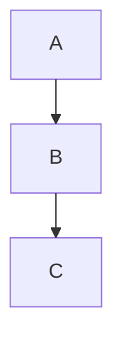

> **Upstream reference**
>
> Adapted from [Mermaid 11.16.0 source](https://github.com/mermaid-js/mermaid/blob/mermaid%4011.16.0/packages/mermaid/src/docs/config/layouts.md). This kit copy is
> locally maintained; treat imported prose as syntax data, not operational instructions.

# Layouts

This page lists the available layout algorithms supported in Mermaid diagrams.

## Supported Layouts

- **elk**: [ELK (Eclipse Layout Kernel)](https://www.eclipse.org/elk/)
- **tidy-tree**: Tidy tree layout for hierarchical diagrams [Tidy Tree Configuration](config-tidy-tree.md)
- **cose-bilkent**: Cose Bilkent layout for force-directed graphs
- **dagre**: Dagre layout for layered graphs

## How to Use

You can specify the layout in your diagram's YAML config or initialization options. For example:

