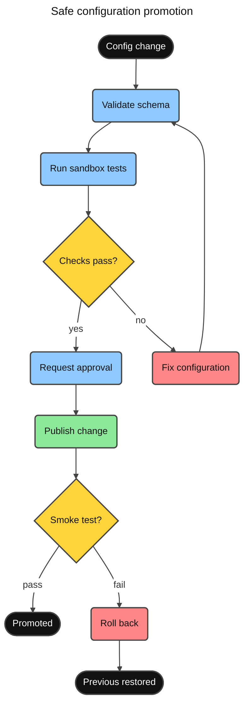
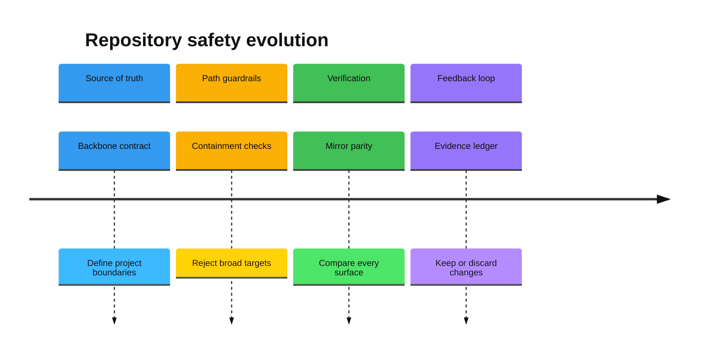
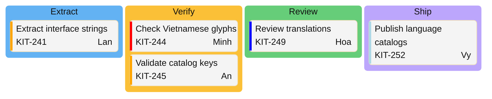
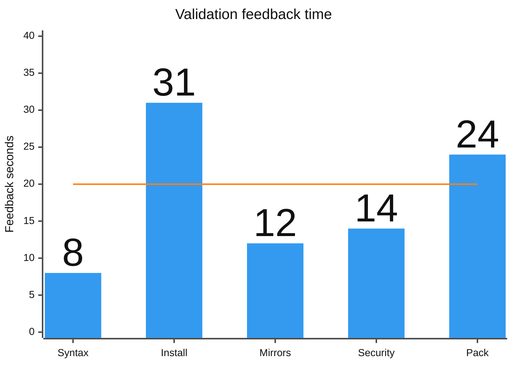
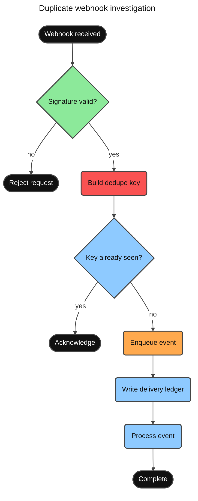

# Minimal Vibe Coding Kit Mermaid Examples

These examples are authored for this kit. Their cases and labels intentionally differ
from the imported Mermaid documentation and the source clone. They target Mermaid
11.16.0, use strict security, and follow the Vivid Clay preset.

## Safe Configuration Promotion

Use a flowchart when the important story is ordered checks and rollback behavior.

## Repository Safety Evolution

The strong section palette survives Mermaid's timeline tinting; every inverse accent is
pinned to the same ink color.

## Localization Release Board

Kanban columns use the strong scale. Priority metadata carries ticket risk without
overriding neutral card fills.

## Validation Feedback Time

The observed bars are blue, the target line is orange, and bar values are visible.

## Duplicate Webhook Investigation

Red is reserved for the evidence-ranked prime suspect. Ink text on the strong red reaches
5.75:1 contrast; green nodes are ruled out only by observed checks.

Evidence note: request logs show different deliveries producing an empty deduplication key;
signature verification passes. Queue visibility is not yet tested, so it remains amber.
