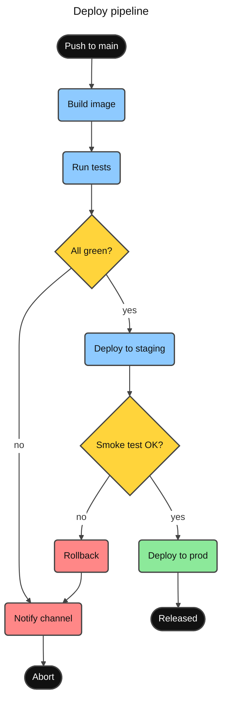

# Vivid Clay Style Preset

Default visual style for every generated diagram: **colourful claymorphism × neubrutalism**.
Soft rounded shapes and saturated pastel fills (clay) + dark borders, ink text, high contrast
(neubrutalism). Goal: one glance separates roles — steps, decisions, success, failure — before
reading a single label.

Apply this preset unless the user asks for plain/minimal output or names another theme.

## Design rules

1. **One hue = one semantic role**, never one hue per node. All nodes of the same kind share a color.
2. **Uniform dark borders**: `#444444`, 2px on nodes, 1.5px on edges. Differentiation comes from fill hue, not border color.
3. **Contrast**: ink `#111111` text on pastel fills; white `#FFFFFF` text only on the ink fill. Never light-on-light.
4. **Every node gets a class** (in diagram types that support classDef). No unstyled default-gray boxes.
5. **Rounded shapes for the clay feel**: stadium `([ ])` for start/end, rounded `( )` for steps, diamond `{ }` for decisions, cylinder `[( )]` for data stores.
6. Edge labels: short (1–3 words), white background (`edgeLabelBackground`).
7. Group phases with subgraphs on the paper tint when the flow has distinct stages.

## Anti-overflow rules (text must never clip)

- `fontFamily` is one of the verified stacks in the Typography section below —
  the default mono stack everywhere, the sans option when the user asks for a prose look,
  or the web-font mono variant when the host preloads fonts.
  Fonts like `ui-sans-serif` make Mermaid measure text with one font and render with another;
  containers come out too narrow and labels clip (verified: ER headers lost their last character).
- Never put a dash-containing token (`sans-serif`, `system-ui`) in a **custom**
  `themeVariables.fontFamily`: mermaid's sanitizer whitelists `[\d "#%(),.;A-Za-z]` and blanks
  the whole value on any other character, silently falling back to the default stack (upstream
  mermaid#6256; verified by render probes on v11.16 — `segoe ui, verdana, arial` passes, adding
  `, sans-serif` voids the value). Mermaid's own trebuchet default is unaffected only because
  the sanitizer's fallback happens to equal it. Generic `serif` and `monospace` are dash-free
  and safe.
- Never set `font-weight` in classDef — bold renders wider than the measured normal text and
  overflows the node.
- Node labels ≤ 6 words, edge labels ≤ 3 words. Break longer text with `<br/>`.

## Typography

Three verified stacks — mono is the default for every diagram:

| Stack | fontSize | When |
| ----- | -------- | ---- |
| `cascadia mono, consolas, noto sans mono, menlo, monospace` (default) | 15px | Every diagram on any page. Dev/terminal look that fits the neubrutalist style, Vietnamese-safe end to end: Cascadia Mono (Windows 11) → Consolas (older Windows) → Noto Sans Mono (Linux with Noto) → Menlo (macOS, best effort). System fonts — no loading race. |
| `segoe ui, verdana, arial` (sans option) | 16px | Only when the user asks for a sans/prose look. Vietnamese-safe on Windows; macOS falls through to Verdana/Arial. No `sans-serif` generic: the sanitizer voids dash tokens (see anti-overflow). |
| `JetBrains Mono, Cascadia Code, Consolas, monospace` (web-font mono) | 15px | Only when the host page preloads the fonts (own site, preview HTML). Load JetBrains Mono with a Vietnamese sample string (web-font section below). |

Every preview.html section renders the default mono stack at 15px (re-verified 2026-07;
clip-scanned). Mono glyphs run wider than sans — keep 15px, not 16px.

### Language coverage — Vietnamese

Mermaid's own default face, **Trebuchet MS, has no Vietnamese glyphs**. Its Latin Extended
Additional coverage is 8 characters (U+1E80–1E85, U+1EF2–1EF3) — none of the Vietnamese range
U+1EA0–1EF9, no horn vowels (ư U+01B0), no đồng sign (₫ U+20AB). Verified 2026-07 two ways: the
glyph map of trebuc.ttf on Windows 11, and the font's published Unicode coverage table. The
browser falls back **per character** to Verdana: base letters draw in Trebuchet, marked letters
in Verdana — two typefaces inside one word. It also clips: mermaid measures text on a canvas,
where a missing glyph hits a different fallback than the DOM draw (preview section 33a measures
~34px of overflow on "Kiểm thử hệ thống dữ liệu").

The default mono stack is Vietnamese-safe by construction — verified per member: Cascadia
Mono and Consolas by glyph map (Windows 11), Noto Sans Mono by its Google Fonts `vietnamese`
subset. Menlo is best effort: it descends from DejaVu Sans Mono, whose own langcover.txt
reports only 76% Vietnamese coverage, so macOS marks may sit slightly off.

Fonts that look tempting but break Vietnamese — keep them out of every stack:

- **Fira Code / Fira Mono** — no `vietnamese` subset (Google Fonts css2, checked 2026-07).
- **SF Mono** — Apple lists Latin, Greek, Cyrillic only; a Mac with it installed mixes
  typefaces on marked letters.
- **DejaVu Sans Mono, Ubuntu Mono, Red Hat Mono, Liberation Mono** — missing or deformed
  Vietnamese marks (DejaVu 76%; Ubuntu and Red Hat ship no vietnamese subset; Liberation
  misplaces combining marks).
- **Trebuchet MS, Georgia** — no Vietnamese glyph block at all (glyph map, Windows 11).

For a sans look on pages you control, the best face is **Be Vietnam Pro** (Google Fonts,
OFL — designed for Vietnamese, diacritic-adaptive letterforms):
`fontFamily: Be Vietnam Pro, segoe ui, verdana, arial`, fontSize 16px.
Load it with a Vietnamese sample string before `mermaid.run()` — see the web-font section
below; without the sample only the latin file loads and Vietnamese labels are measured
with the fallback font.

preview.html section 33 renders all of this, including the Trebuchet mixed-font repro.

### Web fonts must load before mermaid runs

Mermaid measures label text once, at render time (upstream issues mermaid#1540, mermaid#5701).
If a web font arrives later, text is measured with the fallback font but drawn with the web
font — labels clip. When self-hosting:

```html
<link href="https://fonts.googleapis.com/css2?family=JetBrains+Mono:wght@400;500&display=swap" rel="stylesheet">
<script type="module">
  import mermaid from 'https://cdn.jsdelivr.net/npm/mermaid@11/dist/mermaid.esm.min.mjs';
  mermaid.initialize({ startOnLoad: false });
  await document.fonts.load('15px "JetBrains Mono"', 'Đọc dữ liệu, gỡ lỗi — 500.000₫');
  await mermaid.run();
</script>
```

The second argument to `load()` matters: Google Fonts splits each family into unicode-range
files (latin, vietnamese, …) and `load()` fetches only the files that sample text needs —
the default sample is a single space, which pulls the latin file alone. Pass a sample in
every script the diagram renders (the Vietnamese sample above pulls the vietnamese file too).

On pages you don't control the loading race is unfixable — never name a web font there;
stay on the default stack.

### The mermaid container needs a real font stack too

Some diagram types (verified: block) never inject `fontFamily` into their SVG, so labels
inherit the font of the surrounding element. Diagrams usually sit in a `<pre class="mermaid">`,
and the browser default for `<pre>` is monospace — text gets measured with the themeVariables
font but drawn in monospace, and labels clip (caught by the eval harness: block's
"Load balancer" lost its trailing letters). When self-hosting, mirror the stack on the container:

```css
.mermaid { font-family: cascadia mono, consolas, noto sans mono, menlo, monospace; }
```

Hosted renderers (GitHub, mermaid.live) style their own containers; this rule is for pages you control.

### Weight, emphasis, text color

- Never set `font-weight` in classDef or themeVariables (see anti-overflow rules).
  Mermaid's own bold (titles, ER headers, section labels) is already measured correctly — leave it.
- Emphasis comes from fill color (palette roles), not bold.
- Text color is fixed by the palette: ink `#111111` on pastel fills, white `#FFFFFF` only on
  the ink fill. No mid-gray text on tinted fills.

### Font licensing (checked 2026-07)

JetBrains Mono, Fira Code, and Be Vietnam Pro are OFL-licensed — free for any use, served by Google Fonts.
Dank Mono (~$40) and MonoLisa (~$59) are commercial with no public CDN: never emit them in
shipped diagrams. A user who owns one can prepend it to the mono stack on their own machine —
the fallback chain keeps the diagram valid everywhere else.

## Palette tokens

| Role | Fill | Text | Use for |
| ---- | ---- | ---- | ------- |
| `terminal` | `#111111` | `#FFFFFF` | start / end / exit points |
| `step` | `#8ECAFF` sky | `#111111` | normal process steps |
| `decision` | `#FFD43B` amber | `#111111` | branches, questions |
| `success` | `#8CE99A` green | `#111111` | happy path, pass, done |
| `danger` | `#FF8787` red | `#111111` | failure, error, abort |
| `accent` | `#D0BFFF` violet | `#111111` | highlights, key artifacts |
| `data` | `#63E6BE` teal | `#111111` | data stores, files, I/O |
| `external` | `#FFA94D` orange | `#111111` | third-party / external systems |

All borders: `#444444`. Paper/cluster tint: `#FFF9DB`. Hex only — the theming engine does not accept color names.

### Strong palette — large-area marks

Some renderers **lighten** the colors you give them before painting big areas: timeline tints
period and event boxes, kanban tints column backgrounds, and xychart draws wide bars with no
border. Feed those types the pastel tokens above and the result washes out (pale bars, faded
columns). For those large-area marks use the strong variants — same hue family, one level
deeper — and keep the pastel tokens for small bordered nodes:

| Role | Strong fill | Pairs with |
| ---- | ----------- | ---------- |
| `stepStrong` | `#339AF0` blue | `step` #8ECAFF |
| `decisionStrong` | `#FAB005` yellow | `decision` #FFD43B |
| `successStrong` | `#40C057` green | `success` #8CE99A |
| `dangerStrong` | `#FA5252` red | `danger` #FF8787; use ink `#111111` text |
| `accentStrong` | `#9775FA` violet | `accent` #D0BFFF |
| `dataStrong` | `#20C997` teal | `data` #63E6BE |
| `externalStrong` | `#FD7E14` orange | `external` #FFA94D |

All strong fills keep ink `#111111` text readable. Do not use white on `#FA5252` for normal text:
the contrast is only 3.28:1; ink `#111111` reaches 5.75:1.

## Universal frontmatter block

Works for every diagram type (only `base` theme is customizable). Start each diagram with:

```yaml
---
title: <diagram title>
config:
  theme: base
  themeVariables:
    fontFamily: cascadia mono, consolas, noto sans mono, menlo, monospace
    fontSize: 15px
    primaryColor: "#8ECAFF"
    primaryTextColor: "#111111"
    primaryBorderColor: "#444444"
    secondaryColor: "#FFD43B"
    secondaryBorderColor: "#444444"
    tertiaryColor: "#FFF9DB"
    tertiaryBorderColor: "#444444"
    lineColor: "#444444"
    textColor: "#111111"
    edgeLabelBackground: "#FFFFFF"
    clusterBkg: "#FFF9DB"
    clusterBorder: "#444444"
---
```

Include the `title:` line only when the host page's background is controlled (own site,
preview HTML). The title renders in plain `textColor` ink directly on the canvas — see the
theme-following-hosts section below before shipping a titled diagram to GitHub.

## Theme-following hosts (GitHub light/dark)

GitHub and similar renderers draw the SVG on a transparent canvas that follows the page
theme. The preset's filled shapes carry their own text colors, so nodes survive both
modes — but any text that does not sit on a filled shape flips illegible in one mode
(observed 2026-07 on GitHub dark mode, Mermaid 11):

- **Diagram `title:`** — rendered in `textColor` ink on the transparent canvas; invisible
  on a dark page. Omit the frontmatter title on theme-following hosts and let the
  surrounding document heading name the diagram.
- **Edge labels** — safe: `edgeLabelBackground: "#FFFFFF"` keeps a white pill behind ink text.
- **Cluster titles** — safe: they sit inside the `clusterBkg` paper fill.
- **Mindmap node text** — not safe; see the mindmap trap in the timeline/mindmap/kanban
  section. For a catalog/overview on a theme-following host, prefer a flowchart of
  per-category subgraph columns: `direction TB` inside each subgraph, invisible `~~~`
  links to stack the entries, and a classDef per category so every label has an explicit
  fill and text color.

Rule of thumb: on a host with more than one theme, every character must sit on a shape
whose fill and text color the diagram sets explicitly, or on the white edge-label pill.

## Flowchart / state / block diagrams — classDef recipe

Append after the diagram body, then assign every node:

```
  classDef terminal fill:#111111,stroke:#444444,stroke-width:2px,color:#FFFFFF
  classDef step fill:#8ECAFF,stroke:#444444,stroke-width:2px,color:#111111
  classDef decision fill:#FFD43B,stroke:#444444,stroke-width:2px,color:#111111
  classDef success fill:#8CE99A,stroke:#444444,stroke-width:2px,color:#111111
  classDef danger fill:#FF8787,stroke:#444444,stroke-width:2px,color:#111111
  classDef accent fill:#D0BFFF,stroke:#444444,stroke-width:2px,color:#111111
  classDef data fill:#63E6BE,stroke:#444444,stroke-width:2px,color:#111111
  classDef external fill:#FFA94D,stroke:#444444,stroke-width:2px,color:#111111
  linkStyle default stroke:#444444,stroke-width:1.5px

  class Start,End terminal
  class S1,S2 step
  class Q1 decision
```

Only emit the classDefs you actually assign. Drop unused roles.
`linkStyle` exists in flowcharts only — omit it in state and block diagrams.
Block diagrams keep the same `classDef` + `class` syntax and support the cylinder
shape `Name[("Label")]` for data stores.

### Full example (rendered and verified)



## Class / ER diagrams — themeVariables only

`classDef` inside `classDiagram` is unreliable in Mermaid v11 (silently ignored when combined
with frontmatter config; washed out via `cssClass` — verified by rendering). Style these two
types with the universal frontmatter block alone: `primaryColor` sky fills headers/boxes,
`primaryBorderColor` and `lineColor` keep the dark outline. Do not emit classDef/cssClass here.

## Sequence diagram

Add to the universal block:

```yaml
    actorBkg: "#8ECAFF"
    actorBorder: "#444444"
    actorTextColor: "#111111"
    actorLineColor: "#777777"
    signalColor: "#444444"
    signalTextColor: "#111111"
    activationBkgColor: "#FFD43B"
    activationBorderColor: "#444444"
    labelBoxBkgColor: "#D0BFFF"
    labelBoxBorderColor: "#444444"
    noteBkgColor: "#FFF9DB"
    noteBorderColor: "#444444"
    noteTextColor: "#111111"
```

## Pie chart

```yaml
    pie1: "#8ECAFF"
    pie2: "#FFD43B"
    pie3: "#8CE99A"
    pie4: "#FF8787"
    pie5: "#D0BFFF"
    pie6: "#63E6BE"
    pie7: "#FFA94D"
    pie8: "#FAA2C1"
    pieStrokeColor: "#444444"
    pieStrokeWidth: 1.5px
    pieOuterStrokeColor: "#444444"
    pieOuterStrokeWidth: 2px
    pieOpacity: 1
```

`pieOpacity: 1` matters — the 0.7 default washes the palette out.

## Gantt

```yaml
    sectionBkgColor: "#FFF9DB"
    altSectionBkgColor: "#FFFFFF"
    taskBkgColor: "#8ECAFF"
    taskBorderColor: "#444444"
    taskTextColor: "#111111"
    taskTextOutsideColor: "#111111"
    activeTaskBkgColor: "#FFD43B"
    activeTaskBorderColor: "#444444"
    doneTaskBkgColor: "#8CE99A"
    doneTaskBorderColor: "#444444"
    critBkgColor: "#FF8787"
    critBorderColor: "#444444"
    todayLineColor: "#FF8787"
```

## User journey

```yaml
    fillType0: "#8ECAFF"
    fillType1: "#FFD43B"
    fillType2: "#8CE99A"
    fillType3: "#FF8787"
    fillType4: "#D0BFFF"
    fillType5: "#63E6BE"
```

## Timeline / mindmap / kanban

All three take the `cScale` palette (timeline periods, mindmap branches, kanban columns),
but Mermaid 11.16's Kanban renderer has the version-specific offset documented below.
Three traps make the default output ugly:

1. **Unset `cScaleInv` auto-derives the hue-opposite of each `cScale` color** and paints it on
   the accent underline of every timeline box — sky gets an orange underline, amber gets blue,
   green gets magenta, red gets cyan (verified by rendering). Pin every `cScaleInv` to the ink
   border so accents stay uniform.
2. **The renderer tints large fills lighter** (timeline event rows, kanban column backgrounds),
   so pastel tokens wash out. Use the strong palette here.
3. **Mindmap ignores pinned `cScaleLabel` values** — node label colors are auto-derived per
   section instead, and on dark theme-following pages several sections come out low-contrast
   to unreadable (observed 2026-07 on GitHub dark mode). Do not rely on `cScaleLabel` to fix
   mindmap contrast; on theme-varying hosts use the flowchart catalog pattern from the
   theme-following-hosts section instead of a mindmap.

```yaml
    cScale0: "#339AF0"
    cScale1: "#FAB005"
    cScale2: "#40C057"
    cScale3: "#FA5252"
    cScale4: "#9775FA"
    cScale5: "#20C997"
    cScaleLabel0: "#111111"
    cScaleLabel1: "#111111"
    cScaleLabel2: "#111111"
    cScaleLabel3: "#111111"
    cScaleLabel4: "#111111"
    cScaleLabel5: "#111111"
    cScaleInv0: "#444444"
    cScaleInv1: "#444444"
    cScaleInv2: "#444444"
    cScaleInv3: "#444444"
    cScaleInv4: "#444444"
    cScaleInv5: "#444444"
```

Set as many `cScale*`/`cScaleLabel*`/`cScaleInv*` slots as the diagram has sections
(12 slots, indexed 0 through 11).
When a timeline has **no sections** (or the periods carry no meaning worth color-coding),
avoid the per-period rainbow entirely — one hue reads calmer:

```yaml
config:
  timeline:
    disableMulticolor: true
```

### Kanban specifics

Mermaid 11.16 assigns its first Kanban column to `section-1`, while its generated style sheet
maps `section-1` to `cScale2`. The isolated render therefore uses `cScale2` for column one,
`cScale3` for column two, and so on. This is renderer behavior, not the intuitive zero-based
order; recheck it when upgrading Mermaid.

```yaml
    # Mermaid 11.16 Kanban column 1..4 compatibility mapping
    cScale2: "#339AF0"
    cScale3: "#FAB005"
    cScale4: "#40C057"
    cScale5: "#9775FA"
    cScaleLabel2: "#111111"
    cScaleLabel3: "#111111"
    cScaleLabel4: "#111111"
    cScaleLabel5: "#111111"
```

The renderer lightens these colors by 10%, so the strong inputs remain readable. Ticket cards
stay on a neutral fill by design; convey urgency with documented `priority` metadata instead
of fighting it:

```
kanban
  todo[Todo]
    t1[Fix login timeout]@{ priority: 'Very High' }
    t2[Write API spec]@{ priority: 'Low' }
```

`priority` accepts `'Very High'`, `'High'`, `'Low'`, `'Very Low'` and colors the card edge
red → orange → blue → light blue. Use `Very High`/`High` for risky or bug-suspect work so the
board pinpoints hot items at a glance.

## Quadrant chart

```yaml
    quadrant1Fill: "#8CE99A"
    quadrant2Fill: "#8ECAFF"
    quadrant3Fill: "#FFF9DB"
    quadrant4Fill: "#FF8787"
    quadrant1TextFill: "#111111"
    quadrant2TextFill: "#111111"
    quadrant3TextFill: "#111111"
    quadrant4TextFill: "#111111"
    quadrantPointFill: "#111111"
    quadrantPointTextFill: "#111111"
    quadrantXAxisTextFill: "#111111"
    quadrantYAxisTextFill: "#111111"
    quadrantInternalBorderStrokeFill: "#444444"
    quadrantExternalBorderStrokeFill: "#444444"
```

## XY chart

`xyChart` variables are a nested object:

```yaml
    xyChart:
      backgroundColor: "#FFFFFF"
      titleColor: "#111111"
      xAxisLabelColor: "#111111"
      xAxisTitleColor: "#111111"
      xAxisTickColor: "#444444"
      xAxisLineColor: "#444444"
      yAxisLabelColor: "#111111"
      yAxisTitleColor: "#111111"
      yAxisTickColor: "#444444"
      yAxisLineColor: "#444444"
      plotColorPalette: "#339AF0, #FD7E14, #40C057, #FA5252, #9775FA, #20C997"
```

Bars and lines have no border, so pastel fills look anemic at bar size — the palette above
uses the strong tokens, and its first pair (blue bars, orange line) stays distinguishable
for colorblind readers. Colors assign to plots in order of appearance: put the series you
want blue first. For bar charts also turn on the value labels (v11.14+):

```yaml
config:
  xyChart:
    showDataLabel: true
```

## Git graph

```yaml
    git0: "#8ECAFF"
    git1: "#FFD43B"
    git2: "#8CE99A"
    git3: "#FF8787"
    gitBranchLabel0: "#111111"
    gitBranchLabel1: "#111111"
    gitBranchLabel2: "#111111"
    gitBranchLabel3: "#111111"
    commitLabelColor: "#111111"
    commitLabelBackground: "#FFF9DB"
    tagLabelColor: "#111111"
    tagLabelBackground: "#D0BFFF"
    tagLabelBorder: "#444444"
```

## Sankey — config.sankey (v11.15+)

Sankey colors live in `config.sankey`, not themeVariables. `nodeColors` keys are the
node names from the CSV rows; unlisted nodes keep the default scheme:

```yaml
config:
  theme: base
  themeVariables:
    fontFamily: cascadia mono, consolas, noto sans mono, menlo, monospace
    fontSize: 15px
    textColor: "#111111"
  sankey:
    linkColor: gradient
    labelStyle: outlined
    nodeColors:
      Traffic: "#8ECAFF"
      Signup: "#8CE99A"
      Bounce: "#FF8787"
      Paid: "#FFD43B"
      Free: "#D0BFFF"
```

`linkColor: gradient` blends each flow between its endpoint colors;
`labelStyle: outlined` puts a stroke behind labels so they stay readable on the flows.

## TreeView — nested treeView themeVariables

```yaml
    treeView:
      labelColor: "#111111"
      lineColor: "#444444"
```

`iconColor` also exists, but icons are unreliable: with `showIcons: true` the icon
symbols land in the SVG `<defs>` yet never get instanced (verified v11.16) — rows just
reserve empty indent space. Leave icons off.

## Venn — style statements

Venn ignores themeVariables colors; style each set with `style` lines. The default
fill-opacity is so low the fills look white — raise it to 0.6 so the palette shows
while overlaps stay readable:

```
  style Frontend fill:#8ECAFF,stroke:#444444,color:#111111,fill-opacity:0.6
  style Backend fill:#8CE99A,stroke:#444444,color:#111111,fill-opacity:0.6
```

Write the `title` unquoted — quotes render as literal characters.

## C4 diagrams — UpdateElementStyle macros

C4 ignores themeVariables colors; use its own macros after the last `Rel`.
Map elements to palette roles: person → accent, internal system → step,
external system → external.

```
  UpdateElementStyle(customer, $bgColor="#D0BFFF", $fontColor="#111111", $borderColor="#444444")
  UpdateElementStyle(bank, $bgColor="#8ECAFF", $fontColor="#111111", $borderColor="#444444")
  UpdateElementStyle(mail, $bgColor="#FFA94D", $fontColor="#111111", $borderColor="#444444")
  UpdateRelStyle(customer, bank, $textColor="#111111", $lineColor="#444444", $offsetY="-20")
```

`$offsetY="-20"` on each `UpdateRelStyle` lifts the label off the line (default overlaps).

## Coverage — all 31 diagram types (mermaid v11.16)

The 30 types on the docs sidebar plus railroad (documented but not listed there).
Every type renders with the universal block; what else applies differs per type
(all verified by rendering):

| Styling mechanism | Diagram types |
| ----------------- | ------------- |
| classDef roles + universal block | flowchart, state, block |
| type-specific themeVariables (sections above) | sequence, pie, gantt, journey, timeline, mindmap, kanban (columns via `cScale`), quadrant, xychart, gitgraph, treeView (`treeView-beta`) |
| universal block only — primary/cluster colors apply | class, ER, swimlanes (`swimlane-beta`), requirement, railroad (`railroad-ebnf-beta`) |
| `cScale0..n` palette (same block as timeline/mindmap) | radar (`radar-beta`, curve fills), treemap (`treemap-beta`, section colors) |
| `config.sankey` — `nodeColors` / `linkColor` (section above) | sankey |
| `style` lines per set (section above) | venn (`venn-beta`) |
| C4 macros — `UpdateElementStyle` / `UpdateRelStyle` (section above) | C4 |
| own fixed palette — universal block styles font/ink only | packet, architecture (`architecture-beta`), event modeling (`eventmodeling`), ishikawa (`ishikawa-beta`), wardley (`wardley-beta`), cynefin (`cynefin-beta`) |
| external plugin required | zenuml — register `@mermaid-js/mermaid-zenuml` first; plain mermaid errors "No diagram type detected". Ignores themeVariables (its header clips ~50px with any container stack — pre-existing plugin issue, measured against the sans baseline) |

The own-palette types are already legible out of the box (cynefin domain tints,
event-modeling entity colors); do not fight them with overrides. Specifics verified
by rendering: packet's documented theme variables are a no-op (upstream bug — blocks
stay `#efefef`); architecture exposes only layout knobs (`randomize`, fcose tuning),
no colors; wardley and zenuml expose no color config at all.

## Legibility checklist (before returning the diagram)

- [ ] `fontFamily` is the default mono stack at 15px (or the documented sans option at 16px); no `font-weight` in any classDef.
- [ ] Every node has an explicit class (flowchart/state) or the type's themeVariables are set.
- [ ] No light text on light fill anywhere.
- [ ] Same role ⇒ same color across the whole diagram.
- [ ] Labels ≤ 6 words; edge labels ≤ 3 words.
- [ ] Direction fits the story: `TD` for processes, `LR` for pipelines/timelines.
- [ ] Theme-following host (GitHub README): no frontmatter `title:`, no mindmap, and no text
      on the bare canvas — every label sits on an explicitly filled shape or the white
      edge-label pill.
