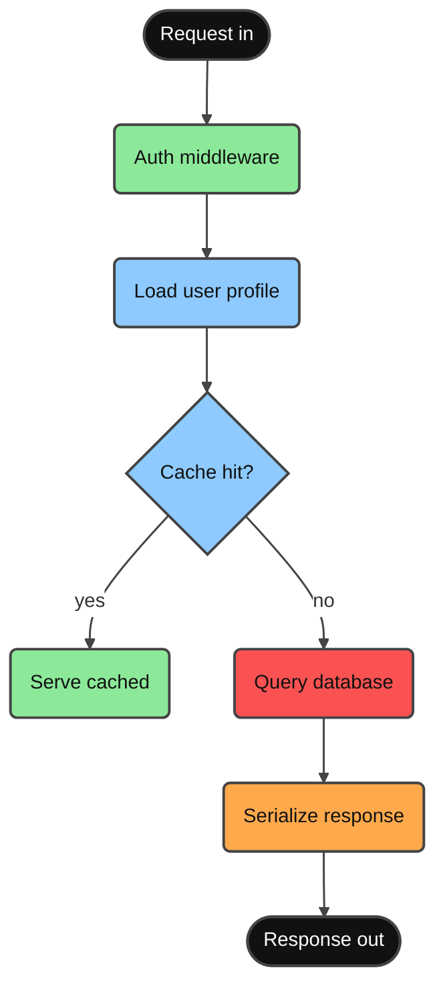

# Debug Heat Map

Maintained by Minimal Vibe Coding Kit. When the user accepts the debug-chart offer, render the failing workflow as a flowchart whose colors encode **suspicion**, so the eye lands on the most likely cause first.

## Risk classes

Append these classDefs and assign every node exactly one:

```
  classDef riskHigh fill:#FA5252,stroke:#444444,stroke-width:2px,color:#111111
  classDef riskMed fill:#FFA94D,stroke:#444444,stroke-width:2px,color:#111111
  classDef normal fill:#8ECAFF,stroke:#444444,stroke-width:2px,color:#111111
  classDef verified fill:#8CE99A,stroke:#444444,stroke-width:2px,color:#111111
  linkStyle default stroke:#444444,stroke-width:1.5px
```

| Class | Meaning | Assign when |
| ----- | ------- | ----------- |
| `riskHigh` (red, ink text) | most likely cause | crash site, failing assertion, unvalidated input, code changed right before the bug appeared |
| `riskMed` (amber) | suspicious, unverified | touched by the same code path but not yet tested |
| `normal` (sky) | in the flow, no evidence against it | default |
| `verified` (green) | ruled out by a passing test or log evidence | only after real evidence, never by assumption |

## Rules

- **Evidence ranks the red.** Base suspicion on observed facts (stack traces, logs, diffs, failing tests) and state the strongest fact in the node or on its edge label (`"500 here"`, `"null at line 42"`).
- Show relative likelihood in the label when it helps: `Parse config<br/>(suspect ~70%)`. Percentages are stated estimates, not measurements - round to tens.
- One or two red nodes maximum. If everything looks red, the investigation is not ready for a chart yet.
- Re-emit the chart when evidence changes: a ruled-out red node turns green, and the next suspect turns red. The chart tracks the hypothesis→verification loop of the `sequential-thinking` skill.
- Respect the active coding level for density (see `coding-level-charts.md`).

## Example



Reading: auth and cache-serve are ruled out (green), the database query is the prime suspect (red - timeouts observed in logs), serialization is untested downstream of it (amber).
