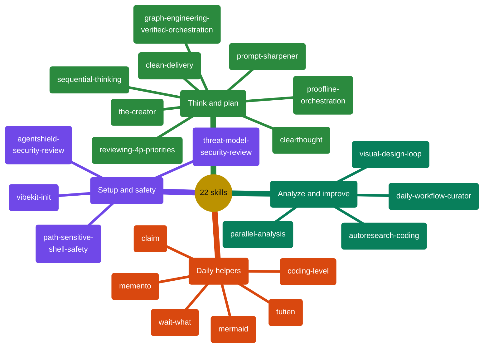
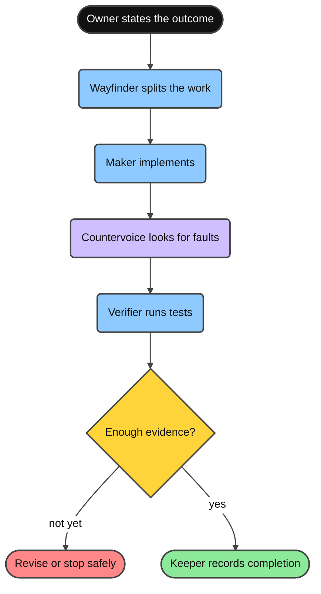
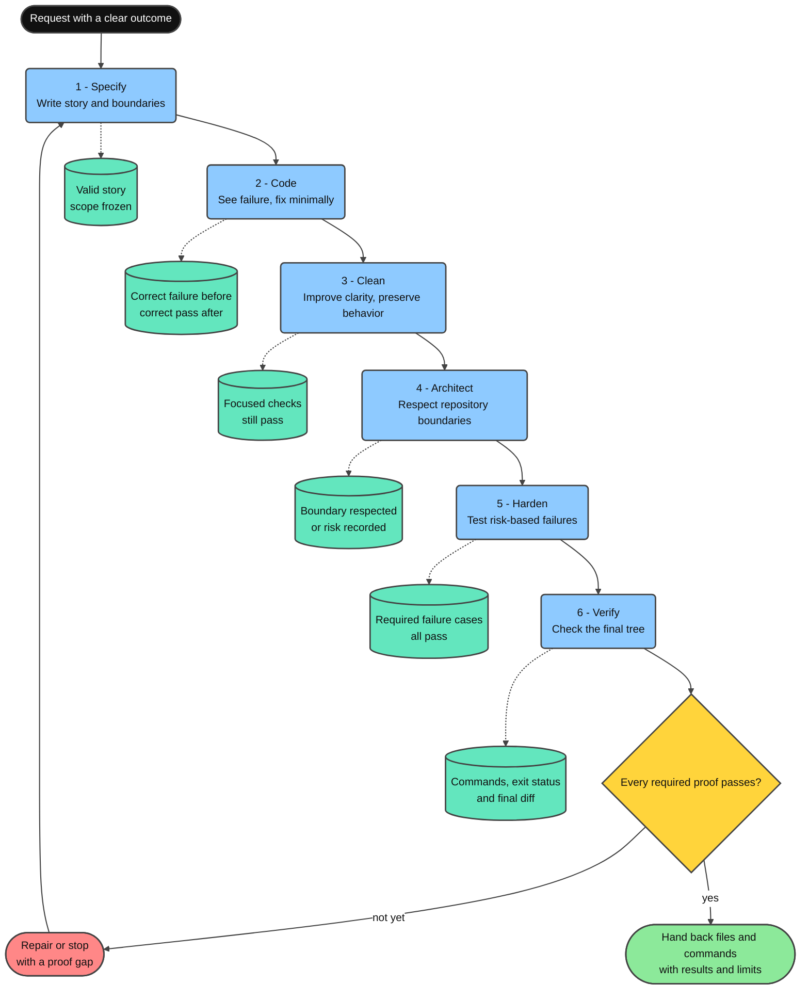
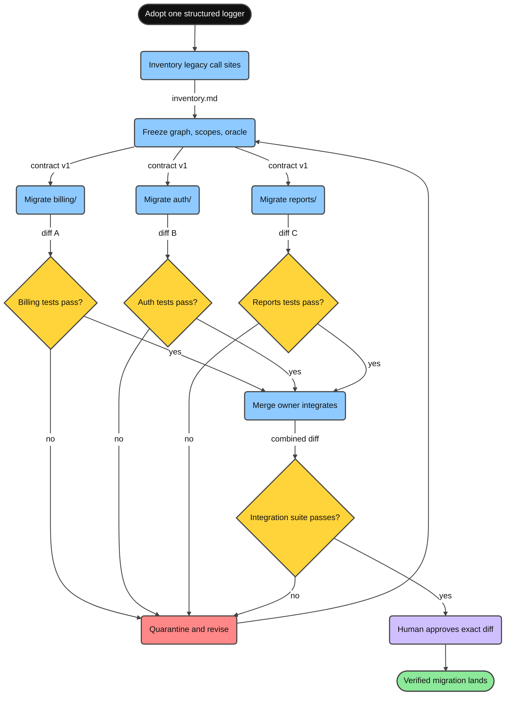

<div align="center">

**Read in:** **English** · [Tiếng Việt](docs/README.vi.md) · [简体中文](docs/README.zh-CN.md) · [日本語](docs/README.ja.md) · [한국어](docs/README.ko.md) · [Deutsch](docs/README.de.md) · [Български](docs/README.bg.md)

# Minimal Vibe Coding Kit

[](LICENSE)
[](https://www.npmjs.com/package/minimal-vibe-coding-kit)
[](CHANGELOG.md)


**One installable AI-coding workflow kit for Claude Code, Cursor, Codex, OpenCode, Grok, and Kimi - any repo, any language.**

Install → paste one prompt → approve the proposal → code with guardrails.

If you use this kit and it actually helps you, drop a star. It tells me it’s useful to one more person and gives me the energy to keep improving it

</div>

---

## What is this?

A small kit of shared **rules**, **skills**, and **commands**, plus one **`backbone.yml`** manifest, so Claude Code, Cursor, Codex, OpenCode, Grok, and Kimi all understand your project the same way.

- Never overwrites your existing `CLAUDE.md` / `AGENTS.md` - it only adds managed blocks.
- Every setup write waits for your explicit approval.
- Security review of agent surfaces (AgentShield) is part of the normal workflow.
- Safe deletes by default: all agents prefer the recoverable `trash` command (init checks it and recommends an install if missing), backed by each tool's documented guardrail config - Claude Code deny rules (`.claude/settings.json`), Cursor CLI permissions (`.cursor/cli.json`), Codex execution-policy rules (`.codex/rules/`, experimental, active once the project is trusted), OpenCode project permissions (`opencode.json`), and Grok project permission rules (`.grok/config.toml`).
- First-time init asks two setup preferences - use `trash` instead of `rm`, and your default explanation level (0-5, changeable anytime with `/coding-level N`) - and records both in `backbone.yml`.

## Quick Start

Three steps, about two minutes.


**1. Install into your project** (no clone needed):

```bash
npx --yes minimal-vibe-coding-kit@latest install /path/to/your-project
```

Already ran `npm i minimal-vibe-coding-kit`, or prefer GitHub or a local clone? See [Install from npm](#install-from-npm).

**2. Open the project in Claude Code, Cursor, Codex, OpenCode, Grok, or Kimi Code and paste:**

```text
Read .vibekit/init/FIRST_TIME_INIT.md and initialize this repo with Minimal Vibe Coding Kit.
First print the requirements you will check. Then run detection, propose one diff
for backbone.yml and managed instruction blocks, and wait for my yes before writing.
```

**3. Review the proposed diff and answer `yes`.**

The agent fills `backbone.yml` with your detected stack and conventions and flips it to `initialized`. Done - every later session reads it automatically and skips init.

Optional health check any time:

```bash
node .vibekit/scripts/mvck.mjs doctor .
```

## Install from npm

The kit is published on npm as [`minimal-vibe-coding-kit`](https://www.npmjs.com/package/minimal-vibe-coding-kit). It is a **scaffolding CLI, not a library** - files sitting in `node_modules/` do nothing by themselves. Running `install` once copies the kit into your repo root, exactly like the GitHub installer does.

**Option A - one-shot (recommended).** Nothing is added to your project's dependencies:

```bash
npx --yes minimal-vibe-coding-kit@latest install /path/to/your-project
```

**Option B - as a dependency.** If the package is (or will be) in your `package.json`, one more command is required:

```bash
npm i -D minimal-vibe-coding-kit
npx mvck install .        # required - copies the kit out of node_modules into your repo
```

> **Important:** `npm i` alone only downloads the kit into `node_modules/` - nothing is active yet.
> `mvck install` is the step that copies `.claude/`, `.cursor/`, `.agents/`, `.grok/`, `.kimi-code/`, `.vibekit/`, and `backbone.yml` into your repo root.

Either way, the short `mvck` command (alias: `vibe-kit`) is then available via `npx`:

| Short command         | What it does                                                     |
| --------------------- | ---------------------------------------------------------------- |
| `npx mvck install .`  | Copy the kit into the repo (`--profile`, `--dry-run`, `--force`) |
| `npx mvck update .`   | Refresh kit-owned files after a new kit release                  |
| `npx mvck doctor .`   | Read-only health check (`--run-repo-checks` also runs repo validation and probe) |
| `npx mvck validate .` | Structure validation                                             |

Then continue with **step 2** of the Quick Start (paste the init prompt).

Other install paths: `npx github:giang6283623/minimal-vibe-coding-kit install /path/to/your-project`, or from a local clone `./install.sh /path/to/your-project` (Windows: `./install.ps1 -Target C:\path\to\your-project`).

## What lands in your repo

Install adds exactly this - nothing else in your project is touched:

```text
your-project/
├── backbone.yml              ← project map agents read first (single source of truth)
├── AGENTS.md                 ← shared agent instructions (managed block)
├── CLAUDE.md                 ← short; imports AGENTS.md (created only if missing)
├── .gitignore                ← kit entries appended inside a managed block
├── .claude/                  ← Claude Code: rules, commands, agents, skills
├── .cursor/                  ← Cursor: rules, commands, skills
├── .agents/                  ← Codex + OpenCode shared skills
├── .codex/  .codex-plugin/   ← Codex config example + plugin manifest
├── .opencode/                ← OpenCode commands and integration guide
├── opencode.json             ← OpenCode permission baseline (seed-only)
├── .grok/                    ← Grok Build: rules, skills, config example
├── .kimi-code/                    ← Kimi Code: skills (highest-priority project skills dir)
└── .vibekit/                 ← everything kit-owned, in ONE folder
    ├── skills/               ← canonical shared skills (mirrored to the harness dirs)
    ├── commands/             ← shared command prompts
    ├── scripts/              ← mvck CLI, init, validate, doctor, security probe
    ├── docs/                 ← deeper references
    └── init/                 ← one-time onboarding files (removable via /vibe-finalize)
```

Existing files are never replaced - the kit merges managed blocks (`BEGIN/END: minimal-vibe-coding-kit`) and skips anything you already own.

## How the pieces connect


- **`backbone.yml`** - paths, conventions, protected paths, and the validate command for your repo.
- **Rules** - short, always-loaded guardrails (read backbone first, small diffs, security review on agent surfaces).
- **Skills** - repeatable procedures, loaded only when a task needs them.
- **Commands** - one-word shortcuts to the most common skills.

## Guide - day-to-day usage


<details>
<summary><strong>Read more</strong></summary>

1. **Just code.** Ask for features and fixes normally; the agent follows `backbone.yml` conventions and keeps diffs small.
2. **Big or vague task?** Start with the `clearthought` or `sequential-thinking` skill to get a plan first.
3. **Complex task but only a rough prompt?** `/prompt-sharpener <rough prompt>` sharpens it into a precise prompt and executes it in the same turn.
4. **Found a skill, rule, or tool you want to bring in?** `/claim <request + links>` validates the sources against official docs, checks fit with your repo, asks when unclear, then integrates and documents it.
5. **The agent's last answer did not land?** `/wait-what [the part that lost you]` makes it stop and re-pitch: same facts and decisions, plain language in your language, project terms from the glossary in `.vibekit/docs/CONTEXT.md`.
6. **Want a quiet reset while reviewing progress?** `/tutien` is a private xianxia coding-reflection mode over Git history + supplied AI-chat exports. Once enabled, every reply keeps an adaptive cultivation-novel voice in the user's language until `/tutien off`; eligible workflow villains default to evidence-bound sarcasm and mockery. Activation asks for an optional `humiliation=0..10` level that can stage increasingly severe defeat for the fictional cultivation avatar while preserving real-person hard boundaries. Its living chronicle grows an original project-specific world, cast, sects, cultivation system, and ordered chapters in Vietnamese, English, or Simplified Chinese.
7. **Repo-wide question or big review?** Use `parallel-analysis` - it fans out read-only analysis lanes and verifies the merged result.
8. **Changed `.claude/`, skills, hooks, or installer scripts?** Run `/security-scan` before merging.
9. **Want measurable improvements?** Run `/autoresearch-coding` with a metric and budget.
10. **Keep the setup sharp:** `/daily-enhance` proposes improvements - it never applies them silently.
11. **Onboarding finished for good?** `/vibe-finalize` moves one-time bootstrap files out.

</details>

## Commands

```mermaid
---
config:
  theme: base
  themeVariables:
    fontFamily: cascadia mono, consolas, noto sans mono, menlo, monospace
    fontSize: 15px
    lineColor: "#444444"
    textColor: "#111111"
    edgeLabelBackground: "#FFFFFF"
    clusterBkg: "#FFF9DB"
    clusterBorder: "#444444"
---
flowchart LR
    subgraph SetupPhase["Setup"]
        Init("/init-vibe<br/>one diff, your yes")
    end
    subgraph DailyPhase["Every day"]
        Scan("/security-scan<br/>agent surfaces")
        Enhance("/daily-enhance<br/>propose-only")
    end
    subgraph ImprovePhase["Improve"]
        Auto("/autoresearch-coding<br/>metric loop")
        Council("/council<br/>merged plan")
    end
    subgraph GradPhase["Graduate"]
        Final("/vibe-finalize<br/>cleanup bootstrap")
    end
    SetupPhase --> DailyPhase --> ImprovePhase --> GradPhase

    classDef terminal fill:#111111,stroke:#444444,stroke-width:2px,color:#FFFFFF
    classDef step fill:#8ECAFF,stroke:#444444,stroke-width:2px,color:#111111
    classDef success fill:#8CE99A,stroke:#444444,stroke-width:2px,color:#111111
    classDef danger fill:#FF8787,stroke:#444444,stroke-width:2px,color:#111111
    classDef accent fill:#D0BFFF,stroke:#444444,stroke-width:2px,color:#111111
    linkStyle default stroke:#444444,stroke-width:1.5px

    class Init step
    class Scan danger
    class Enhance,Council accent
    class Auto success
    class Final terminal
```



<details>
<summary><strong>Read more</strong></summary>

| Command                | What it does                                                                | Example                                                            |
| ---------------------- | --------------------------------------------------------------------------- | ------------------------------------------------------------------ |
| `/init-vibe`           | First-time init or repair: propose one diff, wait for approval.             | `/init-vibe` - then review the diff and answer `yes`.              |
| `/security-scan`       | Read-only AgentShield probe + optional scanner over agent surfaces.         | `/security-scan` before merging changes to `.claude/**` or skills. |
| `/daily-enhance`       | Propose-only report to improve rules, skills, and workflows.                | `/daily-enhance` - review the proposed diff, then approve.         |
| `/autoresearch-coding` | Metric-driven experiment loop with baseline and budget.                     | `/autoresearch-coding` Goal: fewer lint errors. Budget: 3.         |
| `/clean-delivery`      | Delivers one behavior through six proportional craftsmanship gates.          | `/clean-delivery` Goal: add rate limiting. Risk: medium.              |
| `/council`             | Resolves provider mode, then coordinates only the roles the task needs.       | `/council` on this branch diff.                                    |
| `/proofline`           | Governs bounded roles, independent challenge, typed signals, and proof.     | `/proofline` Goal: harden auth. Done signal: targeted tests pass.  |
| `/vibe-finalize`       | Graduate the project: move one-time bootstrap files to `_vibekit-cleanup/`. | `/vibe-finalize` - preview first, apply after approval.            |

</details>

### Multi-agent choice

Immediately before the first child agent or multi-agent lane is dispatched, the parent asks for Default, Auto, or Custom with the active provider's native structured-question tool when available. Default preserves the current provider and default model. Auto routes bounded lanes only across ready adapters and chooses the lowest-cost model above the task's quality and safety floor. Custom lets you assign a verified provider and model per role.

Choose "Don't show again" to remember that exact mode in .vibekit/preferences.json. Child agents return needs_user_input to the parent instead of questioning you directly. Coding level changes explanation detail and the recommended option, never model quality or safety. See [.vibekit/docs/ORCHESTRATION_MODES.md](.vibekit/docs/ORCHESTRATION_MODES.md).

## Skills

All 22 skills live canonically in `.vibekit/skills/`. Claude, Codex, OpenCode, Grok, and Kimi use all 22; Cursor uses the 17 interactive ones. OpenCode and Codex share `.agents/skills/`. Invoke them by name ("Use the X skill…") or via the commands above.



<details>
<summary><strong>Read more</strong></summary>

| Skill                         | Use it when                                                                                                                                                                                                                              | Example prompt                                                                                        |
| ----------------------------- | ---------------------------------------------------------------------------------------------------------------------------------------------------------------------------------------------------------------------------------------- | ----------------------------------------------------------------------------------------------------- |
| `vibekit-init`                | First-time setup, or `backbone.yml` / managed blocks need repair.                                                                                                                                                                        | "Use the vibekit-init skill. Propose one diff and wait for my yes."                                   |
| `parallel-analysis`           | Repo-wide questions, large diff reviews, consistency audits.                                                                                                                                                                             | "Use parallel-analysis: where is auth handled and what depends on it?"                                |
| `graph-engineering-verified-orchestration` | Complex work has genuinely independent branches and needs explicit dependencies, isolation, budgets, objective verification, rollback, and bounded merge gates. | "Use graph-engineering-verified-orchestration to design a safe task graph for this migration." |
| `clean-delivery` | A behavior slice needs disciplined Specify, Code, Clean, Architect, Harden, and Verify gates with proportional TDD and reproducible evidence. | "Use clean-delivery to implement this behavior with extreme craftsmanship." |
| `proofline-orchestration`     | Complex work benefits from explicit governance, bounded implementation, an empowered independent challenger, typed escalation signals, and evidence-bound acceptance. | "Use proofline-orchestration to govern this migration and preserve dissent." |
| `agentshield-security-review` | Auditing agent config, skills, hooks, MCP, commands before merge.                                                                                                                                                                        | "Use agentshield-security-review on .claude/** and .vibekit/skills/**."                               |
| `threat-model-security-review` | Reviewing application source, APIs, authentication, authorization, input paths, trust boundaries, and security-sensitive diffs with explicit evidence and coverage. | "Use threat-model-security-review on this repository. Stay read-only and report proof gaps." |
| `autoresearch-coding`         | Improving the repo through measured experiments.                                                                                                                                                                                         | "Use autoresearch-coding. Metric: `npm test`. Direction: higher. Budget: 3."                          |
| `daily-workflow-curator`      | Periodic tune-up of rules, skills, and workflows (propose-only).                                                                                                                                                                         | "Use daily-workflow-curator and propose today's improvements."                                        |
| `path-sensitive-shell-safety` | Before editing shell/installer/deploy logic with path variables or `rm`/`mv`/`rsync`.                                                                                                                                                    | "Use path-sensitive-shell-safety before changing this cleanup script."                                |
| `visual-design-loop`          | UI polish: render → screenshot → review → fix, in a loop.                                                                                                                                                                                | "Use visual-design-loop on /dashboard. Budget 3 loops."                                               |
| `clearthought`                | Ambiguous requirements, design tradeoffs, risky decisions.                                                                                                                                                                               | "Use clearthought. Operation: implementation_plan. Split this feature into safe tasks."               |
| `sequential-thinking`         | Step-by-step decomposition of complex work.                                                                                                                                                                                              | "Use sequential-thinking. Break this refactor into ordered steps with tests."                         |
| `reviewing-4p-priorities`     | Triaging bugs/findings into P0-P4 fix order.                                                                                                                                                                                             | "Use reviewing-4p-priorities. Classify these findings and give a fix sequence."                       |
| `memento`                     | Multi-day tasks: save context before stopping, resume next session.                                                                                                                                                                      | "/memento - write MEMENTO.md with Goal, Done, Stuck, Next."                                           |
| `coding-level`                | Setting how detailed explanations should be (0 = ELI5 … 5 = expert).                                                                                                                                                                     | "/coding-level 2"                                                                                     |
| `prompt-sharpener`            | A complex task but only a rough prompt: sharpen it, then execute it in the same turn.                                                                                                                                                    | "/prompt-sharpener make the settings page load faster"                                                |
| `claim`                       | Bringing something new into the repo (skill, rule, convention, tool): vet sources against official docs, fit-check, confirm, integrate, document.                                                                                        | "/claim add the conventional-commits rule from https://www.npmjs.com/package/minimal-vibe-coding-kit" |
| `wait-what`                   | The last answer did not land: the agent re-pitches it in plain language, in your language, restoring the missing premise with project glossary terms; no new work.                                                                       | "/wait-what the part about token budgets"                                                             |
| `tutien`                      | A private, user-invoked xianxia coding-reflection mode with exact Git/chat evidence and an open-ended chronicle. While on, every reply uses an adaptive cultivation voice in the user's language; an explicit `humiliation=0..10` controls fictional-avatar defeat intensity; `/tutien off` restores normal prose. | "/tutien on humiliation=8"                                                                          |
| `the-creator`                 | Creating original but workable art, designs, interfaces, methods, processes, or systems through ten cumulative creativity levels while preserving safety, logic, and functional acceptance. | "Use the-creator level 7 to invent a safer code-review process." |
| `mermaid`                     | Generating styled Mermaid diagrams (31 types) with coding-level-aware density. Offers to illustrate generated docs, and draws debug workflow charts with the risky zones highlighted red.                                                                | "Use the mermaid skill. Draw this deploy pipeline as a flowchart."                                    |

With `story=on` (default), approved analysis prepares `.vibekit/reports/tutien/story/`: `plot.md` is the evolving world/plot bible, `story-state.json` preserves continuity, and `chapters/NNNN-<xianxia-title>.md` stores one chapter per save. Story prose is agent-authored from aggregate evidence rather than a fixed sentence bank; character names and dialogue follow `story-language=vi|en|zh` naturally.

</details>

### Proofline: stop AI from grading its own work

**In one sentence:** Proofline organizes several AI workers into a team with separate responsibilities for doing the work, challenging it, testing it, and recording whether it is ready. This reduces the chance that one AI chooses an approach, changes the code, and then declares its own work correct.

Think about renovating a house. You would not want the same electrician to install the wiring, perform the independent safety inspection, and sign the final certificate. Important code deserves the same separation of responsibility.

#### What does each role resemble?

| Role | Real-world analogy | Responsibility |
| --- | --- | --- |
| `Owner` | Homeowner or product owner | States the desired outcome and keeps final authority |
| `Wayfinder` | Site manager | Splits the work, assigns boundaries, and combines results |
| `Maker` | Skilled worker | Completes one assigned piece of work |
| `Countervoice` | Independent inspector | Looks for false assumptions, gaps, and conflicting evidence |
| `Verifier` | Test engineer | Runs objective tests or measurements |
| `Keeper` | Acceptance checklist custodian | Records completion only when every gate is satisfied |

These are responsibilities, not seniority levels. `Countervoice` may conclude that the original plan is wrong even when `Wayfinder` is more experienced.

#### Practical benefits

- **Fewer confidently wrong results:** the implementer does not get the final word without challenge and tests.
- **Bad foundations are caught early:** the reviewer may reject the premise or architecture instead of polishing the wrong solution.
- **Fewer accidental edits:** each worker receives a bounded area while important tests and files remain protected.
- **A result you can audit:** the handback names changed files, tests, unresolved objections, and remaining limits.
- **Safe stopping:** missing authority, unreliable tests, or exhausted budgets stop the workflow instead of triggering guesses.

#### When should you use it?

| Use Proofline | A simpler workflow is enough |
| --- | --- |
| Authentication, permissions, payments, or sensitive data | A typo or copy-only edit |
| Data migrations, major refactors, or architecture changes | A small, reversible one-file change |
| Several agents or branches working in parallel | One implementer with a clear test is enough |
| Failure could cause data loss, excessive access, or downtime | The task only needs ideas and has no objective verifier |

#### Where does it run?

Proofline runs inside a repository that uses Minimal Vibe Coding Kit, with Codex, OpenCode, Claude Code, Cursor, Grok, or Kimi. It works best for coding tasks with named files, explicit boundaries, and a measurable test. Paseo is an optional adapter for coordinating several sessions; Proofline does not require Paseo.



#### The simplest way to start

You do not need to understand digests, leases, or gateways. Describe these five things:

```text
/proofline
Goal: make unknown login roles fail closed.
May edit: src/auth-policy.mjs
Must not edit: test/auth-policy.test.mjs
Done when: the authentication tests pass.
Limits: keep the API unchanged and install no packages.
```

The kit chooses the smallest useful workflow:

- Small task: one sequential worker, without unnecessary ceremony.
- Task needs challenge: add `Countervoice` for an independent check.
- Complex task with separate pieces: use bounded parallel lanes.
- Missing authority or trustworthy tests: return a plan or stop safely.

#### Real example: changing login permissions

Assume only `admin` and `editor` may enter, while every unknown role must be denied:

1. `Wayfinder` assigns `src/auth-policy.mjs` to `Maker` and protects the test.
2. `Maker` changes the policy to an explicit allowlist.
3. `Countervoice` looks for dangerous gaps, such as `unknown` becoming allowed.
4. `Verifier` tests `admin`, `editor`, and `unknown`.
5. `Keeper` records completion only after the tests pass and every challenge is answered.

The result is more useful than "done". It includes the code change, tests, review evidence, remaining risk, and a clear reason if the workflow had to stop.

<details>
<summary>Technical terms and ledger validation</summary>

| Term | Plain meaning |
| --- | --- |
| Scope | The area a worker may touch |
| Digest | A fingerprint that changes when a file or state changes |
| Grant | Permission for one actor, action, target, and time window |
| Lease | A temporary key that allows only one integration owner |
| Proof Return | A handback containing the change and verification evidence |
| Seal | A record that gates passed; it is not deploy permission |
| Gateway | A guard that rechecks permission before a consequential action |

Run the deterministic example:

```bash
npm run test:proofline
node .vibekit/skills/proofline-orchestration/scripts/run-proofline-sandbox.mjs \
  .vibekit/skills/proofline-orchestration/examples/auth-migration-case.json
```

See the [skill contract](.vibekit/skills/proofline-orchestration/SKILL.md), [control matrix](.vibekit/skills/proofline-orchestration/references/control-matrix.md), and [authentication example](.vibekit/skills/proofline-orchestration/examples/auth-migration-case.json).

The bundled validator and gateway simulate policy inside the current process. They do not prove that the OS, provider, MCP server, or an external system enforced every boundary. A real merge, deployment, or external mutation still needs fresh `Owner` authority and an external gateway with durable shared state.

The [Paseo adapter](.vibekit/skills/proofline-orchestration/references/paseo-adapter.md) is optional and useful only when coordinating several sessions. Proofline does not install Paseo, store credentials, or edit user-level configuration.

</details>

### Clean Delivery: one small change, six checks

**Quick explanation:** Clean Delivery is a way to make one small change in a clear order. Each gate answers one question, produces evidence that another person can check, and allows the work to continue only when its condition is satisfied. The six gates are six quality checks, not six agents and not six parallel workflows.

For example, "do not write `NaN` to the ledger" is still ambiguous. Clean Delivery turns it into a measurable outcome: every non-finite value must be rejected before a write, the ledger must remain unchanged after the error, and finite values must still be accepted. The implementation is then written, cleaned, checked against repository boundaries, exercised through failure cases, and verified again on the final repository state.

In this guide, **evidence** means a check command with its relevant result and exit status, or a clearly scoped technical review when the repository has no suitable command. A missing required check is a `proof gap`, not a pass.

#### What does each gate do?

| Gate | Work to do | Continue only when |
| --- | --- | --- |
| `Specify` | Write one story that names the user-visible outcome, editable files, protected files, and completion criteria. | The validator accepts the story, scope is frozen, and important tests are marked as protected verifier assets. |
| `Code` | Run a check that exposes the real defect, then write the smallest amount of code that makes the behavior correct. | The same check fails for the expected reason before the change and passes after it. No test was weakened to create a false pass. |
| `Clean` | Improve names, split hard-to-read code, and remove duplication without adding behavior. | The focused check still passes after every meaningful cleanup. |
| `Architect` | Check module boundaries, dependency direction, and the rules in `backbone.yml`. | The architecture command passes, or the unverified boundary and remaining risk are recorded explicitly. |
| `Harden` | Exercise failure paths and hostile inputs that match the risk, such as boundary values, authorization, no mutation on error, or end-to-end behavior. | Every check required for the risk tier passes. An unavailable check is `not-configured`, never passed. |
| `Verify` | Rerun repository and story checks on the exact final tree, then review the diff for scope drift. | Every required proof passes, each result is recorded, and no change remains outside the story. |

#### What happens when a gate fails?

- Do not skip the gate or call the work complete.
- If the failure belongs to the implementation, repair it and rerun the relevant check.
- If the requested outcome must change, return to `Specify` and freeze the revised story.
- If a required tool or proof is unavailable, stop safely and record the `proof gap` plus the smallest decision needed from the user.
- Only the green branch after `Verify` is ready for handback.

#### Practical benefits

- **Smaller changes:** one story freezes what is in scope and what must stay out.
- **Tests that mean something:** the workflow captures the expected failure before implementation and protects tests from being weakened for an easy pass.
- **Clean code without speculative refactoring:** cleanup happens only after the behavior works and is checked again afterward.
- **Proportional rigor:** a copy change does not need the same proof as authentication or payment code.
- **Honest gaps:** a missing tool or command is reported as `not-configured`, never silently counted as passed.
- **A reproducible handback:** the final report names the changed files, commands, results, and remaining limits.

#### When should you use it?

| Use Clean Delivery | A simpler workflow is enough |
| --- | --- |
| One behavior needs high-confidence implementation and clear acceptance criteria | A typo, comment, or mechanical copy edit |
| The user asks for TDD, clean code, architecture checks, or extreme craftsmanship | Read-only investigation or brainstorming |
| Tests or validators must stay protected from the implementation | No repository change is requested |
| Failure behavior, boundaries, or security risk matter | The change is trivial, reversible, and already covered by one existing check |

For a large request, split it into several independently verifiable Clean Delivery stories. Add Proofline or graph orchestration only when independent challenge, separate ownership, or parallel work materially helps.

#### Where does it run?

**Clean Delivery is not a server, background application, or external service.** It is a workflow that a coding agent follows inside the open repository:

1. Read the request, repository instructions, and `backbone.yml`.
2. Create one small story, freeze its scope, and identify protected checks.
3. Reuse existing repository commands such as `npm test`.
4. Record the outcome of each gate and every `proof gap`.
5. Hand back the change with evidence another person can rerun.

Clean Delivery does not install a test framework, enable hooks, or expand permissions just to make a gate look successful.

#### Full flow and evidence from every gate



**How to read the diagram:**

1. Follow the solid arrows from top to bottom for the order of the six gates.
2. Blue boxes show the work the agent performs at each gate.
3. Teal cylinders connected by dotted lines show the evidence retained after that gate.
4. The yellow diamond asks whether every required proof has passed.
5. The red branch returns to `Specify` because a repair may change scope or acceptance criteria. If a safe repair is impossible, work stops with an explicit `proof gap`.
6. The green branch appears only after checks pass on the final tree.

**Diagram takeaway:** finishing the implementation at `Code` does not finish the work. The change becomes ready for handback only after `Verify` confirms every required proof on the final repository state.

#### The simplest way to start

```text
/clean-delivery
Goal (observable outcome): reject non-finite metrics before any ledger row is written.
May edit (allowed files): src/metric-ledger.py and focused tests.
Must not edit (protected files): existing acceptance fixtures or release scripts.
Done when (testable condition): NaN and infinities fail without mutating the ledger, while finite values still pass.
Risk: medium.
```

| Prompt line | Meaning |
| --- | --- |
| `Goal` | The externally observable result, not an implementation recipe. |
| `May edit` | The files or directories the agent may change. |
| `Must not edit` | Tests, fixtures, scripts, or other areas that must remain unchanged. |
| `Done when` | A condition that a check can use to decide pass or fail. |
| `Risk` | The minimum verification tier to apply. |

#### How does risk change verification?

| Tier | Minimum verification |
| --- | --- |
| `low` | Focused behavior check, repository validation, and final diff review. |
| `medium` | Add acceptance evidence and an architecture boundary review. |
| `high` | Add security, failure-path, protected verifier asset, and independent verification when the environment supports it reliably. |
| `critical` | Add human approval, rollback evidence, and an independent final verifier. |

#### Real example: rejecting invalid metric values

| Gate | What happens in this example | Evidence to retain |
| --- | --- | --- |
| `Specify` | Freeze the rule that `NaN`, `Infinity`, `-Infinity`, and overflow fail before append, while the ledger stays unchanged. | Valid story with editable files and protected tests named. |
| `Code` | Run the invalid-metric case to expose the defect, then add the smallest finite-number check. | The case fails correctly before the change and passes afterward. |
| `Clean` | Keep parsing and error handling readable without changing valid metric formatting. | Finite and non-finite metric checks still pass. |
| `Architect` | Keep validation at the boundary where a metric becomes a ledger row, not scattered among callers. | Boundary review or repository architecture command. |
| `Harden` | Test `NaN`, both infinity signs, overflow, arbitrary text, and no write on error. | Results for every case plus evidence that the ledger did not mutate. |
| `Verify` | Run every promised command on the final tree and review the diff for scope drift. | Commands, exit status, relevant output, and remaining limits. |

#### Terms used in this section

| Term | Plain meaning |
| --- | --- |
| `Story` | A small description of one deliverable outcome, editable scope, and completion test. |
| Red evidence | A check that fails for the specific missing behavior before implementation |
| Focused check | The smallest check aimed directly at the behavior being changed. |
| Protected verifier asset | A test, fixture, schema, snapshot, policy, benchmark input, or validator the implementation may not weaken |
| Proof gap | A required check that is unavailable or unresolved |
| Boundary | The responsibility line between modules, layers, or systems. |
| Final tree | The complete final file state after implementation and cleanup. |

Validate a story with these commands:

```bash
node .vibekit/skills/clean-delivery/scripts/validate-story.mjs path/to/story.md
npm run test:clean-delivery
```

Replace `path/to/story.md` with the real story path. `null`, an absent command, or `not-configured: <reason>` means that no verifier exists. It never means the gate passed.

See the [skill contract](.vibekit/skills/clean-delivery/SKILL.md), [story template](.vibekit/skills/clean-delivery/references/story-template.md), [verification tiers](.vibekit/skills/clean-delivery/references/verification-tiers.md), and [architecture contract](.vibekit/skills/clean-delivery/references/architecture-contract.md).

### Graph engineering: verified orchestration

This is a **user-invoked skill**, not an always-on rule or a provider-specific workflow. Use it when a graph has a plausible time/cost benefit or reduces coordination risk. Every edge must carry a named artifact; mutable work needs enforceable isolation; and only objectively verified outputs reach the final merge. If authority, budgets, rollback, or verifiers are unresolved, the skill returns a graph plan instead of executing.


<details>
<summary><strong>Read more: a real example</strong></summary>

**Case - migrate three services to one structured logger.** A monorepo has `billing/`, `auth/`, and `reports/`, each calling a legacy logger from its own files. This matches the skill's trigger exactly: three bounded work items, branches that share no files, and one objective verifier (the test suite).

- **When**: the work splits into three or more bounded items with two or more genuinely independent branches, and a graph plausibly saves time or reduces coordination risk.
- **Where**: repos where write ownership separates cleanly (per service, package, or doc set) and tests or schemas can verify results from outside the writers' scope.
- **Why**: enforced isolation prevents overlapping writes, every edge carries a named artifact so no imagined dependency serializes the work, and only verified diffs reach the single merge owner.
- **When not**: fewer than three items, branches that touch the same files, or no objective verifier - a plain sequential edit is cheaper, and the skill says so by returning a graph plan instead of executing.

```text
Use graph-engineering-verified-orchestration.
Goal: replace the legacy logger with structlog in billing/, auth/, reports/.
Done signal: npm test passes and no legacy logger import remains.
Editable paths: billing/ auth/ reports/. Protected paths: tests/ and configs.
```

How this case runs as a graph - every edge carries the named artifact the next node consumes:



The three migrate nodes run as one wave because their write scopes never overlap; the test oracle stays protected outside those scopes; a failed diff is quarantined and revised without blocking accepted ones; and the human gate approves the exact combined diff before anything lands.

</details>

## Advanced

### Install profiles

Install only the surfaces you use (default is `all`):

```bash
npx --yes minimal-vibe-coding-kit@latest install . --profile claude          # Claude Code only
npx --yes minimal-vibe-coding-kit@latest install . --profile claude,cursor   # Claude + Cursor
npx --yes minimal-vibe-coding-kit@latest install . --profile codex           # Codex / AGENTS.md agents
npx --yes minimal-vibe-coding-kit@latest install . --profile opencode        # OpenCode / AGENTS.md, shared skills, commands
npx --yes minimal-vibe-coding-kit@latest install . --profile grok            # Grok Build CLI
npx --yes minimal-vibe-coding-kit@latest install . --profile kimi            # Kimi Code CLI
```

Flags: `--force` (overwrite existing kit files), `--dry-run` (preview), `--json` (machine-readable plan).

### Updating an installed project

Run inside your project when the kit ships new skills or scripts:

```bash
npx --yes minimal-vibe-coding-kit@latest update . --dry-run   # preview
npx --yes minimal-vibe-coding-kit@latest update .             # apply
```

`update` refreshes **kit-owned files only**, never touches `backbone.yml` or your own content, updates managed blocks in place, and backs up changed files to `.vibekit/update-backup/<timestamp>/`. Details: [.vibekit/docs/INSTALL.md](.vibekit/docs/INSTALL.md).

### Autoresearch loop

```text
Use the autoresearch-coding skill.
Goal: improve maintainability. Metric command: <your validate command>. Direction: higher.
Editable paths: src/ docs/. Protected paths: .git .env* node_modules lockfiles.
Budget: 3.
```

Contract: baseline first → one small experiment at a time → keep only metric-positive changes → log everything.


### Security review (AgentShield)

```bash
node .vibekit/scripts/agentshield-probe.mjs .                          # fast read-only probe
npx ecc-agentshield scan --path . --format text --min-severity medium  # optional full scan
```

Any change to `CLAUDE.md`, `AGENTS.md`, `.claude/**`, `.cursor/**`, `.agents/**`, `.opencode/**`, `opencode.json`, `.grok/**`, `.kimi-code/**`, `.codex-plugin/**`, or `.vibekit/skills|commands|scripts/**` should trigger a review. Model: [.vibekit/docs/SECURITY_MODEL.md](.vibekit/docs/SECURITY_MODEL.md).

### Doctor and reports

```bash
node .vibekit/scripts/mvck.mjs doctor .                 # read-only health check (add --run-repo-checks to run repo validation and probe)
node .vibekit/scripts/mvck.mjs doctor . --write-report  # writes VIBE_REPORT.md
node .vibekit/scripts/daily-enhance.mjs . --write-report
```

### For kit developers

```bash
npm test                # syntax + real temp-dir install test + structure validation
npm run validate:all    # npm test + AgentShield probe + npm pack dry-run
```

Publishing checklist: [.vibekit/init/PUSH_TO_GITHUB.md](.vibekit/init/PUSH_TO_GITHUB.md). Deeper docs: [.vibekit/docs/](.vibekit/docs/).

<details>
<summary><strong>Troubleshooting</strong></summary>

| Symptom                             | Fix                                                                                                                |
| ----------------------------------- | ------------------------------------------------------------------------------------------------------------------ |
| Agent ignores the init flow         | Re-run the installer, or copy [.vibekit/init/CLAUDE-template.md](.vibekit/init/CLAUDE-template.md) to `CLAUDE.md`. |
| Agent re-asks to init every session | Run init and approve; confirm `meta.template_status: initialized` in `backbone.yml`.                               |
| Wrong stack detected                | Remove stale lockfiles, or edit `backbone.yml` directly.                                                           |
| Agent touches a path it shouldn't   | Add the path to `policy.protected_paths` in `backbone.yml` (globs supported).                                      |
| AgentShield probe warning           | Install Python 3, or ignore - it is a warning, not a failure.                                                      |
| Scripts missing after install       | Re-run install with `--force`, or copy `.vibekit/scripts/` manually.                                               |

</details>

## Contributing

Issues and PRs welcome at [`giang6283623/minimal-vibe-coding-kit`](https://github.com/giang6283623/minimal-vibe-coding-kit). Before a PR: mirror skill changes across `.claude/`, `.cursor/`, `.agents/`, `.grok/`, `.kimi-code/`, keep templates project-neutral, and run `npm run validate:all`. See [CONTRIBUTING.md](CONTRIBUTING.md), [SECURITY.md](SECURITY.md), [CODE_OF_CONDUCT.md](CODE_OF_CONDUCT.md).

**Created by:** [GiangBV](https://www.linkedin.com/in/buivangiang1992), [AuPMH](https://www.linkedin.com/in/pham-au-2a1bb1162)
**Powered by:** Caffeine, Determination, AI Collaboration, and Weekend Coding Sessions.

## License

MIT. See [LICENSE](LICENSE).

<!-- user-authored dedication: keep the Vietnam flag emoji; exempt from the writing-style emoji rule -->
> 🇻🇳 _If you love Vietnam and its people, you are fully free to use everything in here at no cost._
