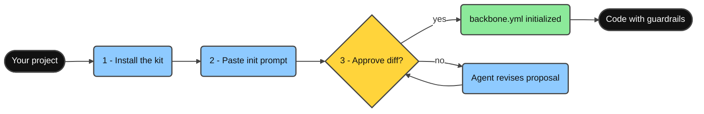
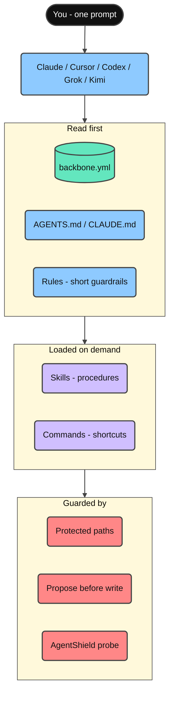
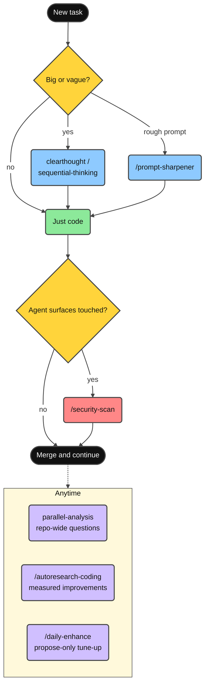
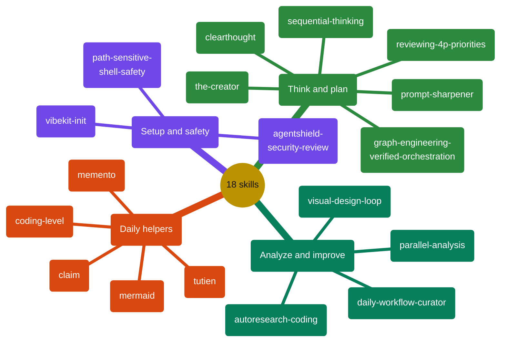
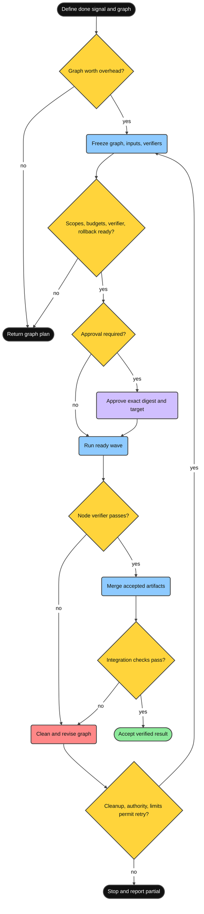
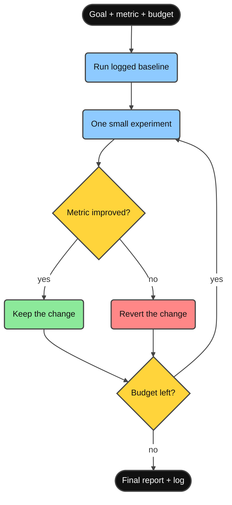

<div align="center">

**Read in:** **English** · [Tiếng Việt](docs/README.vi.md) · [简体中文](docs/README.zh-CN.md)

# Minimal Vibe Coding Kit

[](LICENSE)
[](https://www.npmjs.com/package/minimal-vibe-coding-kit)
[](CHANGELOG.md)


**One installable AI-coding workflow kit for Claude Code, Cursor, Codex, Grok, and Kimi - any repo, any language.**

Install → paste one prompt → approve the proposal → code with guardrails.

</div>

---

## What is this?

A small kit of shared **rules**, **skills**, and **commands**, plus one **`backbone.yml`** manifest, so Claude Code, Cursor, Codex, Grok, and Kimi all understand your project the same way.

- Never overwrites your existing `CLAUDE.md` / `AGENTS.md` - it only adds managed blocks.
- Every setup write waits for your explicit approval.
- Security review of agent surfaces (AgentShield) is part of the normal workflow.
- Safe deletes by default: all agents prefer the recoverable `trash` command (init checks it and recommends an install if missing), backed by each tool's documented guardrail config - Claude Code deny rules (`.claude/settings.json`), Cursor CLI permissions (`.cursor/cli.json`), Codex execution-policy rules (`.codex/rules/`, experimental, active once the project is trusted), and Grok project permission rules (`.grok/config.toml`).
- First-time init asks two setup preferences - use `trash` instead of `rm`, and your default explanation level (0-5, changeable anytime with `/coding-level N`) - and records both in `backbone.yml`.

## Quick Start

Three steps, about two minutes.



**1. Install into your project** (no clone needed):

```bash
npx --yes minimal-vibe-coding-kit@latest install /path/to/your-project
```

Already ran `npm i minimal-vibe-coding-kit`, or prefer GitHub or a local clone? See [Install from npm](#install-from-npm).

**2. Open the project in Claude Code, Cursor, Codex, Grok, or Kimi Code and paste:**

```text
Read .vibekit/init/FIRST_TIME_INIT.md and initialize this repo with Minimal Vibe Coding Kit.
First print the requirements you will check. Then run detection, propose one diff
for backbone.yml and managed instruction blocks, and wait for my yes before writing.
```

**3. Review the proposed diff and answer `yes`.**

The agent fills `backbone.yml` with your detected stack and conventions and flips it to `initialized`. Done - every later session reads it automatically and skips init.

Optional health check any time:

```bash
node .vibekit/scripts/mvck.mjs doctor .
```

## Install from npm

The kit is published on npm as [`minimal-vibe-coding-kit`](https://www.npmjs.com/package/minimal-vibe-coding-kit). It is a **scaffolding CLI, not a library** - files sitting in `node_modules/` do nothing by themselves. Running `install` once copies the kit into your repo root, exactly like the GitHub installer does.

**Option A - one-shot (recommended).** Nothing is added to your project's dependencies:

```bash
npx --yes minimal-vibe-coding-kit@latest install /path/to/your-project
```

**Option B - as a dependency.** If the package is (or will be) in your `package.json`, one more command is required:

```bash
npm i -D minimal-vibe-coding-kit
npx mvck install .        # required - copies the kit out of node_modules into your repo
```

> **Important:** `npm i` alone only downloads the kit into `node_modules/` - nothing is active yet.
> `mvck install` is the step that copies `.claude/`, `.cursor/`, `.agents/`, `.grok/`, `.kimi-code/`, `.vibekit/`, and `backbone.yml` into your repo root.

Either way, the short `mvck` command (alias: `vibe-kit`) is then available via `npx`:

| Short command         | What it does                                                     |
| --------------------- | ---------------------------------------------------------------- |
| `npx mvck install .`  | Copy the kit into the repo (`--profile`, `--dry-run`, `--force`) |
| `npx mvck update .`   | Refresh kit-owned files after a new kit release                  |
| `npx mvck doctor .`   | Read-only health check (`--run-repo-checks` also runs repo validation and probe) |
| `npx mvck validate .` | Structure validation                                             |

Then continue with **step 2** of the Quick Start (paste the init prompt).

Other install paths: `npx github:giang6283623/minimal-vibe-coding-kit install /path/to/your-project`, or from a local clone `./install.sh /path/to/your-project` (Windows: `./install.ps1 -Target C:\path\to\your-project`).

## What lands in your repo

Install adds exactly this - nothing else in your project is touched:

```text
your-project/
├── backbone.yml              ← project map agents read first (single source of truth)
├── AGENTS.md                 ← shared agent instructions (managed block)
├── CLAUDE.md                 ← short; imports AGENTS.md (created only if missing)
├── .gitignore                ← kit entries appended inside a managed block
├── .claude/                  ← Claude Code: rules, commands, agents, skills
├── .cursor/                  ← Cursor: rules, commands, skills
├── .agents/                  ← Codex / portable skills
├── .codex/  .codex-plugin/   ← Codex config example + plugin manifest
├── .grok/                    ← Grok Build: rules, skills, config example
├── .kimi-code/                    ← Kimi Code: skills (highest-priority project skills dir)
└── .vibekit/                 ← everything kit-owned, in ONE folder
    ├── skills/               ← canonical shared skills (mirrored to the harness dirs)
    ├── commands/             ← shared command prompts
    ├── scripts/              ← mvck CLI, init, validate, doctor, security probe
    ├── docs/                 ← deeper references
    └── init/                 ← one-time onboarding files (removable via /vibe-finalize)
```

Existing files are never replaced - the kit merges managed blocks (`BEGIN/END: minimal-vibe-coding-kit`) and skips anything you already own.

## How the pieces connect



- **`backbone.yml`** - paths, conventions, protected paths, and the validate command for your repo.
- **Rules** - short, always-loaded guardrails (read backbone first, small diffs, security review on agent surfaces).
- **Skills** - repeatable procedures, loaded only when a task needs them.
- **Commands** - one-word shortcuts to the most common skills.

## Guide - day-to-day usage



<details>
<summary><strong>Read more</strong></summary>

1. **Just code.** Ask for features and fixes normally; the agent follows `backbone.yml` conventions and keeps diffs small.
2. **Big or vague task?** Start with the `clearthought` or `sequential-thinking` skill to get a plan first.
3. **Complex task but only a rough prompt?** `/prompt-sharpener <rough prompt>` sharpens it into a precise prompt and executes it in the same turn.
4. **Found a skill, rule, or tool you want to bring in?** `/claim <request + links>` validates the sources against official docs, checks fit with your repo, asks when unclear, then integrates and documents it.
5. **Want a quiet reset while reviewing progress?** `/tutien` is a private xianxia coding-reflection mode over Git history + supplied AI-chat exports. Once enabled, every reply keeps an adaptive cultivation-novel voice in the user's language until `/tutien off`; eligible workflow villains default to evidence-bound sarcasm and mockery. Activation asks for an optional `humiliation=0..10` level that can stage increasingly severe defeat for the fictional cultivation avatar while preserving real-person hard boundaries. Its living chronicle grows an original project-specific world, cast, sects, cultivation system, and ordered chapters in Vietnamese, English, or Simplified Chinese.
6. **Repo-wide question or big review?** Use `parallel-analysis` - it fans out read-only analysis lanes and verifies the merged result.
7. **Changed `.claude/`, skills, hooks, or installer scripts?** Run `/security-scan` before merging.
8. **Want measurable improvements?** Run `/autoresearch-coding` with a metric and budget.
9. **Keep the setup sharp:** `/daily-enhance` proposes improvements - it never applies them silently.
10. **Onboarding finished for good?** `/vibe-finalize` moves one-time bootstrap files out.

</details>

## Commands

```mermaid
---
config:
  theme: base
  themeVariables:
    fontFamily: cascadia mono, consolas, noto sans mono, menlo, monospace
    fontSize: 15px
    lineColor: "#444444"
    textColor: "#111111"
    edgeLabelBackground: "#FFFFFF"
    clusterBkg: "#FFF9DB"
    clusterBorder: "#444444"
---
flowchart LR
    subgraph SetupPhase["Setup"]
        Init("/init-vibe<br/>one diff, your yes")
    end
    subgraph DailyPhase["Every day"]
        Scan("/security-scan<br/>agent surfaces")
        Enhance("/daily-enhance<br/>propose-only")
    end
    subgraph ImprovePhase["Improve"]
        Auto("/autoresearch-coding<br/>metric loop")
        Council("/council<br/>merged plan")
    end
    subgraph GradPhase["Graduate"]
        Final("/vibe-finalize<br/>cleanup bootstrap")
    end
    SetupPhase --> DailyPhase --> ImprovePhase --> GradPhase

    classDef terminal fill:#111111,stroke:#444444,stroke-width:2px,color:#FFFFFF
    classDef step fill:#8ECAFF,stroke:#444444,stroke-width:2px,color:#111111
    classDef success fill:#8CE99A,stroke:#444444,stroke-width:2px,color:#111111
    classDef danger fill:#FF8787,stroke:#444444,stroke-width:2px,color:#111111
    classDef accent fill:#D0BFFF,stroke:#444444,stroke-width:2px,color:#111111
    linkStyle default stroke:#444444,stroke-width:1.5px

    class Init step
    class Scan danger
    class Enhance,Council accent
    class Auto success
    class Final terminal
```



<details>
<summary><strong>Read more</strong></summary>

| Command                | What it does                                                                | Example                                                            |
| ---------------------- | --------------------------------------------------------------------------- | ------------------------------------------------------------------ |
| `/init-vibe`           | First-time init or repair: propose one diff, wait for approval.             | `/init-vibe` - then review the diff and answer `yes`.              |
| `/security-scan`       | Read-only AgentShield probe + optional scanner over agent surfaces.         | `/security-scan` before merging changes to `.claude/**` or skills. |
| `/daily-enhance`       | Propose-only report to improve rules, skills, and workflows.                | `/daily-enhance` - review the proposed diff, then approve.         |
| `/autoresearch-coding` | Metric-driven experiment loop with baseline and budget.                     | `/autoresearch-coding` Goal: fewer lint errors. Budget: 3.         |
| `/council`             | Coordinates reviewer/researcher/analyst agents into one merged plan.        | `/council` on this branch diff.                                    |
| `/vibe-finalize`       | Graduate the project: move one-time bootstrap files to `_vibekit-cleanup/`. | `/vibe-finalize` - preview first, apply after approval.            |

</details>

## Skills

All 18 skills live canonically in `.vibekit/skills/`. Claude, Codex, Grok, and Kimi mirror all 18; Cursor mirrors the 13 interactive ones. Invoke them by name ("Use the X skill…") or via the commands above.



<details>
<summary><strong>Read more</strong></summary>

| Skill                         | Use it when                                                                                                                                                                                                                              | Example prompt                                                                                        |
| ----------------------------- | ---------------------------------------------------------------------------------------------------------------------------------------------------------------------------------------------------------------------------------------- | ----------------------------------------------------------------------------------------------------- |
| `vibekit-init`                | First-time setup, or `backbone.yml` / managed blocks need repair.                                                                                                                                                                        | "Use the vibekit-init skill. Propose one diff and wait for my yes."                                   |
| `parallel-analysis`           | Repo-wide questions, large diff reviews, consistency audits.                                                                                                                                                                             | "Use parallel-analysis: where is auth handled and what depends on it?"                                |
| `graph-engineering-verified-orchestration` | Complex work has genuinely independent branches and needs explicit dependencies, isolation, budgets, objective verification, rollback, and bounded merge gates. | "Use graph-engineering-verified-orchestration to design a safe task graph for this migration." |
| `agentshield-security-review` | Auditing agent config, skills, hooks, MCP, commands before merge.                                                                                                                                                                        | "Use agentshield-security-review on .claude/** and .vibekit/skills/**."                               |
| `autoresearch-coding`         | Improving the repo through measured experiments.                                                                                                                                                                                         | "Use autoresearch-coding. Metric: `npm test`. Direction: higher. Budget: 3."                          |
| `daily-workflow-curator`      | Periodic tune-up of rules, skills, and workflows (propose-only).                                                                                                                                                                         | "Use daily-workflow-curator and propose today's improvements."                                        |
| `path-sensitive-shell-safety` | Before editing shell/installer/deploy logic with path variables or `rm`/`mv`/`rsync`.                                                                                                                                                    | "Use path-sensitive-shell-safety before changing this cleanup script."                                |
| `visual-design-loop`          | UI polish: render → screenshot → review → fix, in a loop.                                                                                                                                                                                | "Use visual-design-loop on /dashboard. Budget 3 loops."                                               |
| `clearthought`                | Ambiguous requirements, design tradeoffs, risky decisions.                                                                                                                                                                               | "Use clearthought. Operation: implementation_plan. Split this feature into safe tasks."               |
| `sequential-thinking`         | Step-by-step decomposition of complex work.                                                                                                                                                                                              | "Use sequential-thinking. Break this refactor into ordered steps with tests."                         |
| `reviewing-4p-priorities`     | Triaging bugs/findings into P0-P4 fix order.                                                                                                                                                                                             | "Use reviewing-4p-priorities. Classify these findings and give a fix sequence."                       |
| `memento`                     | Multi-day tasks: save context before stopping, resume next session.                                                                                                                                                                      | "/memento - write MEMENTO.md with Goal, Done, Stuck, Next."                                           |
| `coding-level`                | Setting how detailed explanations should be (0 = ELI5 … 5 = expert).                                                                                                                                                                     | "/coding-level 2"                                                                                     |
| `prompt-sharpener`            | A complex task but only a rough prompt: sharpen it, then execute it in the same turn.                                                                                                                                                    | "/prompt-sharpener make the settings page load faster"                                                |
| `claim`                       | Bringing something new into the repo (skill, rule, convention, tool): vet sources against official docs, fit-check, confirm, integrate, document.                                                                                        | "/claim add the conventional-commits rule from https://www.npmjs.com/package/minimal-vibe-coding-kit" |
| `tutien`                      | A private, user-invoked xianxia coding-reflection mode with exact Git/chat evidence and an open-ended chronicle. While on, every reply uses an adaptive cultivation voice in the user's language; an explicit `humiliation=0..10` controls fictional-avatar defeat intensity; `/tutien off` restores normal prose. | "/tutien on humiliation=8"                                                                          |
| `the-creator`                 | Creating original but workable art, designs, interfaces, methods, processes, or systems through ten cumulative creativity levels while preserving safety, logic, and functional acceptance. | "Use the-creator level 7 to invent a safer code-review process." |
| `mermaid`                     | Generating styled Mermaid diagrams (31 types) with coding-level-aware density. Offers to illustrate generated docs, and draws debug workflow charts with the risky zones highlighted red.                                                                | "Use the mermaid skill. Draw this deploy pipeline as a flowchart."                                    |

With `story=on` (default), approved analysis prepares `.vibekit/reports/tutien/story/`: `plot.md` is the evolving world/plot bible, `story-state.json` preserves continuity, and `chapters/NNNN-<xianxia-title>.md` stores one chapter per save. Story prose is agent-authored from aggregate evidence rather than a fixed sentence bank; character names and dialogue follow `story-language=vi|en|zh` naturally.

</details>

### Graph engineering: verified orchestration

This is a **user-invoked skill**, not an always-on rule or a provider-specific workflow. Use it when a graph has a plausible time/cost benefit or reduces coordination risk. Every edge must carry a named artifact; mutable work needs enforceable isolation; and only objectively verified outputs reach the final merge. If authority, budgets, rollback, or verifiers are unresolved, the skill returns a graph plan instead of executing.



<details>
<summary><strong>Read more: a real example</strong></summary>

**Case - migrate three services to one structured logger.** A monorepo has `billing/`, `auth/`, and `reports/`, each calling a legacy logger from its own files. This matches the skill's trigger exactly: three bounded work items, branches that share no files, and one objective verifier (the test suite).

- **When**: the work splits into three or more bounded items with two or more genuinely independent branches, and a graph plausibly saves time or reduces coordination risk.
- **Where**: repos where write ownership separates cleanly (per service, package, or doc set) and tests or schemas can verify results from outside the writers' scope.
- **Why**: enforced isolation prevents overlapping writes, every edge carries a named artifact so no imagined dependency serializes the work, and only verified diffs reach the single merge owner.
- **When not**: fewer than three items, branches that touch the same files, or no objective verifier - a plain sequential edit is cheaper, and the skill says so by returning a graph plan instead of executing.

```text
Use graph-engineering-verified-orchestration.
Goal: replace the legacy logger with structlog in billing/, auth/, reports/.
Done signal: npm test passes and no legacy logger import remains.
Editable paths: billing/ auth/ reports/. Protected paths: tests/ and configs.
```

How this case runs as a graph - every edge carries the named artifact the next node consumes:


The three migrate nodes run as one wave because their write scopes never overlap; the test oracle stays protected outside those scopes; a failed diff is quarantined and revised without blocking accepted ones; and the human gate approves the exact combined diff before anything lands.

</details>

## Advanced

### Install profiles

Install only the surfaces you use (default is `all`):

```bash
npx --yes minimal-vibe-coding-kit@latest install . --profile claude          # Claude Code only
npx --yes minimal-vibe-coding-kit@latest install . --profile claude,cursor   # Claude + Cursor
npx --yes minimal-vibe-coding-kit@latest install . --profile codex           # Codex / AGENTS.md agents
npx --yes minimal-vibe-coding-kit@latest install . --profile grok            # Grok Build CLI
npx --yes minimal-vibe-coding-kit@latest install . --profile kimi            # Kimi Code CLI
```

Flags: `--force` (overwrite existing kit files), `--dry-run` (preview), `--json` (machine-readable plan).

### Updating an installed project

Run inside your project when the kit ships new skills or scripts:

```bash
npx --yes minimal-vibe-coding-kit@latest update . --dry-run   # preview
npx --yes minimal-vibe-coding-kit@latest update .             # apply
```

`update` refreshes **kit-owned files only**, never touches `backbone.yml` or your own content, updates managed blocks in place, and backs up changed files to `.vibekit/update-backup/<timestamp>/`. Details: [.vibekit/docs/INSTALL.md](.vibekit/docs/INSTALL.md).

### Autoresearch loop

```text
Use the autoresearch-coding skill.
Goal: improve maintainability. Metric command: <your validate command>. Direction: higher.
Editable paths: src/ docs/. Protected paths: .git .env* node_modules lockfiles.
Budget: 3.
```

Contract: baseline first → one small experiment at a time → keep only metric-positive changes → log everything.



### Security review (AgentShield)

```bash
node .vibekit/scripts/agentshield-probe.mjs .                          # fast read-only probe
npx ecc-agentshield scan --path . --format text --min-severity medium  # optional full scan
```

Any change to `CLAUDE.md`, `AGENTS.md`, `.claude/**`, `.cursor/**`, `.agents/**`, `.grok/**`, `.kimi-code/**`, `.codex-plugin/**`, or `.vibekit/skills|commands|scripts/**` should trigger a review. Model: [.vibekit/docs/SECURITY_MODEL.md](.vibekit/docs/SECURITY_MODEL.md).

### Doctor and reports

```bash
node .vibekit/scripts/mvck.mjs doctor .                 # read-only health check (add --run-repo-checks to run repo validation and probe)
node .vibekit/scripts/mvck.mjs doctor . --write-report  # writes VIBE_REPORT.md
node .vibekit/scripts/daily-enhance.mjs . --write-report
```

### For kit developers

```bash
npm test                # syntax + real temp-dir install test + structure validation
npm run validate:all    # npm test + AgentShield probe + npm pack dry-run
```

Publishing checklist: [.vibekit/init/PUSH_TO_GITHUB.md](.vibekit/init/PUSH_TO_GITHUB.md). Deeper docs: [.vibekit/docs/](.vibekit/docs/).

<details>
<summary><strong>Troubleshooting</strong></summary>

| Symptom                             | Fix                                                                                                                |
| ----------------------------------- | ------------------------------------------------------------------------------------------------------------------ |
| Agent ignores the init flow         | Re-run the installer, or copy [.vibekit/init/CLAUDE-template.md](.vibekit/init/CLAUDE-template.md) to `CLAUDE.md`. |
| Agent re-asks to init every session | Run init and approve; confirm `meta.template_status: initialized` in `backbone.yml`.                               |
| Wrong stack detected                | Remove stale lockfiles, or edit `backbone.yml` directly.                                                           |
| Agent touches a path it shouldn't   | Add the path to `policy.protected_paths` in `backbone.yml` (globs supported).                                      |
| AgentShield probe warning           | Install Python 3, or ignore - it is a warning, not a failure.                                                      |
| Scripts missing after install       | Re-run install with `--force`, or copy `.vibekit/scripts/` manually.                                               |

</details>

## Contributing

Issues and PRs welcome at [`giang6283623/minimal-vibe-coding-kit`](https://github.com/giang6283623/minimal-vibe-coding-kit). Before a PR: mirror skill changes across `.claude/`, `.cursor/`, `.agents/`, `.grok/`, `.kimi-code/`, keep templates project-neutral, and run `npm run validate:all`. See [CONTRIBUTING.md](CONTRIBUTING.md), [SECURITY.md](SECURITY.md), [CODE_OF_CONDUCT.md](CODE_OF_CONDUCT.md).

**Created by:** [GiangBV](https://www.linkedin.com/in/buivangiang1992), [AuPMH](https://www.linkedin.com/in/pham-au-2a1bb1162)
**Powered by:** Caffeine, Determination, AI Collaboration, and Weekend Coding Sessions.

## License

MIT. See [LICENSE](LICENSE).

<!-- user-authored dedication: keep the Vietnam flag emoji; exempt from the writing-style emoji rule -->
> 🇻🇳 _If you love Vietnam and its people, you are fully free to use everything in here at no cost._
