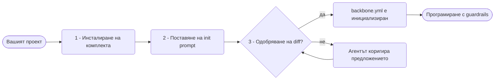
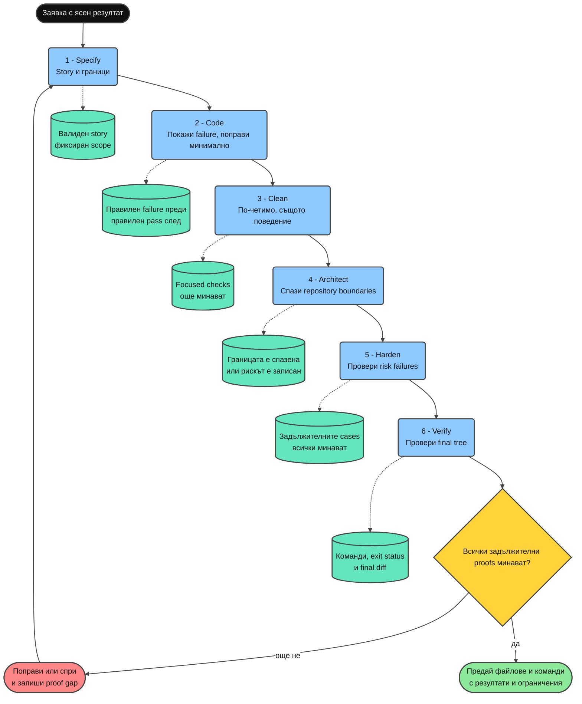

<div align="center">

**Прочетете на:** [English](../README.md) · [Tiếng Việt](README.vi.md) · [简体中文](README.zh-CN.md) · [日本語](README.ja.md) · [한국어](README.ko.md) · [Deutsch](README.de.md) · **Български**

# Minimal Vibe Coding Kit

> **Бележка:** Поради няколко причини ще продължа да разработвам отделна Premium версия вместо тази OSS версия. Premium версията ще бъде изцяло преработена и ще включва повече оригинални идеи, основани на опита и многократните проби и грешки в моите проекти и проектите на приятелите ми преди всяка актуализация. Тази OSS версия ще остане тук като резервен вариант за всеки, който все още се нуждае от нея и я намира за полезна.

[](../LICENSE)
[](https://www.npmjs.com/package/minimal-vibe-coding-kit)
[](../CHANGELOG.md)


**Инсталируем комплект за AI програмиране с Claude Code, Cursor, Codex, OpenCode, Grok и Kimi. За всяко хранилище и всеки език.**

Инсталирайте → поставете един prompt → прегледайте предложението → програмирайте с guardrails.

Ако този комплект наистина ви помага, дайте звезда на хранилището. Така разбирам, че е полезен за още един човек, и получавам енергия да продължа да го подобрявам.

</div>

---

## Какво представлява този комплект?

Малък комплект от споделени **правила**, **умения** и **команди**, заедно с един manifest **`backbone.yml`**, така че Claude Code, Cursor, Codex, OpenCode, Grok и Kimi да разбират проекта ви по един и същ начин.

- Никога не презаписва съществуващите `CLAUDE.md` или `AGENTS.md`. Добавя само управлявани блокове.
- Всяка операция за запис по време на настройването чака изричното ви одобрение.
- Проверката за сигурност на agent повърхностите с AgentShield е част от нормалния workflow.
- За изтриване всички агенти предпочитат възстановимата команда `trash`.
- При първоначалната настройка се избират безопасно изтриване и ниво на обяснение, които се записват в `backbone.yml`.

## Бърз старт

Три стъпки, около две минути.



**1. Инсталирайте комплекта в проекта си.** Не е необходимо да клонирате хранилището.

```bash
npx --yes minimal-vibe-coding-kit@latest install /path/to/your-project
```

**2. Отворете проекта в Claude Code, Cursor, Codex, OpenCode, Grok или Kimi Code и поставете следния prompt:**

```text
Read .vibekit/init/FIRST_TIME_INIT.md and initialize this repo with Minimal Vibe Coding Kit.
First print the requirements you will check. Then run detection, propose one diff
for backbone.yml and managed instruction blocks, and wait for my yes before writing.
```

**3. Прегледайте предложения diff и отговорете с `yes`.**

Агентът попълва `backbone.yml` с откритите технологии и правила и сменя състоянието на `initialized`. Всяка следваща сесия автоматично прочита този файл първо.

По всяко време можете да изпълните проверка само за четене:

```bash
node .vibekit/scripts/mvck.mjs doctor .
```

## Инсталиране от npm

Комплектът се публикува в npm като [`minimal-vibe-coding-kit`](https://www.npmjs.com/package/minimal-vibe-coding-kit). Това е scaffolding CLI, а не библиотека. Файловете в `node_modules/` не са активни сами по себе си.

**Опция A, еднократно инсталиране, препоръчително:**

```bash
npx --yes minimal-vibe-coding-kit@latest install /path/to/your-project
```

**Опция B, като development dependency:**

```bash
npm i -D minimal-vibe-coding-kit
npx mvck install .
```

> `npm i` само изтегля пакета. `npx mvck install .` копира файловете на комплекта в корена на хранилището и ги активира.

| Кратка команда | Действие |
| --- | --- |
| `npx mvck install .` | Копира комплекта в хранилището. Поддържа `--profile`, `--dry-run` и `--force`. |
| `npx mvck update .` | Обновява файловете на комплекта след нова версия. |
| `npx mvck doctor .` | Изпълнява проверка само за четене. |
| `npx mvck validate .` | Проверява структурата. |

Директно инсталиране от GitHub: `npx github:giang6283623/minimal-vibe-coding-kit install /path/to/your-project`.

## Какво се добавя в хранилището

```text
your-project/
├── backbone.yml              ← карта на проекта, която агентите четат първо
├── AGENTS.md                 ← споделени инструкции в управляван блок
├── CLAUDE.md                 ← кратка входна точка, само ако липсва
├── .gitignore                ← записи на комплекта в управляван блок
├── .claude/                  ← правила, команди, агенти и умения за Claude Code
├── .cursor/                  ← правила, команди и умения за Cursor
├── .agents/                  ← преносими умения за Codex
├── .codex/  .codex-plugin/   ← примерна Codex конфигурация и plugin manifest
├── .opencode/                ← OpenCode commands and integration guide
├── .grok/                    ← правила, умения и примерна конфигурация за Grok
├── .kimi-code/               ← проектни умения за Kimi Code
└── .vibekit/                 ← всички файлове, притежавани от комплекта
    ├── skills/               ← канонични умения
    ├── commands/             ← споделени command prompts
    ├── scripts/              ← CLI, init, validation и security probe
    ├── docs/                 ← подробна документация
    └── init/                 ← еднократни onboarding файлове
```

Съществуващите файлове не се заменят. Комплектът обединява управляваните блокове `BEGIN/END: minimal-vibe-coding-kit` и пропуска файлове, които вече са ваши.

## Как са свързани частите

- **`backbone.yml`**: единствен източник за пътища, правила, защитени пътища и командата за validation.
- **Правила**: кратки guardrails, които винаги се зареждат.
- **Умения**: повторяеми процедури, зареждани само когато задачата ги изисква.
- **Команди**: кратки входни точки към най-често използваните умения.

## Ежедневна употреба

1. Заявявайте функции и поправки нормално. Агентът следва правилата в `backbone.yml`.
2. Започвайте голяма или неясна задача с `clearthought` или `sequential-thinking`.
3. Използвайте `/prompt-sharpener`, ако разполагате само с груб prompt. Той се уточнява и изпълнява в същия turn.
4. Проверявайте нови умения, инструменти и URL адреси с `/claim` спрямо официални източници преди интегриране.
5. Използвайте `parallel-analysis` за въпроси върху цялото хранилище и големи review задачи.
6. Изпълнявайте `/security-scan` преди merge при промяна на agent конфигурация, умения, hooks или installer scripts.
7. Използвайте `/autoresearch-coding` с metric и budget за измерими подобрения.
8. След приключване на onboarding използвайте `/vibe-finalize` за еднократните файлове.

## Команди

| Команда | Действие | Пример |
| --- | --- | --- |
| `/init-vibe` | Инициализира или поправя комплекта, предлага един diff и чака одобрение. | `/init-vibe` |
| `/security-scan` | Проверява agent повърхностите само за четене. | `/security-scan` преди merge |
| `/daily-enhance` | Предлага подобрения на правила и workflows, без да ги прилага скрито. | `/daily-enhance` |
| `/autoresearch-coding` | Изпълнява metric loop с baseline и budget. | `Goal: fewer lint errors. Budget: 3.` |
| `/clean-delivery` | Доставя едно поведение през шест пропорционални quality gates. | `Goal: add rate limiting. Risk: medium.` |
| `/council` | Избира provider mode и координира само необходимите роли. | `/council` on this branch diff |
| `/proofline` | Управлява отделени роли, независима критика и приемане според доказателства. | `Goal: harden auth.` |
| `/vibe-finalize` | Премества еднократните bootstrap файлове в cleanup папка. | `/vibe-finalize` |

### Избор при множество агенти

Непосредствено преди първия подагент или паралелен lane родителят пита за Default, Auto или Custom чрез структурирания question tool на активния provider, когато е наличен. Default запазва текущия provider и стандартния му модел. Auto използва само потвърдени като готови adapters и избира най-евтиния модел над прага за качество и безопасност на задачата. Custom задава проверен provider и модел за всяка роля.

"Don't show again" записва избора в `.vibekit/preferences.json`. Подагентите не питат потребителя директно, а връщат `needs_user_input` към родителя. Вижте [ORCHESTRATION_MODES.md](../.vibekit/docs/ORCHESTRATION_MODES.md).

Опционалното Cursor SDK routing използва актуалния model каталог на акаунта, ограничени local tool профили и запомнени adapter и model. Настройката и смяната на model са описани в [CURSOR_SDK.md](../.vibekit/docs/CURSOR_SDK.md).

## Умения

Всички 26 умения се намират канонично в `.vibekit/skills/`. Claude, Codex, OpenCode, Grok и Kimi огледално поддържат всичките 26, а Cursor поддържа 21-те интерактивни умения.

| Умение | Кога да го използвате |
| --- | --- |
| `vibekit-init` | Първоначална настройка или поправка на `backbone.yml` и управлявани блокове |
| `parallel-analysis` | Въпроси върху цялото хранилище, големи diff review задачи и проверки за последователност |
| `graph-engineering-verified-orchestration` | Три или повече ограничени задачи изискват зависимости, изолация, бюджети, verification и rollback |
| `clean-delivery` | Едно поведение трябва да премине през Specify, Code, Clean, Architect, Harden и Verify |
| `proofline-orchestration` | Сложна работа изисква независима критика и приемане според доказателства |
| `agent-control-center` | Един проверен controller трябва да координира ограничени native или cross-provider workers |
| `swap-control-center` | Потребителят трябва да избере проверени controller provider, transport, model и reasoning effort, докато активният host запазва правото за изпълнение |
| `agentshield-security-review` | Security review на agent конфигурация, умения, hooks, MCP и команди |
| `threat-model-security-review` | Threat model за application source, authentication, authorization и input paths |
| `autoresearch-coding` | Подобряване на хранилището чрез измерими експерименти |
| `daily-workflow-curator` | Периодични предложения за подобрение на правила и workflows |
| `path-sensitive-shell-safety` | Преди промяна на shell, installer или deployment логика с path variables или команди за изтриване |
| `clearthought` | Структуриране на неясни изисквания или множество валидни design решения |
| `sequential-thinking` | Разделяне на сложни проблеми на стъпки според доказателства и коригиране на хипотези |
| `reviewing-4p-priorities` | Класифициране на проблеми и рискове от P0 до P4 |
| `prompt-sharpener` | Уточняване и незабавно изпълнение на груб prompt |
| `visual-design-loop` | Одобрен screenshot-based loop за подобряване на видим интерфейс |
| `memento` | Устойчива бележка за задача, продължаваща няколко дни |
| `coding-level` | Настройване на подробността на обясненията от 0 до 5 |
| `claim` | Проверка на нови инструменти, умения и URL адреси спрямо официални източници |
| `clone-website` | Клониране или миграция на разрешен уебсайт с ясни граници за права, точност, обхват, стек, бекенд, заснемане и проверка |
| `model-provider-settings` | Безопасно обновяване на native model, reasoning, context и compaction настройки според актуалната официална документация |
| `wait-what` | Когато последният отговор не е разбран: ново обяснение на прост език, на езика на потребителя, с речника на проекта |
| `tutien` | Частен xianxia coding reflection mode според Git и предоставени chat доказателства |
| `the-creator` | Оригинална творческа работа, когато потребителят изрично поиска creativity level |
| `mermaid` | Създаване на стилизирани Mermaid диаграми |

### Proofline: AI да не оценява сам собствената си работа

Proofline разделя отговорностите за изпълнение, критика, verification и записване на завършването. Така се намалява рискът един AI да избере подход, да промени кода и после сам да обяви работата си за правилна.

| Роля | Аналогия | Отговорност |
| --- | --- | --- |
| `Owner` | Продуктов собственик | Определя желания резултат и запазва крайните правомощия. |
| `Wayfinder` | Ръководител на обекта | Разделя работата, задава граници и обединява резултатите. |
| `Maker` | Квалифициран изпълнител | Реализира точно една възложена част. |
| `Countervoice` | Независим инспектор | Търси грешни предположения, пропуски и противоречиви доказателства. |
| `Verifier` | Test engineer | Изпълнява обективни тестове или измервания. |
| `Keeper` | Пазител на acceptance checklist | Записва завършване само когато всички gates са изпълнени. |

Използвайте Proofline за authentication, permissions, payments, sensitive data, migrations и големи refactors. За правописна грешка или малка обратима промяна в един файл е достатъчен прост sequential workflow.

```text
/proofline
Goal: make unknown login roles fail closed.
May edit: src/auth-policy.mjs
Must not edit: test/auth-policy.test.mjs
Done when: the authentication tests pass.
Limits: keep the API unchanged and install no packages.
```

Малките задачи използват един sequential worker. При нужда от независима критика се добавя `Countervoice`. Ако липсват надеждни тестове или необходимите правомощия, workflow връща само план или спира безопасно.

```bash
npm run test:proofline
node .vibekit/skills/proofline-orchestration/scripts/run-proofline-sandbox.mjs \
  .vibekit/skills/proofline-orchestration/examples/auth-migration-case.json
```

Вграденият validator симулира политики в текущия процес. Той не доказва, че операционната система, provider, MCP server или външна система действително са наложили всяка граница. Реален merge, deployment или външна промяна изисква ново `Owner` правомощие и външен gateway с устойчиво споделено състояние.

### Clean Delivery: една малка промяна, шест проверки

**Накратко:** Clean Delivery изпълнява една малка промяна в ясен ред. Всеки gate отговаря на един въпрос, оставя доказателство, което друг може да провери, и допуска следващата стъпка само когато условието му е изпълнено. Шестте gates са шест проверки на качеството, а не шест агента или шест паралелни workflows.

Например изискването "не записвай `NaN` в ledger" все още е неясно. Clean Delivery го превръща в измерим резултат: всяка non-finite стойност трябва да бъде отхвърлена преди запис, ledger трябва да остане непроменен при грешка, а finite стойностите трябва да продължат да се приемат. Следват implementation, почистване на кода, проверка на границите на хранилището, failure cases и повторна проверка върху финалното състояние.

В този раздел **доказателство** означава команда за проверка, съответния резултат и exit status. Ако хранилището няма подходяща команда, може да се използва технически review с ясно определен scope. Липсваща задължителна проверка е `proof gap`, а не pass.

#### Какво реално се прави във всеки gate?

| Gate | Работа | Продължаваме само когато |
| --- | --- | --- |
| `Specify` | Напишете story с наблюдаемия резултат, файловете за промяна, защитените файлове и критериите за завършване. | Validator приема story, scope е фиксиран и важните тестове са отбелязани като защитени verifier assets. |
| `Code` | Първо покажете реалния дефект с проверка, после напишете най-малката корекция. | Същата проверка се проваля по очакваната причина преди промяната и минава след нея. Няма отслабен тест за false pass. |
| `Clean` | Подобрете имената, трудните за четене части и повторенията, без да добавяте поведение. | Focused check продължава да минава след всяко съществено почистване. |
| `Architect` | Проверете module boundaries, посоката на зависимостите и правилата в `backbone.yml`. | Architecture command минава или непроверената граница и оставащият риск са записани изрично. |
| `Harden` | Проверете failure paths според риска, например гранични стойности, права, no mutation при грешка или end-to-end поведение. | Всички проверки за risk tier минават. Липсваща проверка е `not-configured`, никога passed. |
| `Verify` | Изпълнете отново repository и story проверките върху точния final tree и прегледайте diff за scope drift. | Всички задължителни proofs минават, резултатите са записани и няма промяна извън story. |

#### Какво става, ако gate не премине?

- Gate не се пропуска и работата не се обявява за завършена.
- Ако проблемът е в implementation, той се поправя и съответната проверка се изпълнява отново.
- Ако желаният резултат трябва да се промени, върнете се към `Specify` и фиксирайте story отново.
- Ако липсва задължителен tool или proof, спрете безопасно и запишете `proof gap` плюс най-малкото решение, нужно от потребителя.
- Само зеленият клон след `Verify` е готов за handback.

#### Практически ползи

- Малък scope, замразен преди писането на код.
- Реален failure преди промяната и защитени тестове, които не могат да бъдат отслабени за false pass.
- Cleanup само след работещо поведение и повторно изпълнение на същия proof.
- Повече проверка само когато реалният риск го изисква.
- Липсващ verifier остава `not-configured` и никога не се брои за passed.
- Финалният handback посочва файлове, команди, резултати и оставащи ограничения.

#### Кога да го използвате?

| Използвайте Clean Delivery | По-прост workflow е достатъчен |
| --- | --- |
| Едно поведение изисква висока увереност и ясни acceptance criteria | Правописна грешка, коментар или механична промяна на текст |
| Изискват се TDD, clean code, architecture check или extreme craftsmanship | Read-only проучване или brainstorming |
| Тестове или validators трябва да бъдат защитени от implementation | Малка обратима промяна с една подходяща съществуваща проверка |

Голямо изискване се разделя на няколко независимо проверими Clean Delivery stories. Proofline или graph orchestration се добавят само когато независима критика, отделен ownership или паралелна работа носят реална полза.

#### Къде работи?

**Clean Delivery не е server, background application или външна услуга.** Това е workflow, който coding agent изпълнява директно в отвореното хранилище:

1. Прочита заявката, инструкциите на хранилището и `backbone.yml`.
2. Създава малко story, фиксира scope и определя защитените проверки.
3. Използва съществуващи repository commands като `npm test`.
4. Записва резултата от всеки gate и всеки `proof gap`.
5. Предава промяната с доказателства, които друг може да изпълни отново.

Clean Delivery не инсталира test framework, не активира hooks и не разширява права само за да изглежда, че gate е преминат.

#### Пълният поток и доказателството от всеки gate



**Как да четете диаграмата:**

1. Следвайте плътните стрелки отгоре надолу за реда на шестте gates.
2. Сините полета показват работата на agent във всеки gate.
3. Тюркоазените цилиндри с пунктирани връзки показват доказателството, което се пази след gate.
4. Жълтият ромб пита дали всички задължителни proofs са минали.
5. Червеният клон се връща към `Specify`, защото корекцията може да промени scope или acceptance criteria. Ако няма безопасна корекция, работата спира с ясен `proof gap`.
6. Зеленият клон се появява само след успешни проверки върху final tree.

**Извод от диаграмата:** завършена implementation в `Code` не означава завършена работа. Промяната е готова за handback едва когато `Verify` потвърди всички задължителни proofs върху финалното състояние на хранилището.

#### Най-лесният начин за начало

```text
/clean-delivery
Goal (наблюдаем резултат): отхвърляне на non-finite metrics преди запис на ledger row.
May edit (може да се променя): src/metric-ledger.py и focused tests.
Must not edit (защитено): съществуващи acceptance fixtures или release scripts.
Done when (проверимо условие): NaN и infinity fail без промяна на ledger, а finite стойностите pass.
Risk: medium.
```

| Ред в prompt | Значение |
| --- | --- |
| `Goal` | Наблюдаемият отвън резултат, не инструкция за implementation. |
| `May edit` | Файловете или директориите, които agent може да променя. |
| `Must not edit` | Tests, fixtures, scripts или области, които трябва да останат непроменени. |
| `Done when` | Условие, по което проверка може да реши pass или fail. |
| `Risk` | Минималният verification tier, който трябва да се приложи. |

#### Как рискът променя проверката?

| Ниво | Минимална проверка |
| --- | --- |
| `low` | Focused behavior check, repository validation и final diff review. |
| `medium` | Добавя acceptance evidence и review на architecture boundary. |
| `high` | Добавя security, failure paths, Protected verifier asset и independent verification, когато средата го поддържа надеждно. |
| `critical` | Добавя human approval, rollback evidence и independent final verifier. |

#### Реален пример: отхвърляне на невалидни metric стойности

| Gate | Какво се случва в примера | Доказателство за запазване |
| --- | --- | --- |
| `Specify` | Фиксира правилото: `NaN`, `Infinity`, `-Infinity` и overflow fail преди append, а ledger остава непроменен при грешка. | Валиден story с посочени editable files и protected tests. |
| `Code` | Показва дефекта с invalid metric case и добавя най-малката finite-number check. | Същият case правилно fail преди промяната и pass след нея. |
| `Clean` | Прави parsing и error handling четими, без да променя формата на валидните metrics. | Проверките за finite и non-finite metrics още минават. |
| `Architect` | Държи validation на границата, където metric става ledger row, вместо да я разпръсва по callers. | Boundary review или repository architecture command. |
| `Harden` | Проверява `NaN`, двата знака на infinity, overflow, произволен text и no write при грешка. | Резултатите от всеки case и доказателство, че ledger не е променен. |
| `Verify` | Изпълнява всички обещани commands върху final tree и преглежда diff за scope drift. | Commands, exit status, съответни резултати и оставащи ограничения. |

#### Термини в този раздел

| Термин | Просто значение |
| --- | --- |
| `Story` | Кратко описание на един резултат, editable scope и проверка за завършване. |
| `Red evidence` | Проверка, която преди implementation правилно fail заради липсващото поведение. |
| `Focused check` | Най-малката проверка, насочена директно към променяното поведение. |
| `Protected verifier asset` | Test, fixture, schema, snapshot, policy, benchmark input или validator, който implementation не трябва да отслабва. |
| `Proof gap` | Задължителна проверка, която липсва, не може да се изпълни или не е решена. |
| `Boundary` | Граница на отговорност между modules, layers или systems. |
| `Final tree` | Пълното финално състояние на файловете след implementation и cleanup. |

Валидирайте story с тези команди:

```bash
node .vibekit/skills/clean-delivery/scripts/validate-story.mjs path/to/story.md
npm run test:clean-delivery
```

Заменете `path/to/story.md` с реалния path към story. `null`, липсваща command или `not-configured: <причина>` означава, че няма verifier, а не че gate е passed. Вижте [skill contract](../.vibekit/skills/clean-delivery/SKILL.md), [story template](../.vibekit/skills/clean-delivery/references/story-template.md) и [verification tiers](../.vibekit/skills/clean-delivery/references/verification-tiers.md).

### Graph engineering: проверена orchestration

Това е умение, извиквано от потребителя, а не постоянно правило. Използвайте го при поне три задачи, поне два действително независими клона и реална полза за времето или координационния риск.

- Всеки edge предава именуван artifact към следващия node.
- Работата с промени изисква enforceable write isolation.
- Само обективно проверени резултати достигат до final merge.
- Ако правомощията, бюджетът, rollback или verifier не са изяснени, се връща graph plan вместо изпълнение.

```text
Use graph-engineering-verified-orchestration.
Goal: replace the legacy logger with structlog in billing/, auth/, reports/.
Done signal: npm test passes and no legacy logger import remains.
Editable paths: billing/ auth/ reports/. Protected paths: tests/ and configs.
```

Трите услуги могат да работят в една wave, защото притежават различни файлове. Test oracle остава защитен извън write scopes. Неуспешен diff се изолира и преработва. Само един merge owner интегрира проверените резултати.

## Разширена употреба

### Инсталационни профили

```bash
npx --yes minimal-vibe-coding-kit@latest install . --profile claude
npx --yes minimal-vibe-coding-kit@latest install . --profile claude,cursor
npx --yes minimal-vibe-coding-kit@latest install . --profile codex
npx --yes minimal-vibe-coding-kit@latest install . --profile opencode        # OpenCode / AGENTS.md, shared skills, commands
npx --yes minimal-vibe-coding-kit@latest install . --profile grok
npx --yes minimal-vibe-coding-kit@latest install . --profile kimi
```

`--force` презаписва съществуващи файлове на комплекта, `--dry-run` показва preview, а `--json` извежда machine-readable plan.

### Обновяване на инсталиран проект

```bash
npx --yes minimal-vibe-coding-kit@latest update . --dry-run
npx --yes minimal-vibe-coding-kit@latest update .
```

`update` обновява само файлове, притежавани от комплекта. Не променя `backbone.yml` или собственото ви съдържание и архивира заменените файлове в `.vibekit/update-backup/<timestamp>/`.

### Autoresearch loop

```text
Use the autoresearch-coding skill.
Goal: improve maintainability. Metric command: <your validate command>. Direction: higher.
Editable paths: src/ docs/. Protected paths: .git .env* node_modules lockfiles.
Budget: 3.
```

Договорът е: първо baseline, после по един малък експеримент, запазване само на подобренията и записване на всеки резултат.

### Проверка за сигурност

```bash
node .vibekit/scripts/agentshield-probe.mjs .
npx ecc-agentshield scan --path . --format text --min-severity medium
```

Промени в `CLAUDE.md`, `AGENTS.md`, `.claude/**`, `.cursor/**`, `.agents/**`, `.opencode/**`, `opencode.json`, `.grok/**`, `.kimi-code/**`, `.codex-plugin/**` или `.vibekit/skills|commands|scripts/**` трябва да предизвикат review.

### Doctor и отчети

```bash
node .vibekit/scripts/mvck.mjs doctor .
node .vibekit/scripts/mvck.mjs doctor . --write-report
node .vibekit/scripts/daily-enhance.mjs . --write-report
```

### За разработчици на комплекта

```bash
npm test
npm run validate:all
```

Checklist за публикуване: [PUSH_TO_GITHUB.md](../.vibekit/init/PUSH_TO_GITHUB.md). Подробна документация: [.vibekit/docs/](../.vibekit/docs/).

### Отстраняване на проблеми

| Симптом | Решение |
| --- | --- |
| Агентът пренебрегва init flow | Изпълнете installer отново или копирайте template в `CLAUDE.md`. |
| Агентът пита за init във всяка сесия | Одобрете init и проверете `meta.template_status: initialized`. |
| Открит е грешен stack | Премахнете остарели lockfiles или редактирайте `backbone.yml` директно. |
| Агентът променя защитен path | Добавете path към `policy.protected_paths`. |
| След инсталиране липсват scripts | Изпълнете install отново с `--force`. |

## Принос

Issues и PRs са добре дошли в [`giang6283623/minimal-vibe-coding-kit`](https://github.com/giang6283623/minimal-vibe-coding-kit). Преди PR огледално приложете промените по уменията към всички provider повърхности, запазете template файловете неутрални спрямо проекта и изпълнете `npm run validate:all`. Вижте [CONTRIBUTING.md](../CONTRIBUTING.md), [SECURITY.md](../SECURITY.md) и [CODE_OF_CONDUCT.md](../CODE_OF_CONDUCT.md).

**Създадено от:** [GiangBV](https://www.linkedin.com/in/buivangiang1992), [AuPMH](https://www.linkedin.com/in/pham-au-2a1bb1162)

**Задвижвано от:** кофеин, постоянство, AI сътрудничество и програмиране през уикенда.

## Лиценз

MIT. Вижте [LICENSE](../LICENSE).

> 🇻🇳 _Ако обичате Виетнам и неговите хора, можете свободно да използвате всичко тук безплатно._
