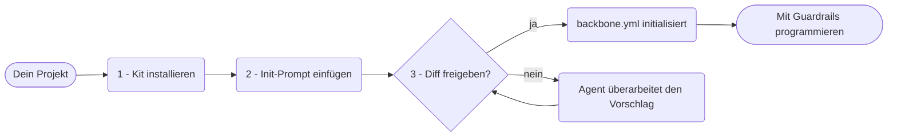
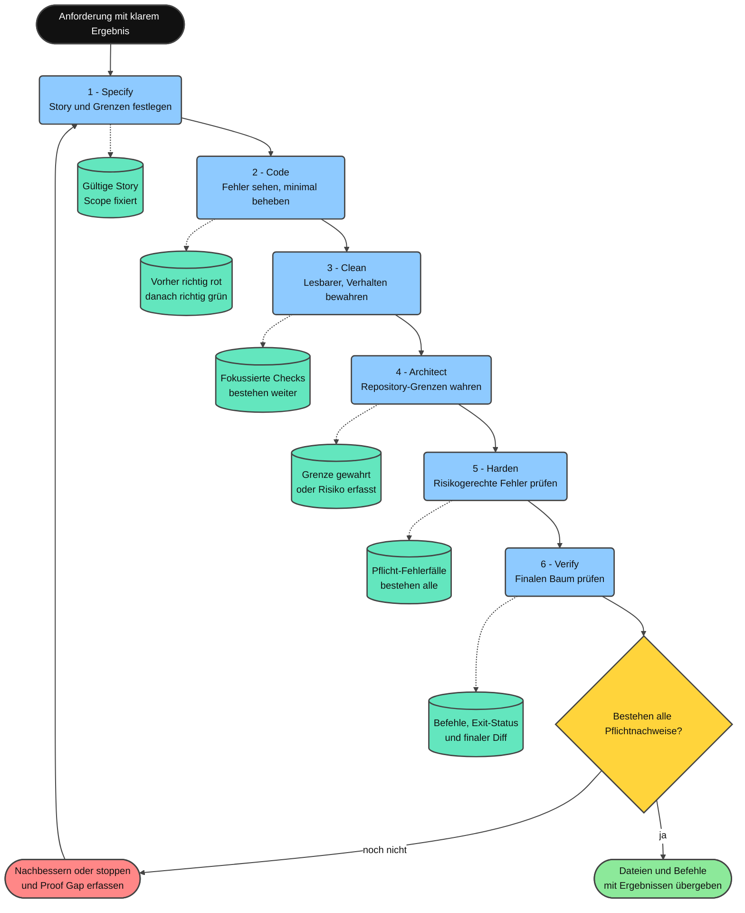

<div align="center">

**Lesen auf:** [English](../README.md) · [Tiếng Việt](README.vi.md) · [简体中文](README.zh-CN.md) · [日本語](README.ja.md) · [한국어](README.ko.md) · **Deutsch** · [Български](README.bg.md)

# Minimal Vibe Coding Kit

[](../LICENSE)
[](https://www.npmjs.com/package/minimal-vibe-coding-kit)
[](../CHANGELOG.md)


**Ein installierbares KI-Coding-Workflow-Kit für Claude Code, Cursor, Codex, OpenCode, Grok und Kimi. Für jedes Repository und jede Sprache.**

Installieren → einen Prompt einfügen → Vorschlag prüfen → mit Guardrails programmieren.

Wenn dir dieses Kit wirklich hilft, gib dem Repository bitte einen Star. So weiß ich, dass es einem weiteren Menschen nützt, und bekomme neue Energie, es weiter zu verbessern.

</div>

---

## Was ist dieses Kit?

Ein kleines Kit aus gemeinsamen **Regeln**, **Skills** und **Befehlen** sowie einem **`backbone.yml`**-Manifest. Damit verstehen Claude Code, Cursor, Codex, OpenCode, Grok und Kimi dein Projekt auf dieselbe Weise.

- Vorhandene `CLAUDE.md`- oder `AGENTS.md`-Dateien werden nie überschrieben. Das Kit ergänzt nur verwaltete Blöcke.
- Jeder schreibende Setup-Schritt wartet auf deine ausdrückliche Zustimmung.
- Die Sicherheitsprüfung von Agent-Oberflächen mit AgentShield gehört zum normalen Workflow.
- Für Löschvorgänge bevorzugen alle Agenten den wiederherstellbaren Befehl `trash`.
- Bei der ersten Initialisierung werden die bevorzugte Erklärungstiefe und die sichere Löschmethode abgefragt und in `backbone.yml` gespeichert.

## Schnellstart

Drei Schritte, ungefähr zwei Minuten.



**1. Installiere das Kit in deinem Projekt.** Ein Klonen des Repositories ist nicht nötig.

```bash
npx --yes minimal-vibe-coding-kit@latest install /path/to/your-project
```

**2. Öffne das Projekt in Claude Code, Cursor, Codex, OpenCode, Grok oder Kimi Code und füge diesen Prompt ein:**

```text
Read .vibekit/init/FIRST_TIME_INIT.md and initialize this repo with Minimal Vibe Coding Kit.
First print the requirements you will check. Then run detection, propose one diff
for backbone.yml and managed instruction blocks, and wait for my yes before writing.
```

**3. Prüfe den vorgeschlagenen Diff und antworte mit `yes`.**

Der Agent trägt den erkannten Stack und die Konventionen in `backbone.yml` ein und setzt den Status auf `initialized`. Jede spätere Sitzung liest diese Datei automatisch zuerst.

Ein schreibgeschützter Gesundheitscheck ist jederzeit möglich:

```bash
node .vibekit/scripts/mvck.mjs doctor .
```

## Installation über npm

Das Kit wird auf npm als [`minimal-vibe-coding-kit`](https://www.npmjs.com/package/minimal-vibe-coding-kit) veröffentlicht. Es ist eine Scaffolding-CLI und keine Bibliothek. Dateien in `node_modules/` sind allein noch nicht aktiv.

**Option A, einmalige Installation, empfohlen:**

```bash
npx --yes minimal-vibe-coding-kit@latest install /path/to/your-project
```

**Option B, als Entwicklungsabhängigkeit:**

```bash
npm i -D minimal-vibe-coding-kit
npx mvck install .
```

> `npm i` lädt das Paket nur herunter. Erst `npx mvck install .` kopiert die Kit-Dateien in das Stammverzeichnis deines Repositories und aktiviert sie dort.

| Kurzbefehl | Funktion |
| --- | --- |
| `npx mvck install .` | Kopiert das Kit in das Repository. Unterstützt `--profile`, `--dry-run` und `--force`. |
| `npx mvck update .` | Aktualisiert Kit-eigene Dateien nach einer neuen Version. |
| `npx mvck doctor .` | Führt einen schreibgeschützten Gesundheitscheck aus. |
| `npx mvck validate .` | Prüft die Struktur. |

Direkte Installation von GitHub: `npx github:giang6283623/minimal-vibe-coding-kit install /path/to/your-project`.

## Was in deinem Repository angelegt wird

```text
your-project/
├── backbone.yml              ← Projektplan, den Agenten zuerst lesen
├── AGENTS.md                 ← gemeinsame Agent-Anweisungen im verwalteten Block
├── CLAUDE.md                 ← kurzer Einstieg, nur falls noch nicht vorhanden
├── .gitignore                ← Kit-Einträge im verwalteten Block
├── .claude/                  ← Regeln, Befehle, Agenten und Skills für Claude Code
├── .cursor/                  ← Regeln, Befehle und Skills für Cursor
├── .agents/                  ← portable Skills für Codex
├── .codex/  .codex-plugin/   ← Codex-Konfigurationsbeispiel und Plugin-Manifest
├── .opencode/                ← OpenCode commands and integration guide
├── .grok/                    ← Regeln, Skills und Konfigurationsbeispiel für Grok
├── .kimi-code/               ← Projekt-Skills für Kimi Code
└── .vibekit/                 ← alle Dateien, die dem Kit gehören
    ├── skills/               ← kanonische Skills
    ├── commands/             ← gemeinsame Befehls-Prompts
    ├── scripts/              ← CLI, Initialisierung, Validierung und Sicherheitsprüfung
    ├── docs/                 ← ausführliche Dokumentation
    └── init/                 ← einmalige Onboarding-Dateien
```

Vorhandene Dateien werden nicht ersetzt. Das Kit führt verwaltete `BEGIN/END: minimal-vibe-coding-kit`-Blöcke zusammen und überspringt Dateien, die bereits dir gehören.

## Wie die Teile zusammenspielen

- **`backbone.yml`**: zentrale Quelle für Pfade, Konventionen, geschützte Pfade und den Validierungsbefehl des Repositories.
- **Regeln**: kurze, immer geladene Guardrails.
- **Skills**: wiederholbare Abläufe, die nur bei Bedarf geladen werden.
- **Befehle**: kurze Einstiege in häufig verwendete Skills.

## Tägliche Nutzung

1. Fordere Features und Fehlerbehebungen normal an. Der Agent folgt den Konventionen aus `backbone.yml`.
2. Beginne große oder unklare Aufgaben mit `clearthought` oder `sequential-thinking`.
3. Verwende `/prompt-sharpener`, wenn du nur einen groben Prompt hast. Er wird im selben Turn präzisiert und ausgeführt.
4. Prüfe neue Skills, Werkzeuge oder URLs mit `/claim` gegen offizielle Quellen, bevor sie integriert werden.
5. Nutze `parallel-analysis` für repositoryweite Fragen und große Reviews.
6. Führe `/security-scan` vor dem Merge aus, wenn Agent-Konfiguration, Skills, Hooks oder Installationsskripte geändert wurden.
7. Nutze `/autoresearch-coding` mit Metrik und Budget für messbare Verbesserungen.
8. Räume nach abgeschlossenem Onboarding einmalige Dateien mit `/vibe-finalize` auf.

## Befehle

| Befehl | Funktion | Beispiel |
| --- | --- | --- |
| `/init-vibe` | Initialisiert oder repariert das Kit, schlägt einen Diff vor und wartet auf Freigabe. | `/init-vibe` |
| `/security-scan` | Prüft Agent-Oberflächen schreibgeschützt. | `/security-scan` vor dem Merge |
| `/daily-enhance` | Schlägt Verbesserungen für Regeln und Workflows vor, ohne sie still anzuwenden. | `/daily-enhance` |
| `/autoresearch-coding` | Führt eine Metrikschleife mit Ausgangswert und Budget aus. | `Goal: fewer lint errors. Budget: 3.` |
| `/clean-delivery` | Liefert ein Verhalten durch sechs proportionale Qualitäts-Gates. | `Goal: add rate limiting. Risk: medium.` |
| `/council` | Klärt den Provider-Modus und koordiniert nur die benötigten Rollen. | `/council` on this branch diff |
| `/proofline` | Steuert getrennte Rollen, unabhängige Kritik und evidenzgebundene Abnahme. | `Goal: harden auth.` |
| `/vibe-finalize` | Verschiebt einmalige Bootstrap-Dateien in den Aufräumordner. | `/vibe-finalize` |

### Auswahl für mehrere Agenten

Unmittelbar vor dem ersten Unteragenten oder parallelen Arbeitsstrang fragt der übergeordnete Agent, wenn möglich mit dem strukturierten Fragetool des Providers, nach Default, Auto oder Custom. Default behält den aktuellen Provider und dessen Standardmodell. Auto verwendet nur als bereit bestätigte Adapter und wählt das günstigste Modell oberhalb der Qualitäts- und Sicherheitsgrenze der Aufgabe. Custom weist jeder Rolle einen verifizierten Provider und ein Modell zu.

Mit "Don't show again" wird die Auswahl in `.vibekit/preferences.json` gespeichert. Unteragenten fragen den Benutzer nicht direkt, sondern geben `needs_user_input` an den übergeordneten Agenten zurück. Details stehen in [ORCHESTRATION_MODES.md](../.vibekit/docs/ORCHESTRATION_MODES.md).

Das optionale Cursor SDK Routing verwendet den aktuellen Modellkatalog des Kontos, begrenzte lokale Tool-Profile sowie einen gespeicherten Adapter und ein gespeichertes Modell. Einrichtung und Modellwechsel stehen in [CURSOR_SDK.md](../.vibekit/docs/CURSOR_SDK.md).

## Skills

Alle 25 Skills liegen kanonisch unter `.vibekit/skills/`. Claude, Codex, OpenCode, Grok und Kimi spiegeln alle 25, Cursor spiegelt die 20 interaktiven Skills.

| Skill | Wann er sinnvoll ist |
| --- | --- |
| `vibekit-init` | Erstinstallation oder Reparatur von `backbone.yml` und verwalteten Blöcken |
| `parallel-analysis` | Repositoryweite Fragen, große Diff-Reviews und Konsistenzprüfungen |
| `graph-engineering-verified-orchestration` | Mindestens drei klar begrenzte Aufgaben brauchen Abhängigkeiten, Isolation, Budgets, Verifikation und Rollback |
| `clean-delivery` | Ein Verhalten soll durch Specify, Code, Clean, Architect, Harden und Verify geliefert werden |
| `proofline-orchestration` | Komplexe Arbeit braucht unabhängigen Widerspruch und evidenzgebundene Abnahme |
| `agent-control-center` | Ein verifizierter Controller soll begrenzte native oder providerübergreifende Worker koordinieren |
| `swap-control-center` | Der Benutzer soll einen verifizierten Controller-Provider, Transport, Modell und Reasoning-Aufwand wählen, während der aktive Host die Ausführungsrechte behält |
| `agentshield-security-review` | Sicherheitsprüfung von Agent-Konfiguration, Skills, Hooks, MCP und Befehlen |
| `threat-model-security-review` | Bedrohungsmodell für Anwendungscode, Authentifizierung, Autorisierung und Eingabepfade |
| `autoresearch-coding` | Verbesserung eines Repositories durch messbare Experimente |
| `daily-workflow-curator` | Regelmäßige, ausschließlich vorgeschlagene Verbesserungen an Regeln und Workflows |
| `path-sensitive-shell-safety` | Vor Änderungen an Shell-, Installer- oder Deployment-Logik mit Pfadvariablen oder Löschbefehlen |
| `clearthought` | Strukturierung unklarer Anforderungen oder mehrerer gültiger Designoptionen |
| `sequential-thinking` | Evidenzbasierte Zerlegung komplexer Probleme und Revision von Hypothesen |
| `reviewing-4p-priorities` | Einordnung von Problemen und Risiken von P0 bis P4 |
| `prompt-sharpener` | Präzisierung und sofortige Ausführung eines groben Prompts |
| `visual-design-loop` | Freigegebene, screenshotbasierte Verbesserung sichtbarer Oberflächen |
| `memento` | Dauerhafte Notiz für Aufgaben, die sich über mehrere Tage erstrecken |
| `coding-level` | Einstellung der Erklärungstiefe von 0 bis 5 |
| `claim` | Prüfung neuer Tools, Skills oder URLs gegen offizielle Quellen vor der Integration |
| `clone-website` | Klonen oder Migrieren einer autorisierten Website mit klaren Grenzen für Rechte, Wiedergabetreue, Umfang, Stack, Backend, Erfassung und Prüfung |
| `wait-what` | Wenn die letzte Antwort nicht ankam: Neuvortrag in einfacher Sprache, in der Sprache des Nutzers, mit dem Projektglossar |
| `tutien` | Privater Xianxia-Coding-Rückblick auf Basis von Git und bereitgestellten Chat-Belegen |
| `the-creator` | Originale kreative Arbeit, wenn der Benutzer ausdrücklich eine Kreativitätsstufe aufruft |
| `mermaid` | Erstellung formatierter Mermaid-Diagramme |

### Proofline: KI soll ihre eigene Arbeit nicht selbst bewerten

Proofline trennt die Verantwortung für Umsetzung, Widerspruch, Verifikation und Abschlussprotokoll. Dadurch sinkt das Risiko, dass dieselbe KI einen Ansatz auswählt, den Code ändert und ihre eigene Arbeit anschließend für korrekt erklärt.

| Rolle | Vergleich | Verantwortung |
| --- | --- | --- |
| `Owner` | Produktverantwortlicher | Definiert das gewünschte Ergebnis und behält die letzte Autorität. |
| `Wayfinder` | Bauleiter | Teilt die Arbeit, setzt Grenzen und führt Ergebnisse zusammen. |
| `Maker` | Facharbeiter | Implementiert genau den zugewiesenen Teil. |
| `Countervoice` | Unabhängiger Prüfer | Sucht falsche Annahmen, Lücken und widersprüchliche Belege. |
| `Verifier` | Testingenieur | Führt objektive Tests oder Messungen aus. |
| `Keeper` | Hüter der Abnahmecheckliste | Protokolliert Abschluss nur, wenn alle Gates erfüllt sind. |

Proofline eignet sich für Authentifizierung, Berechtigungen, Zahlungen, sensible Daten, Migrationen und große Refactorings. Für Tippfehler oder kleine, leicht rückgängig zu machende Ein-Datei-Änderungen reicht ein einfacher sequenzieller Ablauf.

```text
/proofline
Goal: make unknown login roles fail closed.
May edit: src/auth-policy.mjs
Must not edit: test/auth-policy.test.mjs
Done when: the authentication tests pass.
Limits: keep the API unchanged and install no packages.
```

Kleine Aufgaben verwenden einen einzigen sequenziellen Arbeiter. Wenn unabhängige Kritik nötig ist, kommt `Countervoice` hinzu. Fehlen vertrauenswürdige Tests oder die nötige Autorität, liefert der Ablauf nur einen Plan oder stoppt sicher.

```bash
npm run test:proofline
node .vibekit/skills/proofline-orchestration/scripts/run-proofline-sandbox.mjs \
  .vibekit/skills/proofline-orchestration/examples/auth-migration-case.json
```

Der mitgelieferte Validator simuliert Richtlinien im aktuellen Prozess. Er beweist nicht, dass Betriebssystem, Provider, MCP-Server oder externe Systeme jede Grenze tatsächlich erzwungen haben. Für reale Merges, Deployments und externe Änderungen braucht es neue `Owner`-Autorität und ein externes Gateway mit dauerhaftem gemeinsamen Zustand.

### Clean Delivery: eine kleine Änderung, sechs Prüfungen

**Kurz erklärt:** Clean Delivery führt eine kleine Änderung in einer klaren Reihenfolge aus. Jedes Gate beantwortet eine Frage, hinterlässt überprüfbare Nachweise und erlaubt den nächsten Schritt erst, wenn seine Bedingung erfüllt ist. Die sechs Gates sind sechs Qualitätsprüfungen, nicht sechs Agenten und nicht sechs parallele Workflows.

Die Anforderung "kein `NaN` ins Ledger schreiben" ist zum Beispiel noch ungenau. Clean Delivery macht daraus ein messbares Ergebnis: Jeder nicht-endliche Wert wird vor dem Schreiben abgelehnt, das Ledger bleibt bei einem Fehler unverändert und endliche Werte werden weiterhin akzeptiert. Danach folgen Implementierung, Bereinigung, Prüfung der Repository-Grenzen, Fehlerszenarien und eine erneute Verifikation auf dem finalen Stand.

**Nachweis** bedeutet hier einen Prüfbefehl mit relevantem Ergebnis und Exit-Status. Wenn das Repository keinen passenden Befehl hat, kann ein klar abgegrenzter technischer Review dienen. Eine fehlende Pflichtprüfung ist ein `proof gap`, kein bestandener Check.

#### Was geschieht an jedem Gate?

| Gate | Aufgabe | Weiter erst, wenn |
| --- | --- | --- |
| `Specify` | Eine Story mit beobachtbarem Ergebnis, erlaubten Dateien, geschützten Dateien und Abschlusskriterien schreiben. | Der Validator die Story akzeptiert, der Scope fixiert ist und wichtige Tests als geschützte Verifier markiert sind. |
| `Code` | Zuerst den echten Fehler mit einem Check sichtbar machen, dann die kleinste Korrektur schreiben. | Derselbe Check vor der Änderung aus dem erwarteten Grund fehlschlägt und danach besteht. Kein Test wurde für einen False Pass geschwächt. |
| `Clean` | Namen, schwer lesbare Stellen und Duplikate verbessern, ohne neues Verhalten einzuführen. | Der fokussierte Check nach jeder wesentlichen Bereinigung weiterhin besteht. |
| `Architect` | Modulgrenzen, Abhängigkeitsrichtung und die Regeln in `backbone.yml` prüfen. | Der Architektur-Befehl besteht oder die ungeprüfte Grenze und das Restrisiko ausdrücklich dokumentiert sind. |
| `Harden` | Zum Risiko passende Fehlerpfade prüfen, etwa Grenzwerte, Berechtigungen, keine Mutation bei Fehlern oder End-to-End-Verhalten. | Alle für die Risikostufe erforderlichen Checks bestehen. Ein fehlender Check ist `not-configured`, niemals bestanden. |
| `Verify` | Repository- und Story-Checks auf dem exakten finalen Baum wiederholen und den Diff auf Scope Drift prüfen. | Alle Pflichtnachweise bestehen, jedes Ergebnis protokolliert ist und keine Änderung außerhalb der Story bleibt. |

#### Was passiert, wenn ein Gate nicht besteht?

- Das Gate wird nicht übersprungen und die Arbeit nicht als fertig bezeichnet.
- Liegt der Fehler in der Implementierung, wird er behoben und der relevante Check erneut ausgeführt.
- Muss sich das gewünschte Ergebnis ändern, geht es zurück zu `Specify` und die Story wird neu fixiert.
- Fehlt ein notwendiges Werkzeug oder ein Nachweis, wird sicher gestoppt. Der `proof gap` und die kleinste nötige Entscheidung des Benutzers werden dokumentiert.
- Nur der grüne Zweig nach `Verify` ist bereit zur Übergabe.

#### Praktische Vorteile

- Kleiner, vor dem Coding eingefrorener Scope.
- Ein echter Fehler vor der Änderung und geschützte Tests, die nicht für einen False Pass geschwächt werden dürfen.
- Cleanup erst nach funktionierendem Verhalten, danach läuft derselbe Nachweis erneut.
- Mehr Prüfung nur bei höherem tatsächlichem Risiko.
- Ein fehlender Verifier bleibt `not-configured` und zählt niemals als bestanden.
- Die Übergabe nennt Dateien, Befehle, Ergebnisse und verbleibende Grenzen.

#### Wann solltest du es verwenden?

| Clean Delivery verwenden | Einfacherer Workflow reicht |
| --- | --- |
| Ein Verhalten braucht hohe Sicherheit und klare Akzeptanzkriterien | Tippfehler, Kommentar oder mechanische Textänderung |
| TDD, Clean Code, Architekturprüfung oder extreme Sorgfalt sind gefragt | Schreibgeschützte Untersuchung oder Ideensuche |
| Tests oder Validatoren müssen vor der Implementierung geschützt bleiben | Kleine, reversible Änderung mit einem passenden bestehenden Check |

Große Anforderungen werden in mehrere unabhängig prüfbare Clean-Delivery-Storys geteilt. Proofline oder Graph-Orchestrierung kommen nur hinzu, wenn unabhängige Kritik, getrennte Ownership oder Parallelität wirklich helfen.

#### Wo läuft es?

**Clean Delivery ist kein Server, keine Hintergrundanwendung und kein externer Dienst.** Es ist ein Workflow, den ein Coding-Agent direkt im geöffneten Repository ausführt:

1. Anforderung, Repository-Anweisungen und `backbone.yml` lesen.
2. Eine kleine Story erstellen, den Scope fixieren und geschützte Checks bestimmen.
3. Vorhandene Repository-Befehle wie `npm test` wiederverwenden.
4. Das Ergebnis jedes Gates und jeden `proof gap` protokollieren.
5. Die Änderung mit Nachweisen übergeben, die andere erneut ausführen können.

Clean Delivery installiert kein Test-Framework, aktiviert keine Hooks und erweitert keine Rechte, nur damit ein Gate erfolgreich aussieht.

#### Vollständiger Ablauf und Nachweise je Gate



**So liest du das Diagramm:**

1. Die durchgezogenen Pfeile von oben nach unten zeigen die Reihenfolge der sechs Gates.
2. Blaue Kästen zeigen die Arbeit des Agenten an jedem Gate.
3. Türkise Zylinder mit gepunkteter Verbindung zeigen die Nachweise, die nach dem Gate erhalten bleiben.
4. Die gelbe Raute fragt, ob alle Pflichtnachweise bestanden sind.
5. Der rote Zweig führt zu `Specify` zurück, weil eine Korrektur Scope oder Akzeptanzkriterien verändern kann. Ist keine sichere Korrektur möglich, stoppt die Arbeit mit einem klaren `proof gap`.
6. Der grüne Zweig erscheint erst, wenn die Checks auf dem finalen Baum bestehen.

**Kernaussage:** Eine fertige Implementierung am Gate `Code` ist noch keine fertige Lieferung. Erst wenn `Verify` alle Pflichtnachweise auf dem finalen Repository-Stand bestätigt, ist die Änderung bereit zur Übergabe.

#### Der einfachste Einstieg

```text
/clean-delivery
Goal (beobachtbares Ergebnis): nicht-endliche Metriken ablehnen, bevor eine Ledger-Zeile geschrieben wird.
May edit (darf geändert werden): src/metric-ledger.py und fokussierte Tests.
Must not edit (geschützt): vorhandene Acceptance Fixtures oder Release Scripts.
Done when (prüfbare Bedingung): NaN und Infinity ohne Ledger-Änderung fehlschlagen, endliche Werte weiter bestehen.
Risk: medium.
```

| Prompt-Zeile | Bedeutung |
| --- | --- |
| `Goal` | Das von außen beobachtbare Ergebnis, nicht die Implementierungsanleitung. |
| `May edit` | Dateien oder Verzeichnisse, die der Agent ändern darf. |
| `Must not edit` | Tests, Fixtures, Scripts oder Bereiche, die unverändert bleiben müssen. |
| `Done when` | Eine Bedingung, die ein Check als bestanden oder fehlgeschlagen bewerten kann. |
| `Risk` | Die mindestens anzuwendende Verifikationsstufe. |

#### Wie verändert das Risiko die Prüfung?

| Stufe | Mindestprüfung |
| --- | --- |
| `low` | Fokussierter Verhaltenscheck, Repository-Validierung und finaler Diff-Review. |
| `medium` | Zusätzlich Acceptance-Nachweis und Review der Architekturgrenze. |
| `high` | Zusätzlich Security, Fehlerpfade, Protected verifier asset und unabhängige Verifikation, wenn die Umgebung sie zuverlässig unterstützt. |
| `critical` | Zusätzlich menschliche Freigabe, Rollback-Nachweis und unabhängiger finaler Verifier. |

#### Reales Beispiel: ungültige Metrikwerte ablehnen

| Gate | Was in diesem Beispiel geschieht | Zu erhaltender Nachweis |
| --- | --- | --- |
| `Specify` | Die Regel fixieren: `NaN`, `Infinity`, `-Infinity` und Overflow scheitern vor dem Anhängen, das Ledger bleibt bei Fehlern unverändert. | Gültige Story mit editierbaren Dateien und geschützten Tests. |
| `Code` | Den Fehler mit einem ungültigen Metrikfall zeigen und dann die kleinste Endlichkeitsprüfung ergänzen. | Derselbe Fall scheitert vor der Änderung korrekt und besteht danach. |
| `Clean` | Parsing und Fehlerbehandlung lesbar halten, ohne das Format gültiger Metriken zu ändern. | Checks für endliche und nicht-endliche Metriken bestehen weiter. |
| `Architect` | Validierung an der Grenze halten, an der eine Metrik zur Ledger-Zeile wird, statt sie auf Caller zu verteilen. | Boundary-Review oder Repository-Architektur-Befehl. |
| `Harden` | `NaN`, beide Unendlichkeitszeichen, Overflow, beliebigen Text und kein Schreiben bei Fehlern prüfen. | Ergebnisse aller Fälle und Nachweis, dass das Ledger unverändert blieb. |
| `Verify` | Alle versprochenen Befehle auf dem finalen Baum ausführen und den Diff auf Scope Drift prüfen. | Befehle, Exit-Status, relevante Ergebnisse und verbleibende Grenzen. |

#### Begriffe in diesem Abschnitt

| Begriff | Einfache Bedeutung |
| --- | --- |
| `Story` | Kleine Beschreibung eines Ergebnisses, des editierbaren Scopes und der Abschlussprüfung. |
| `Red evidence` | Ein Check, der vor der Implementierung wegen des fehlenden Verhaltens korrekt scheitert. |
| `Focused check` | Der kleinste Check, der direkt auf das geänderte Verhalten zielt. |
| `Protected verifier asset` | Test, Fixture, Schema, Snapshot, Policy, Benchmark-Input oder Validator, den die Implementierung nicht schwächen darf. |
| `Proof gap` | Eine erforderliche Prüfung, die fehlt, nicht ausführbar oder ungelöst ist. |
| `Boundary` | Verantwortungsgrenze zwischen Modulen, Schichten oder Systemen. |
| `Final tree` | Vollständiger finaler Dateistand nach Implementierung und Bereinigung. |

Eine Story wird mit diesen Befehlen geprüft:

```bash
node .vibekit/skills/clean-delivery/scripts/validate-story.mjs path/to/story.md
npm run test:clean-delivery
```

Ersetze `path/to/story.md` durch den tatsächlichen Story-Pfad. `null`, ein fehlender Befehl oder `not-configured: <Grund>` bedeutet, dass kein Verifier vorhanden ist, niemals dass das Gate bestanden wurde. Siehe [Skill-Vertrag](../.vibekit/skills/clean-delivery/SKILL.md), [Story-Vorlage](../.vibekit/skills/clean-delivery/references/story-template.md) und [Verifikationsstufen](../.vibekit/skills/clean-delivery/references/verification-tiers.md).

### Graph Engineering: verifizierte Orchestrierung

Dies ist ein vom Benutzer aufgerufener Skill und keine dauerhaft aktive Regel. Nutze ihn, wenn es mindestens drei Aufgaben, mindestens zwei wirklich unabhängige Zweige und einen plausiblen Zeit- oder Koordinationsvorteil gibt.

- Jede Kante übergibt ein benanntes Artefakt an den nächsten Knoten.
- Ändernde Arbeit braucht erzwingbare Schreibisolation.
- Nur objektiv verifizierte Ergebnisse erreichen den finalen Merge.
- Sind Autorität, Budget, Rollback oder Verifier ungeklärt, wird ein Graphplan zurückgegeben statt ausgeführt.

```text
Use graph-engineering-verified-orchestration.
Goal: replace the legacy logger with structlog in billing/, auth/, reports/.
Done signal: npm test passes and no legacy logger import remains.
Editable paths: billing/ auth/ reports/. Protected paths: tests/ and configs.
```

Die drei Services können in einer Welle laufen, weil sie unterschiedliche Dateien besitzen. Das Test-Orakel bleibt außerhalb der Schreibbereiche geschützt. Ein fehlgeschlagener Diff wird isoliert und überarbeitet. Nur ein Merge-Verantwortlicher integriert die verifizierten Ergebnisse.

## Erweitert

### Installationsprofile

```bash
npx --yes minimal-vibe-coding-kit@latest install . --profile claude
npx --yes minimal-vibe-coding-kit@latest install . --profile claude,cursor
npx --yes minimal-vibe-coding-kit@latest install . --profile codex
npx --yes minimal-vibe-coding-kit@latest install . --profile opencode        # OpenCode / AGENTS.md, shared skills, commands
npx --yes minimal-vibe-coding-kit@latest install . --profile grok
npx --yes minimal-vibe-coding-kit@latest install . --profile kimi
```

`--force` überschreibt vorhandene Kit-Dateien, `--dry-run` zeigt nur eine Vorschau und `--json` gibt einen maschinenlesbaren Plan aus.

### Ein installiertes Projekt aktualisieren

```bash
npx --yes minimal-vibe-coding-kit@latest update . --dry-run
npx --yes minimal-vibe-coding-kit@latest update .
```

`update` aktualisiert nur Kit-eigene Dateien. `backbone.yml` und eigene Inhalte bleiben unverändert. Ersetzte Dateien werden unter `.vibekit/update-backup/<timestamp>/` gesichert.

### Autoresearch-Schleife

```text
Use the autoresearch-coding skill.
Goal: improve maintainability. Metric command: <your validate command>. Direction: higher.
Editable paths: src/ docs/. Protected paths: .git .env* node_modules lockfiles.
Budget: 3.
```

Der Vertrag lautet: zuerst eine Baseline, dann jeweils ein kleines Experiment, nur Verbesserungen behalten und jedes Ergebnis protokollieren.

### Sicherheitsprüfung

```bash
node .vibekit/scripts/agentshield-probe.mjs .
npx ecc-agentshield scan --path . --format text --min-severity medium
```

Änderungen an `CLAUDE.md`, `AGENTS.md`, `.claude/**`, `.cursor/**`, `.agents/**`, `.opencode/**`, `opencode.json`, `.grok/**`, `.kimi-code/**`, `.codex-plugin/**` oder `.vibekit/skills|commands|scripts/**` sollten eine Prüfung auslösen.

### Doctor und Berichte

```bash
node .vibekit/scripts/mvck.mjs doctor .
node .vibekit/scripts/mvck.mjs doctor . --write-report
node .vibekit/scripts/daily-enhance.mjs . --write-report
```

### Für Kit-Entwickler

```bash
npm test
npm run validate:all
```

Veröffentlichungscheckliste: [PUSH_TO_GITHUB.md](../.vibekit/init/PUSH_TO_GITHUB.md). Ausführliche Dokumentation: [.vibekit/docs/](../.vibekit/docs/).

### Fehlerbehebung

| Symptom | Lösung |
| --- | --- |
| Der Agent ignoriert den Init-Ablauf | Installer erneut ausführen oder die Vorlage nach `CLAUDE.md` kopieren. |
| Der Agent fragt in jeder Sitzung erneut nach Init | Init freigeben und `meta.template_status: initialized` prüfen. |
| Falscher Stack erkannt | Veraltete Lockfiles entfernen oder `backbone.yml` direkt bearbeiten. |
| Der Agent ändert einen geschützten Pfad | Den Pfad zu `policy.protected_paths` hinzufügen. |
| Skripte fehlen nach der Installation | Installation mit `--force` erneut ausführen. |

## Mitwirken

Issues und PRs sind unter [`giang6283623/minimal-vibe-coding-kit`](https://github.com/giang6283623/minimal-vibe-coding-kit) willkommen. Vor einem PR müssen Skill-Änderungen über alle Provider-Oberflächen gespiegelt, Vorlagen projektneutral gehalten und `npm run validate:all` ausgeführt werden. Siehe [CONTRIBUTING.md](../CONTRIBUTING.md), [SECURITY.md](../SECURITY.md) und [CODE_OF_CONDUCT.md](../CODE_OF_CONDUCT.md).

**Erstellt von:** [GiangBV](https://www.linkedin.com/in/buivangiang1992), [AuPMH](https://www.linkedin.com/in/pham-au-2a1bb1162)

**Angetrieben von:** Koffein, Ausdauer, KI-Zusammenarbeit und Coding am Wochenende.

## Lizenz

MIT. Siehe [LICENSE](../LICENSE).

> 🇻🇳 _Wenn du Vietnam und seine Menschen liebst, darfst du alles hier kostenlos und frei verwenden._
