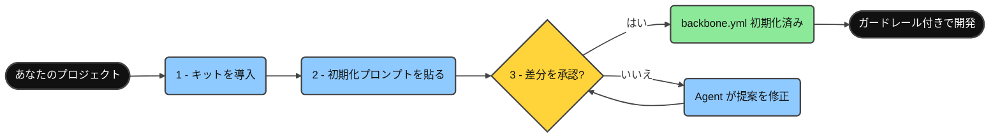
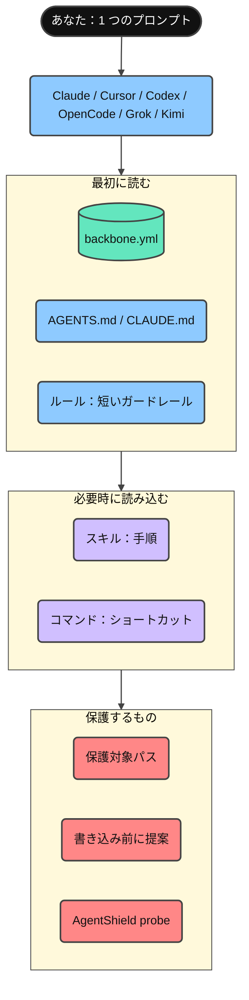
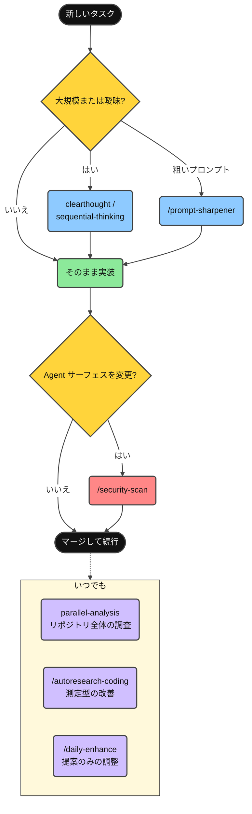
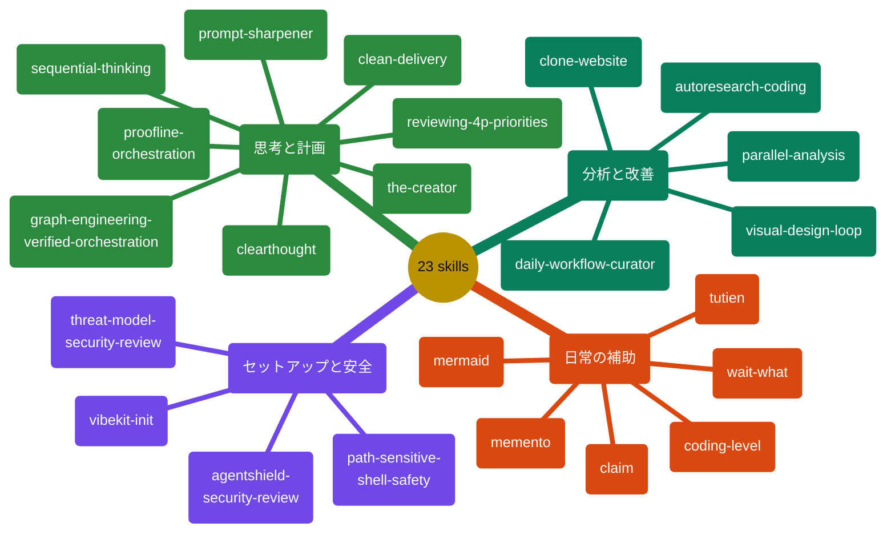
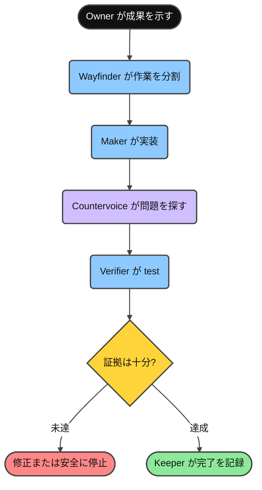
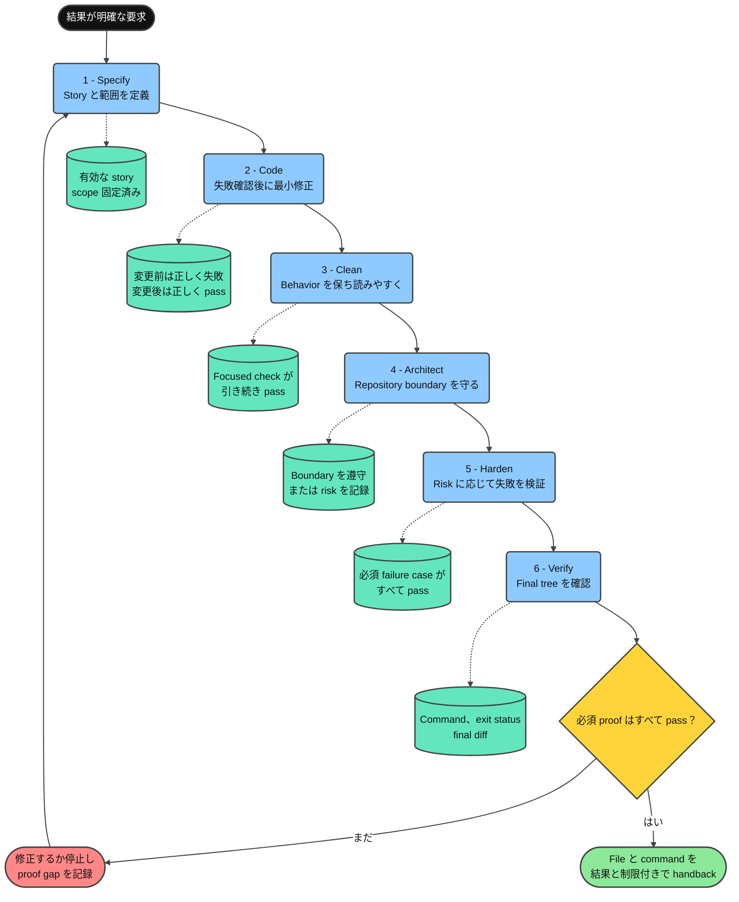
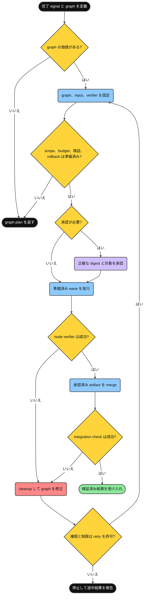
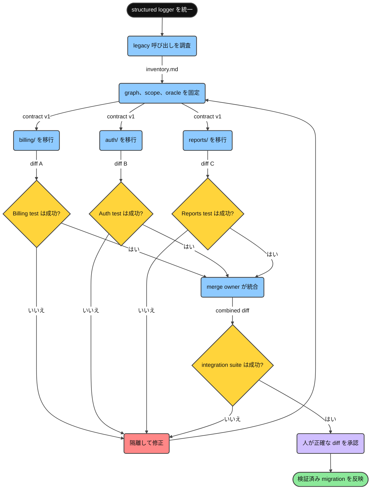
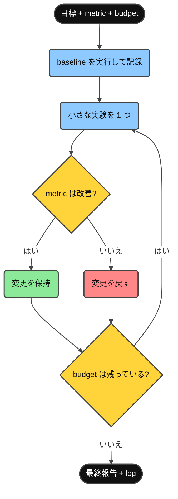

<div align="center">

**言語：** [English](../README.md) · [Tiếng Việt](README.vi.md) · [简体中文](README.zh-CN.md) · **日本語** · [한국어](README.ko.md) · [Deutsch](README.de.md) · [Български](README.bg.md)

# Minimal Vibe Coding Kit

[](../LICENSE)
[](https://www.npmjs.com/package/minimal-vibe-coding-kit)
[](../CHANGELOG.md)


**Claude Code、Cursor、Codex、OpenCode、Grok、Kimi に対応する、あらゆるリポジトリと言語で使えるインストール型 AI コーディングワークフローキット。**

インストール → プロンプトを貼り付ける → 提案を承認する → ガードレール付きでコーディングする。

このキットが実際に役立ったなら、ぜひ Star を付けてください。もう一人の役に立てたと分かり、改善を続ける力になります。

</div>

---

## このキットとは？

共有の **ルール（rules）**、**スキル（skills）**、**コマンド（commands）** と、1 つの **`backbone.yml`** マニフェストからなる小さなキットです。Claude Code、Cursor、Codex、OpenCode、Grok、Kimi が同じ方法でプロジェクトを理解できるようにします。

- 既存の `CLAUDE.md` や `AGENTS.md` は上書きせず、管理対象ブロックだけを追加します。
- セットアップ中の書き込みは、必ず明示的な承認を待ちます。
- AgentShield による Agent サーフェスのセキュリティレビューを通常のワークフローに含めます。
- 安全な削除が既定です。すべての Agent は復元可能な `trash` コマンドを優先します。初期化時に利用可否を確認し、見つからない場合はインストール方法を案内します。さらに、Claude Code の deny rules（`.claude/settings.json`）、Cursor CLI の permissions（`.cursor/cli.json`）、Codex の execution-policy rules（`.codex/rules/`、実験的機能で、信頼済みプロジェクトのみ有効）、Grok のプロジェクト permission rules（`.grok/config.toml`）も利用します。
- 初回初期化では 2 つの設定を確認します。`rm` の代わりに `trash` を使うか、説明レベルを 0 から 5 のどれにするかです。説明レベルは `/coding-level N` でいつでも変更でき、両方の設定は `backbone.yml` に保存されます。

## クイックスタート

3 ステップ、約 2 分です。



**1. プロジェクトへインストールします**（clone は不要です）：

```bash
npx --yes minimal-vibe-coding-kit@latest install /path/to/your-project
```

すでに `npm i minimal-vibe-coding-kit` を実行した場合や、GitHub またはローカル clone を使いたい場合は、[npm からインストール](#npm-からインストール)を参照してください。

**2. Claude Code、Cursor、Codex、OpenCode、Grok、Kimi Code のいずれかでプロジェクトを開き、次を貼り付けます：**

```text
Read .vibekit/init/FIRST_TIME_INIT.md and initialize this repo with Minimal Vibe Coding Kit.
First print the requirements you will check. Then run detection, propose one diff
for backbone.yml and managed instruction blocks, and wait for my yes before writing.
```

**3. 提案された差分を確認し、`yes` と答えます。**

Agent は検出した技術スタックと規約を `backbone.yml` に記録し、状態を `initialized` に変更します。これで完了です。以後のセッションは自動的にこのファイルを読み、初期化を省略します。

いつでも任意でヘルスチェックを実行できます：

```bash
node .vibekit/scripts/mvck.mjs doctor .
```

## npm からインストール

このキットは [`minimal-vibe-coding-kit`](https://www.npmjs.com/package/minimal-vibe-coding-kit) として npm で公開されています。これは **ライブラリではなくスキャフォールディング CLI** です。`node_modules/` に置かれただけでは何も有効になりません。`install` を一度実行すると、GitHub インストーラーと同じようにキットがリポジトリのルートへコピーされます。

**方法 A：1 回だけ実行（推奨）。** プロジェクトの依存関係には追加されません：

```bash
npx --yes minimal-vibe-coding-kit@latest install /path/to/your-project
```

**方法 B：依存関係として導入。** package が `package.json` に含まれている、または追加する予定なら、もう 1 つコマンドが必要です：

```bash
npm i -D minimal-vibe-coding-kit
npx mvck install .        # 必須：キットを node_modules からリポジトリへコピー
```

> **重要：** `npm i` だけではキットが `node_modules/` にダウンロードされるだけで、まだ何も有効になりません。
> `mvck install` が `.claude/`、`.cursor/`、`.agents/`、`.grok/`、`.kimi-code/`、`.vibekit/`、`backbone.yml` をリポジトリのルートへコピーするステップです。

どちらの方法でも、短い `mvck` コマンド（別名：`vibe-kit`）を `npx` から利用できます：

| 短いコマンド | 内容 |
| --- | --- |
| `npx mvck install .` | キットをリポジトリへコピー（`--profile`、`--dry-run`、`--force`） |
| `npx mvck update .` | 新しいリリース後にキット所有ファイルを更新 |
| `npx mvck doctor .` | 読み取り専用ヘルスチェック（`--run-repo-checks` を付けるとリポジトリ検証と probe も実行） |
| `npx mvck validate .` | 構造を検証 |

続いてクイックスタートの **ステップ 2**（初期化プロンプトの貼り付け）へ進みます。

その他の導入方法：`npx github:giang6283623/minimal-vibe-coding-kit install /path/to/your-project`、またはローカル clone から `./install.sh /path/to/your-project`（Windows：`./install.ps1 -Target C:\path\to\your-project`）。

## リポジトリに追加されるもの

インストールでは次のものだけが追加され、プロジェクトの他の部分には触れません：

```text
your-project/
├── backbone.yml              ← Agent が最初に読むプロジェクトマップ（唯一の正）
├── AGENTS.md                 ← 共有 Agent 指示（管理対象ブロック）
├── CLAUDE.md                 ← 短い指示。AGENTS.md を参照（存在しない場合のみ作成）
├── .gitignore                ← キット項目を管理対象ブロック内へ追加
├── .claude/                  ← Claude Code：ルール、コマンド、Agent、スキル
├── .cursor/                  ← Cursor：ルール、コマンド、スキル
├── .agents/                  ← Codex + OpenCode / ポータブルスキル
├── .codex/  .codex-plugin/   ← Codex 設定例と plugin manifest
├── .opencode/                ← OpenCode commands and integration guide
├── .grok/                    ← Grok Build：ルール、スキル、設定例
├── .kimi-code/               ← Kimi Code：スキル（最優先のプロジェクトスキルディレクトリ）
└── .vibekit/                 ← キット所有のすべてを 1 フォルダに集約
    ├── skills/               ← 正本の共有スキル（各ツールのディレクトリへミラー）
    ├── commands/             ← 共有コマンドプロンプト
    ├── scripts/              ← mvck CLI、初期化、検証、doctor、security probe
    ├── docs/                 ← 詳細リファレンス
    └── init/                 ← 1 回限りの導入ファイル（/vibe-finalize で移動可能）
```

既存ファイルは置き換えません。キットは管理対象ブロック（`BEGIN/END: minimal-vibe-coding-kit`）をマージし、ユーザー所有の項目をスキップします。

## 各要素のつながり



- **`backbone.yml`**：リポジトリのパス、規約、保護対象パス、検証コマンドを記録します。
- **ルール**：常に読み込まれる短いガードレールです。最初に backbone を読む、小さな差分を作る、Agent サーフェスはセキュリティレビューする、などを定めます。
- **スキル**：繰り返し使える手順で、タスクに必要なときだけ読み込まれます。
- **コマンド**：よく使うスキルを 1 語で呼び出すショートカットです。

## 日常的な使い方



<details>
<summary><strong>詳しく見る</strong></summary>

1. **通常どおり依頼する。** 機能追加や修正を普段どおり頼めば、Agent は `backbone.yml` の規約に従い、差分を小さく保ちます。
2. **大規模または曖昧なタスク？** 最初に `clearthought` または `sequential-thinking` を使い、計画を作ります。
3. **複雑なタスクだがプロンプトが粗い？** `/prompt-sharpener <rough prompt>` は意図を変えずに正確なプロンプトへ整え、同じターンで実行します。
4. **新しいスキル、ルール、ツールを取り込みたい？** `/claim <request + links>` は公式ドキュメントで情報源を検証し、リポジトリとの適合性を確認し、不明点を質問してから統合と文書化を行います。
5. **進捗を振り返りながら静かにリセットしたい？** `/tutien` は Git 履歴と提供された AI チャットのエクスポートを使う、非公開の仙侠コーディング振り返りモードです。有効にすると `/tutien off` まで、ユーザーの言語に合わせた修行小説風の文体を維持します。根拠のある workflow villain には、既定で皮肉やからかいを使えます。有効化時には任意の `humiliation=0..10` を選べます。これは現実の人物に対する境界を守りながら、架空の修行者 avatar の敗北演出だけを調整します。living chronicle はプロジェクト固有の世界、人物、宗派、修行体系、章をベトナム語、英語、簡体字中国語で育てます。
6. **リポジトリ全体の質問や大きなレビュー？** `parallel-analysis` は読み取り専用の分析 lane に分け、統合結果を再検証します。
7. **`.claude/`、skills、hooks、installer scripts を変更した？** マージ前に `/security-scan` を実行します。
8. **測定可能な改善をしたい？** metric と budget を指定して `/autoresearch-coding` を使います。
9. **設定を継続的に改善したい？** `/daily-enhance` は改善案だけを提示し、黙って適用しません。
10. **導入作業が完全に終わった？** `/vibe-finalize` は 1 回限りの bootstrap ファイルを移動します。

</details>

## コマンド

```mermaid
---
config:
  theme: base
  themeVariables:
    fontFamily: cascadia mono, consolas, noto sans mono, menlo, monospace
    fontSize: 15px
    lineColor: "#444444"
    textColor: "#111111"
    edgeLabelBackground: "#FFFFFF"
    clusterBkg: "#FFF9DB"
    clusterBorder: "#444444"
---
flowchart LR
    subgraph SetupPhase["セットアップ"]
        Init("/init-vibe<br/>1 つの差分を承認")
    end
    subgraph DailyPhase["日常"]
        Scan("/security-scan<br/>Agent サーフェス")
        Enhance("/daily-enhance<br/>提案のみ")
    end
    subgraph ImprovePhase["改善"]
        Auto("/autoresearch-coding<br/>metric loop")
        Council("/council<br/>統合計画")
    end
    subgraph GradPhase["完了"]
        Final("/vibe-finalize<br/>bootstrap を整理")
    end
    SetupPhase --> DailyPhase --> ImprovePhase --> GradPhase

    classDef terminal fill:#111111,stroke:#444444,stroke-width:2px,color:#FFFFFF
    classDef step fill:#8ECAFF,stroke:#444444,stroke-width:2px,color:#111111
    classDef success fill:#8CE99A,stroke:#444444,stroke-width:2px,color:#111111
    classDef danger fill:#FF8787,stroke:#444444,stroke-width:2px,color:#111111
    classDef accent fill:#D0BFFF,stroke:#444444,stroke-width:2px,color:#111111
    linkStyle default stroke:#444444,stroke-width:1.5px

    class Init step
    class Scan danger
    class Enhance,Council accent
    class Auto success
    class Final terminal
```



<details>
<summary><strong>詳しく見る</strong></summary>

| コマンド | 内容 | 例 |
| --- | --- | --- |
| `/init-vibe` | 初回初期化または修復。1 つの差分を提案し、承認を待ちます。 | `/init-vibe` を実行し、差分を確認して `yes` と答える。 |
| `/security-scan` | Agent サーフェスに対する読み取り専用 AgentShield probe と任意の scanner。 | `.claude/**` や skills をマージする前に `/security-scan`。 |
| `/daily-enhance` | rules、skills、workflows の改善案だけを作るレポート。 | `/daily-enhance` の差分案を確認して承認する。 |
| `/autoresearch-coding` | baseline と budget を持つ metric 駆動の実験 loop。 | `/autoresearch-coding` Goal: lint errors を減らす。Budget: 3。 |
| `/clean-delivery` | 1 つの behavior を 6 つの適度な craftsmanship gate で届ける。 | `/clean-delivery` Goal: rate limiting を追加。Risk: medium. |
| `/council` | Provider mode を解決し、task に必要な role だけを調整する。 | この branch diff に `/council` を使う。 |
| `/proofline` | 範囲付きの役割、独立した反論、型付き signal、証拠を管理します。 | `/proofline` Goal: auth を強化。Done signal: 対象 test が成功。 |
| `/vibe-finalize` | プロジェクトを通常運用へ移し、1 回限りの bootstrap ファイルを `_vibekit-cleanup/` へ移動します。 | `/vibe-finalize` で preview し、承認後に適用。 |

</details>

### Multi-agent mode の選択

最初の child agent または multi-agent lane を dispatch する直前に、parent は利用可能なら現在の provider の native structured-question tool を使い、Default、Auto、Custom を尋ねます。Default は現在の provider と default model を維持します。Auto は ready な adapter だけを対象に bounded lane を route し、task の品質と安全性の下限を満たす最小コストの model を選びます。Custom は role ごとに検証済み provider と model を指定できます。

"Don't show again" を選ぶと、その mode を .vibekit/preferences.json に保存します。Child agent は user に直接質問せず、parent に needs_user_input を返します。Coding level は説明量と推奨 option だけに影響し、model の品質や安全性を下げません。詳しくは [.vibekit/docs/ORCHESTRATION_MODES.md](../.vibekit/docs/ORCHESTRATION_MODES.md) を参照してください。

オプションの Cursor SDK routing は、account の live model catalog、制限された local tool profile、保存された adapter と model を使います。Setup と model の変更は [CURSOR_SDK.md](../.vibekit/docs/CURSOR_SDK.md) を参照してください。

## スキル

23 個すべてのスキルの正本は `.vibekit/skills/` にあります。Claude、Codex、OpenCode、Grok、Kimi は 23 個すべてをミラーし、Cursor は対話型の 18 個をミラーします。名前で指定（「Use the X skill」）するか、上記のコマンドから呼び出します。



<details>
<summary><strong>詳しく見る</strong></summary>

| スキル | 使う場面 | プロンプト例 |
| --- | --- | --- |
| `vibekit-init` | 初回セットアップ、または `backbone.yml` や管理対象ブロックの修復。 | "Use the vibekit-init skill. Propose one diff and wait for my yes." |
| `parallel-analysis` | リポジトリ全体の質問、大きな diff review、整合性 audit。 | "Use parallel-analysis: where is auth handled and what depends on it?" |
| `graph-engineering-verified-orchestration` | 複雑な作業に本当に独立した branch があり、明示的な依存関係、分離、budget、客観的検証、rollback、範囲付き merge gate が必要なとき。 | "Use graph-engineering-verified-orchestration to design a safe task graph for this migration." |
| `clean-delivery` | 1 つの behavior slice を、適度な TDD と再現可能な証拠を伴う Specify、Code、Clean、Architect、Harden、Verify gate で届けるとき。 | "Use clean-delivery to implement this behavior with extreme craftsmanship." |
| `proofline-orchestration` | 複雑な作業に明示的な統治、範囲付き実装、権限を持つ独立した反論者、型付き escalation signal、証拠に基づく受け入れが必要なとき。 | "Use proofline-orchestration to govern this migration and preserve dissent." |
| `agentshield-security-review` | マージ前に Agent config、skills、hooks、MCP、commands を監査するとき。 | "Use agentshield-security-review on .claude/** and .vibekit/skills/**." |
| `threat-model-security-review` | application source、API、authentication、authorization、input path、trust boundary、security-sensitive diff を明示的な証拠と coverage でレビューするとき。 | "Use threat-model-security-review on this repository. Stay read-only and report proof gaps." |
| `autoresearch-coding` | 測定可能な実験でリポジトリを改善するとき。 | "Use autoresearch-coding. Metric: `npm test`. Direction: higher. Budget: 3." |
| `daily-workflow-curator` | rules、skills、workflows の定期調整（提案のみ）。 | "Use daily-workflow-curator and propose today's improvements." |
| `path-sensitive-shell-safety` | path variable や `rm`、`mv`、`rsync` を含む shell、installer、deploy logic を編集する前。 | "Use path-sensitive-shell-safety before changing this cleanup script." |
| `visual-design-loop` | UI polish を render → screenshot → review → fix の loop で行うとき。 | "Use visual-design-loop on /dashboard. Budget 3 loops." |
| `clearthought` | 要件が曖昧、設計上の tradeoff、危険な意思決定があるとき。 | "Use clearthought. Operation: implementation_plan. Split this feature into safe tasks." |
| `sequential-thinking` | 複雑な作業を順序付きステップへ分解するとき。 | "Use sequential-thinking. Break this refactor into ordered steps with tests." |
| `reviewing-4p-priorities` | bug や finding を P0 から P4 の修正順へ分類するとき。 | "Use reviewing-4p-priorities. Classify these findings and give a fix sequence." |
| `memento` | 複数日にまたがるタスクで、中断前に context を保存し、次の session で再開するとき。 | "/memento - write MEMENTO.md with Goal, Done, Stuck, Next." |
| `coding-level` | 説明の詳しさを設定するとき（0 = ELI5、5 = expert）。 | "/coding-level 2" |
| `prompt-sharpener` | 複雑なタスクに対して粗いプロンプトしかないとき。明確化して同じターンで実行します。 | "/prompt-sharpener make the settings page load faster" |
| `claim` | 新しい skill、rule、convention、tool をリポジトリに持ち込むとき。公式資料を検証し、適合性を確認し、承認後に統合と文書化を行います。 | "/claim add the conventional-commits rule from https://www.npmjs.com/package/minimal-vibe-coding-kit" |
| `clone-website` | 権利、忠実度、範囲、技術スタック、バックエンド、取得、検証の境界を決めて、Web サイトを複製または移行するとき。 | "Use clone-website to create a safe local F2/S1 prototype of this page." |
| `wait-what` | 直前の回答が伝わらなかったとき。agent は止まり、平易な言葉でユーザーの言語のまま説明し直し、glossary の用語で欠けていた前提を補います。新しい作業は行いません。 | "/wait-what token budget の部分" |
| `tutien` | 正確な Git/chat 証拠と終わりのない chronicle を使う、非公開でユーザー起動型の仙侠コーディング振り返りモード。実行中はユーザーの言語に合わせた修行文体を使い、`humiliation=0..10` で架空 avatar の敗北強度を調整し、`/tutien off` で通常文へ戻ります。 | "/tutien on humiliation=8" |
| `the-creator` | 安全性、論理、機能的な受け入れ条件を守りながら、10 段階の累積的創造性で独自かつ実用的な art、design、interface、method、process、system を作るとき。 | "Use the-creator level 7 to invent a safer code-review process." |
| `mermaid` | coding level に合った密度で 31 種類の styled Mermaid diagram を生成するとき。生成した文書への図の追加を提案し、debug workflow では危険箇所を赤で示します。 | "Use the mermaid skill. Draw this deploy pipeline as a flowchart." |

`story=on`（既定）では、承認済み分析が `.vibekit/reports/tutien/story/` を準備します。`plot.md` は発展する世界と plot の設定資料、`story-state.json` は連続性、`chapters/NNNN-<xianxia-title>.md` は保存ごとの章を保持します。物語本文は固定文ではなく集約された証拠から Agent が執筆し、人物名と会話は `story-language=vi|en|zh` に従います。

</details>

### Proofline：AI に自己採点させないための仕組み

**ひとことで言うと：** Proofline は複数の AI を、実装する担当、反論する担当、検証する担当、完了条件を記録する担当に分けます。1 つの AI が方法を決め、code を変更し、自分で正しいと宣言するリスクを減らします。

家の改修を想像してください。同じ電気工事士に配線工事、独立した安全検査、最終検査証の署名をすべて任せたくはないはずです。重要な code にも同じ責任分離が必要です。

#### 各役割を現実に例えると？

| 役割 | 現実の例 | 責任 |
| --- | --- | --- |
| `Owner` | 家主または product owner | 望む結果を示し、最終権限を持つ |
| `Wayfinder` | 現場監督 | 作業を分割し、範囲を割り当て、結果を統合する |
| `Maker` | 専門作業者 | 割り当てられた 1 つの作業を実施する |
| `Countervoice` | 独立検査員 | 誤った前提、抜け、矛盾する証拠を探す |
| `Verifier` | 試験担当者 | 客観的な test や測定を実行する |
| `Keeper` | 検収 checklist の管理者 | すべての gate が満たされた場合だけ完了を記録する |

これらは役職の上下ではなく、責任の違いです。`Wayfinder` の経験が豊富でも、`Countervoice` は元の計画が間違っていると判断できます。

#### 実際の利点

- **自信満々の誤答を減らす：** 実装者だけでは最終判断できず、反論と test が必要です。
- **土台の誤りを早く見つける：** reviewer は間違った解決策を磨くのではなく、前提や architecture 自体を拒否できます。
- **誤編集を減らす：** 各担当者の作業範囲を限定し、重要な test や file を保護します。
- **後から監査できる：** handback には変更 file、実行 test、未解決の異論、残る制約が記録されます。
- **安全に停止できる：** 権限不足、信頼できない test、budget 枯渇時には推測で進めず停止します。

#### いつ使うべき？

| Proofline を使う | より簡単な workflow で十分 |
| --- | --- |
| Authentication、権限、支払い、機密 data | typo や文章だけの修正 |
| Data migration、大規模 refactor、architecture 変更 | 小さく、戻しやすい 1 file の変更 |
| 複数 Agent や branch が並行作業 | 1 人の実装者と明確な test で十分 |
| 失敗が data loss、過剰権限、downtime につながる | アイデアだけが必要で客観的 verifier がない |

#### どこで動く？

Proofline は Minimal Vibe Coding Kit を導入したリポジトリ内で、Codex、Claude Code、Cursor、Grok、Kimi とともに動きます。対象 file、境界、測定可能な test が明確な coding task に最適です。Paseo は複数 session を調整するための任意 adapter であり、Proofline の利用に Paseo は必要ありません。



#### 最も簡単な始め方

digest、lease、gateway を理解していなくても始められます。次の 5 つを記述してください：

```text
/proofline
目標：不明なログイン role を必ず拒否する。
変更可：src/auth-policy.mjs
変更不可：test/auth-policy.test.mjs
完了条件：authentication test が成功する。
制約：API を変更せず、新しい package を追加しない。
```

キットは必要最小限の workflow を選びます：

- 小さな task：不要な手続きを増やさず、1 人の順次担当で進めます。
- 反論が必要な task：独立検査のため `Countervoice` を追加します。
- 分割できる複雑な task：範囲を限定した並行 lane を使います。
- 権限または信頼できる test がない：計画だけを返すか、安全に停止します。

#### 実例：ログイン権限の変更

`admin` と `editor` だけが利用でき、不明な role はすべて拒否する必要があるとします：

1. `Wayfinder` は `src/auth-policy.mjs` を `Maker` に割り当て、test file を保護します。
2. `Maker` は policy を明示的な allowlist へ変更します。
3. `Countervoice` は `unknown` が誤って許可されるような危険な抜けを探します。
4. `Verifier` は `admin`、`editor`、`unknown` を test します。
5. `Keeper` は test が成功し、すべての反論へ回答した場合だけ完了を記録します。

結果は単なる「完了」より有用です。code 変更、test、review の証拠、残る risk、workflow が停止した場合の明確な理由を含みます。

<details>
<summary>技術用語と ledger の検証</summary>

| 用語 | 簡単な意味 |
| --- | --- |
| Scope | 担当者が触れてよい範囲 |
| Digest | file や状態が変わると変化する指紋 |
| Grant | 特定の担当者、操作、対象、時間に対する許可 |
| Lease | 1 人の integration owner だけに許された一時鍵 |
| Proof Return | 変更内容と検証証拠を含む引き渡し |
| Seal | gate 通過の記録。deploy 権限ではない |
| Gateway | 重要な操作前に権限を再確認する guard |

決定的な例を実行します：

```bash
npm run test:proofline
node .vibekit/skills/proofline-orchestration/scripts/run-proofline-sandbox.mjs \
  .vibekit/skills/proofline-orchestration/examples/auth-migration-case.json
```

[スキル契約](../.vibekit/skills/proofline-orchestration/SKILL.md)、[control matrix](../.vibekit/skills/proofline-orchestration/references/control-matrix.md)、[authentication の例](../.vibekit/skills/proofline-orchestration/examples/auth-migration-case.json)も参照してください。

付属の validator と gateway は現在の process 内で policy を模擬します。OS、provider、MCP server、外部 system がすべての境界を実際に強制したことまでは証明しません。実際の merge、deploy、外部への変更には、`Owner` の新しい権限と、永続的な共有状態を持つ外部 gateway が必要です。

[Paseo adapter](../.vibekit/skills/proofline-orchestration/references/paseo-adapter.md)は任意で、複数 session を調整するときだけ有用です。Proofline は Paseo をインストールせず、credential を保存せず、user-level config を変更しません。

</details>

### Clean Delivery：1 つの小さな変更、6 回の確認

**簡単に言うと：** Clean Delivery は、1 つの小さな変更を決まった順序で進める方法です。各 gate は 1 つの問いに答え、後から確認できる証拠を残し、条件を満たした場合だけ次へ進みます。6 つの gate は 6 回の品質確認であり、6 agent や 6 本の並列 workflow ではありません。

たとえば「`NaN` を ledger に書かない」だけでは曖昧です。Clean Delivery では、非有限値を必ず書き込み前に拒否すること、エラー時に ledger が変化しないこと、有限値は引き続き受け入れることを測定可能な結果として定義します。その後、実装、読みやすさの改善、repository boundary の確認、失敗 case の検証、最終状態での再検証を順番に行います。

この節でいう**証拠**とは、check command、その関連結果、exit status の組み合わせです。repository に適切な command がない場合は、範囲を明記した技術 review を使います。必須 check がない状態は `proof gap` であり、pass ではありません。

#### 各 gate で実際に行うこと

| Gate | 行う作業 | 次へ進める条件 |
| --- | --- | --- |
| `Specify` | ユーザーが観測する結果、編集可能 file、保護する file、完了条件を 1 つの story に書きます。 | Validator が story を受理し、scope が固定され、重要な test が保護対象として明記されていること。 |
| `Code` | 先に check を実行して本当の不具合を確認し、behavior を正す最小限の code を書きます。 | 同じ check が変更前には期待した理由で失敗し、変更後には pass すること。False pass のために test を弱めていないこと。 |
| `Clean` | 新しい behavior を追加せず、命名、読みにくい箇所、重複を改善します。 | 意味のある cleanup のたびに focused check が引き続き pass すること。 |
| `Architect` | Module boundary、依存方向、`backbone.yml` の repository rule を確認します。 | Architecture command が pass するか、未検証 boundary と残る risk が明記されていること。 |
| `Harden` | 境界値、権限、エラー時の no mutation、end-to-end behavior など、risk に合う failure path を試します。 | Risk tier で必須の check がすべて pass すること。利用できない check は `not-configured` であり、pass ではありません。 |
| `Verify` | 正確な final tree で repository と story の check を再実行し、diff の scope drift を確認します。 | 必須 proof がすべて pass し、各結果が記録され、story 外の変更が残っていないこと。 |

#### Gate を通過できない場合

- Gate を飛ばさず、作業を完了扱いにしません。
- Implementation の問題なら修正し、関連 check を再実行します。
- 求める結果を変える必要があるなら `Specify` に戻り、story を固定し直します。
- 必須 tool や proof がない場合は安全に停止し、`proof gap` とユーザーに必要な最小判断を記録します。
- `Verify` 後の緑の branch だけが handback 可能です。

#### 実際の利点

- coding 前に小さな scope を固定できます。
- 変更前の失敗を記録し、false pass のために test や validator を弱めることを防ぎます。
- behavior が通ってから cleanup し、その後に同じ proof を再実行します。
- 儀式ではなく実際の risk に応じて検証を増やします。
- verifier がない場合は `not-configured` と報告し、pass 扱いしません。
- 最終 handback に変更 file、command、結果、残る制限が含まれます。

#### いつ使うべきか？

| Clean Delivery を使う | より簡単な workflow で十分 |
| --- | --- |
| 1 つの behavior に高い信頼性と明確な acceptance criteria が必要 | typo、comment、機械的な copy edit |
| TDD、clean code、architecture check、extreme craftsmanship が求められる | read-only 調査や brainstorming |
| test や validator を implementation から保護する必要がある | 小さく可逆で、既存の 1 check で十分な変更 |

大きな要求は、独立して検証できる複数の Clean Delivery story に分けます。独立した challenge、ownership 分離、並列作業に実益があるときだけ Proofline や graph orchestration を追加します。

#### どこで動くのか？

**Clean Delivery は server、background application、外部 service ではありません。** Coding agent が、現在開いている repository 内で実行する workflow です。

1. 要求、repository instruction、`backbone.yml` を読みます。
2. 小さな story を作り、scope と保護する check を固定します。
3. `npm test` など、repository に既存の command を再利用します。
4. 各 gate の結果とすべての `proof gap` を記録します。
5. 他の人が再実行できる証拠とともに変更を handback します。

Clean Delivery は gate を pass したように見せるために test framework を install したり、hook を有効化したり、権限を拡大したりしません。

#### 全体の流れと各 gate の証拠



**図の読み方：**

1. 上から下へ実線矢印を追うと、6 gate の順序が分かります。
2. 青い box は各 gate で agent が行う作業です。
3. 点線で結ばれた青緑の cylinder は、その gate 後に保持する証拠です。
4. 黄色の diamond は、必須 proof がすべて pass したかを問いかけます。
5. 赤い branch は `Specify` に戻ります。修正によって scope や acceptance criteria が変わる場合があるためです。安全に修正できなければ、明確な `proof gap` を残して停止します。
6. 緑の branch は final tree 上の check が pass した後だけ現れます。

**図の要点：** `Code` で実装が終わっても、作業全体は終わりません。`Verify` が最終 repository 状態ですべての必須 proof を確認して初めて handback できます。

#### 最も簡単な始め方

```text
/clean-delivery
Goal（観測可能な結果）: ledger row を書く前に非有限 metric を拒否する。
May edit（編集可能）: src/metric-ledger.py と focused tests。
Must not edit（編集禁止）: 既存の acceptance fixtures と release scripts。
Done when（検証可能な条件）: NaN と infinity は ledger を変更せず失敗し、有限値は通る。
Risk: medium.
```

| Prompt の行 | 意味 |
| --- | --- |
| `Goal` | 実装方法ではなく、外部から観測できる結果。 |
| `May edit` | Agent が変更できる file または directory。 |
| `Must not edit` | 変更してはならない test、fixture、script、その他の領域。 |
| `Done when` | Check で pass または fail を判断できる条件。 |
| `Risk` | 適用する最低 verification tier。 |

#### Risk によって検証はどう変わるか？

| Tier | 最低限の検証 |
| --- | --- |
| `low` | Focused behavior check、repository validation、final diff review。 |
| `medium` | Acceptance evidence と architecture boundary review を追加。 |
| `high` | Security、failure path、Protected verifier asset、環境が信頼できる場合の independent verification を追加。 |
| `critical` | Human approval、rollback evidence、independent final verifier を追加。 |

#### 実例：無効な metric 値を拒否する

| Gate | この例で行うこと | 保持する証拠 |
| --- | --- | --- |
| `Specify` | `NaN`、`Infinity`、`-Infinity`、overflow を append 前に拒否し、error 時は ledger を変えない rule を固定します。 | 編集可能 file と保護 test を明記した有効な story。 |
| `Code` | 無効 metric case で問題を確認し、最小の finite-number check を追加します。 | 同じ case が変更前に正しく失敗し、変更後に pass。 |
| `Clean` | 有効 metric の format を変えず、parsing と error handling を読みやすくします。 | 有限値と非有限値の check が引き続き pass。 |
| `Architect` | Validation を caller に分散させず、metric が ledger row になる boundary に置きます。 | Boundary review または repository architecture command。 |
| `Harden` | `NaN`、正負 infinity、overflow、任意 text、error 時の no write を試します。 | 各 case の結果と ledger が変化しない証拠。 |
| `Verify` | Final tree で約束した command をすべて実行し、diff の scope drift を確認します。 | Command、exit status、関連結果、残る制限。 |

#### この節で使う用語

| 用語 | 簡単な意味 |
| --- | --- |
| `Story` | 1 つの成果、編集 scope、完了 check を記した小さな契約。 |
| `Red evidence` | Implementation 前に、欠けている behavior が原因で正しく失敗する check。 |
| `Focused check` | 変更対象の behavior を直接確認する最小の check。 |
| `Protected verifier asset` | Implementation が弱めてはならない test、fixture、schema、snapshot、policy、benchmark input、validator。 |
| `Proof gap` | 必須だが存在しない、実行できない、または未解決の check。 |
| `Boundary` | Module、layer、system 間の責任範囲。 |
| `Final tree` | Implementation と cleanup 後の完全な最終 file 状態。 |

次の command で story を検証します。

```bash
node .vibekit/skills/clean-delivery/scripts/validate-story.mjs path/to/story.md
npm run test:clean-delivery
```

`path/to/story.md` を実際の story path に置き換えてください。`null`、command 不在、`not-configured: <理由>` は verifier がないという意味であり、pass ではありません。[skill contract](../.vibekit/skills/clean-delivery/SKILL.md)、[story template](../.vibekit/skills/clean-delivery/references/story-template.md)、[verification tiers](../.vibekit/skills/clean-delivery/references/verification-tiers.md) を参照してください。

### Graph engineering：検証付き orchestration

これは **ユーザーが明示的に呼び出すスキル** であり、常時有効なルールでも、特定 provider 専用の workflow でもありません。graph に時間や cost の妥当な利点がある、または coordination risk を減らせる場合に使います。すべての edge は名前付き artifact を運び、mutable な作業には強制可能な分離が必要です。客観的に検証された output だけが最終 merge に進みます。権限、budget、rollback、verifier が未解決なら、スキルは実行せず graph plan を返します。



<details>
<summary><strong>詳しく見る：現実的な例</strong></summary>

**事例：3 つの service を 1 つの structured logger へ移行する。** monorepo に `billing/`、`auth/`、`reports/` があり、それぞれ別の file から legacy logger を呼び出しているとします。これはスキルの起動条件に正確に合います。範囲の明確な 3 つの作業、同じ file を共有しない branch、客観的 verifier である test suite があるからです。

- **いつ：** 作業を 3 つ以上の限定された項目へ分割でき、本当に独立した branch が 2 つ以上あり、graph が時間を節約するか coordination risk を下げる場合。
- **どこで：** service、package、文書群ごとに書き込み ownership を明確に分けられ、writer の scope 外にある test や schema で結果を検証できる repository。
- **なぜ：** 強制された分離が重複書き込みを防ぎ、すべての edge が名前付き artifact を運ぶため想像上の依存で作業を直列化せず、検証済み diff だけが 1 人の merge owner に届くからです。
- **使わない場合：** 3 項目未満、branch が同じ file に触れる、または客観的 verifier がない場合。単純な順次編集の方が安く、スキルも実行せず graph plan を返します。

```text
Use graph-engineering-verified-orchestration.
Goal: replace the legacy logger with structlog in billing/, auth/, reports/.
Done signal: npm test passes and no legacy logger import remains.
Editable paths: billing/ auth/ reports/. Protected paths: tests/ and configs.
```

この事例を graph で実行する方法です。すべての edge は、次の node が利用する名前付き artifact を運びます：



3 つの migrate node は書き込み scope が重ならないため、1 つの wave として実行されます。test oracle は scope の外で保護されます。失敗した diff は隔離して修正し、承認済みの作業を妨げません。最後に、人が正確な統合 diff を承認してから反映します。

</details>

## 高度な使い方

### インストール profile

使うサーフェスだけを導入できます（既定は `all`）：

```bash
npx --yes minimal-vibe-coding-kit@latest install . --profile claude          # Claude Code のみ
npx --yes minimal-vibe-coding-kit@latest install . --profile claude,cursor   # Claude + Cursor
npx --yes minimal-vibe-coding-kit@latest install . --profile codex           # Codex / AGENTS.md agents
npx --yes minimal-vibe-coding-kit@latest install . --profile opencode        # OpenCode / AGENTS.md, shared skills, commands
npx --yes minimal-vibe-coding-kit@latest install . --profile grok            # Grok Build CLI
npx --yes minimal-vibe-coding-kit@latest install . --profile kimi            # Kimi Code CLI
```

Flags：`--force`（既存のキット file を上書き）、`--dry-run`（preview）、`--json`（機械可読 plan）。

### インストール済みプロジェクトの更新

新しい skill や script がリリースされたら、プロジェクト内で次を実行します：

```bash
npx --yes minimal-vibe-coding-kit@latest update . --dry-run   # preview
npx --yes minimal-vibe-coding-kit@latest update .             # apply
```

`update` は **キット所有 file だけ** を更新します。`backbone.yml` やユーザー自身の内容には触れません。管理対象 block をその場で更新し、変更前の file を `.vibekit/update-backup/<timestamp>/` に backup します。詳細：[.vibekit/docs/INSTALL.md](../.vibekit/docs/INSTALL.md)。

### Autoresearch loop

```text
Use the autoresearch-coding skill.
Goal: improve maintainability. Metric command: <your validate command>. Direction: higher.
Editable paths: src/ docs/. Protected paths: .git .env* node_modules lockfiles.
Budget: 3.
```

契約：最初に baseline → 1 回につき 1 つの小さな実験 → metric が改善した変更だけを保持 → すべてを記録。



### セキュリティレビュー（AgentShield）

```bash
node .vibekit/scripts/agentshield-probe.mjs .                          # 高速な読み取り専用 probe
npx ecc-agentshield scan --path . --format text --min-severity medium  # 任意の完全 scan
```

`CLAUDE.md`、`AGENTS.md`、`.claude/**`、`.cursor/**`、`.agents/**`、`.grok/**`、`.kimi-code/**`、`.codex-plugin/**`、`.vibekit/skills|commands|scripts/**` を変更した場合は review が必要です。モデル：[.vibekit/docs/SECURITY_MODEL.md](../.vibekit/docs/SECURITY_MODEL.md)。

### Doctor と reports

```bash
node .vibekit/scripts/mvck.mjs doctor .                 # 読み取り専用 health check（--run-repo-checks で validation と probe も実行）
node .vibekit/scripts/mvck.mjs doctor . --write-report  # VIBE_REPORT.md を作成
node .vibekit/scripts/daily-enhance.mjs . --write-report
```

### キット開発者向け

```bash
npm test                # syntax + 実 temp-dir install test + structure validation
npm run validate:all    # npm test + AgentShield probe + npm pack dry-run
```

公開 checklist：[.vibekit/init/PUSH_TO_GITHUB.md](../.vibekit/init/PUSH_TO_GITHUB.md)。詳細 docs：[.vibekit/docs/](../.vibekit/docs/)。

<details>
<summary><strong>トラブルシューティング</strong></summary>

| 症状 | 対処 |
| --- | --- |
| Agent が初期化 flow を無視する | installer を再実行するか、[.vibekit/init/CLAUDE-template.md](../.vibekit/init/CLAUDE-template.md) を `CLAUDE.md` へコピーします。 |
| Agent が session ごとに初期化を求める | 初期化を実行して承認し、`backbone.yml` の `meta.template_status: initialized` を確認します。 |
| 誤った stack が検出される | 古い lockfile を削除するか、`backbone.yml` を直接編集します。 |
| Agent が触れるべきでない path を変更する | `backbone.yml` の `policy.protected_paths` に path を追加します（glob 対応）。 |
| AgentShield probe の warning | Python 3 をインストールするか、warning なので無視できます。failure ではありません。 |
| インストール後に script がない | `--force` を付けて再インストールするか、`.vibekit/scripts/` を手動でコピーします。 |

</details>

## コントリビューション

Issue と PR は [`giang6283623/minimal-vibe-coding-kit`](https://github.com/giang6283623/minimal-vibe-coding-kit) で歓迎します。PR 前に、skill の変更を `.claude/`、`.cursor/`、`.agents/`、`.grok/`、`.kimi-code/` へミラーし、template を project-neutral に保ち、`npm run validate:all` を実行してください。[CONTRIBUTING.md](../CONTRIBUTING.md)、[SECURITY.md](../SECURITY.md)、[CODE_OF_CONDUCT.md](../CODE_OF_CONDUCT.md)も参照してください。

**作成者：** [GiangBV](https://www.linkedin.com/in/buivangiang1992)、[AuPMH](https://www.linkedin.com/in/pham-au-2a1bb1162)
**原動力：** Caffeine、Determination、AI Collaboration、Weekend Coding Sessions。

## ライセンス

MIT。[LICENSE](../LICENSE)を参照してください。

<!-- user-authored dedication: keep the Vietnam flag emoji; exempt from the writing-style emoji rule -->
> 🇻🇳 _ベトナムとその人々を愛しているなら、ここにあるすべてを無料で自由に利用できます。_
