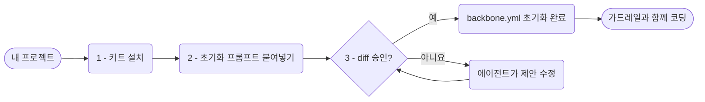
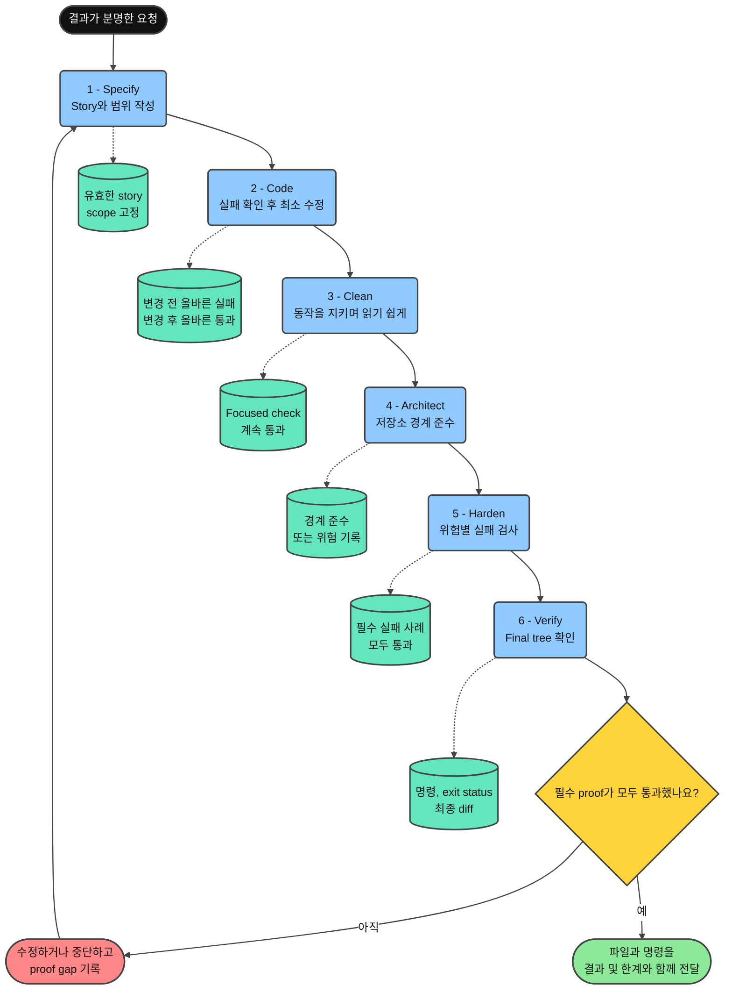

<div align="center">

**언어:** [English](../README.md) · [Tiếng Việt](README.vi.md) · [简体中文](README.zh-CN.md) · [日本語](README.ja.md) · **한국어** · [Deutsch](README.de.md) · [Български](README.bg.md)

# Minimal Vibe Coding Kit

[](../LICENSE)
[](https://www.npmjs.com/package/minimal-vibe-coding-kit)
[](../CHANGELOG.md)


**Claude Code, Cursor, Codex, OpenCode, Grok, Kimi를 위한 설치형 AI 코딩 워크플로 키트. 어떤 저장소와 언어에서도 사용할 수 있습니다.**

설치 → 프롬프트 하나 붙여넣기 → 제안 검토 → 가드레일과 함께 코딩.

이 키트가 실제로 도움이 되었다면 Star를 눌러 주세요. 한 사람에게 더 유용했다는 것을 알 수 있고, 계속 개선할 힘이 됩니다.

</div>

---

## 이 키트는 무엇인가요?

Claude Code, Cursor, Codex, OpenCode, Grok, Kimi가 프로젝트를 같은 방식으로 이해하도록 돕는 공유 **규칙**, **스킬**, **명령**, 그리고 단일 **`backbone.yml`** 매니페스트로 구성된 작은 키트입니다.

- 기존 `CLAUDE.md`나 `AGENTS.md`를 덮어쓰지 않고 관리 블록만 추가합니다.
- 설정 단계의 모든 쓰기 작업은 사용자의 명시적 승인을 기다립니다.
- 에이전트 표면에 대한 AgentShield 보안 검토가 기본 워크플로에 포함됩니다.
- 삭제 작업에는 복구 가능한 `trash` 명령을 우선 사용합니다.
- 첫 초기화에서 기본 설명 수준과 안전 삭제 선호도를 묻고 `backbone.yml`에 기록합니다.

## 빠른 시작

세 단계이며 약 2분이 걸립니다.



**1. 프로젝트에 설치합니다**. 저장소를 복제할 필요가 없습니다.

```bash
npx --yes minimal-vibe-coding-kit@latest install /path/to/your-project
```

**2. Claude Code, Cursor, Codex, OpenCode, Grok 또는 Kimi Code에서 프로젝트를 열고 다음 프롬프트를 붙여넣습니다.**

```text
Read .vibekit/init/FIRST_TIME_INIT.md and initialize this repo with Minimal Vibe Coding Kit.
First print the requirements you will check. Then run detection, propose one diff
for backbone.yml and managed instruction blocks, and wait for my yes before writing.
```

**3. 제안된 diff를 검토하고 `yes`라고 답합니다.**

에이전트는 감지한 스택과 규칙을 `backbone.yml`에 기록하고 상태를 `initialized`로 바꿉니다. 이후 세션은 이 파일을 자동으로 먼저 읽습니다.

언제든 읽기 전용 상태 검사를 실행할 수 있습니다.

```bash
node .vibekit/scripts/mvck.mjs doctor .
```

## npm에서 설치

이 키트는 npm의 [`minimal-vibe-coding-kit`](https://www.npmjs.com/package/minimal-vibe-coding-kit) 패키지로 배포됩니다. 라이브러리가 아니라 스캐폴딩 CLI이므로 `node_modules/`에 내려받는 것만으로는 활성화되지 않습니다.

**옵션 A, 일회성 설치, 권장:**

```bash
npx --yes minimal-vibe-coding-kit@latest install /path/to/your-project
```

**옵션 B, 개발 의존성으로 설치:**

```bash
npm i -D minimal-vibe-coding-kit
npx mvck install .
```

> `npm i`는 패키지를 다운로드할 뿐입니다. `npx mvck install .`이 키트 파일을 저장소 루트로 복사하여 실제로 활성화합니다.

| 짧은 명령 | 기능 |
| --- | --- |
| `npx mvck install .` | 키트를 저장소로 복사합니다. `--profile`, `--dry-run`, `--force`를 지원합니다. |
| `npx mvck update .` | 새 릴리스의 키트 소유 파일을 갱신합니다. |
| `npx mvck doctor .` | 읽기 전용 상태 검사를 수행합니다. |
| `npx mvck validate .` | 구조를 검증합니다. |

GitHub에서 직접 설치하려면 `npx github:giang6283623/minimal-vibe-coding-kit install /path/to/your-project`를 사용할 수 있습니다.

## 저장소에 추가되는 파일

```text
your-project/
├── backbone.yml              ← 에이전트가 먼저 읽는 프로젝트 지도
├── AGENTS.md                 ← 공유 에이전트 지침의 관리 블록
├── CLAUDE.md                 ← 없을 때만 생성되는 짧은 진입점
├── .gitignore                ← 관리 블록 안에 키트 항목 추가
├── .claude/                  ← Claude Code 규칙, 명령, 에이전트, 스킬
├── .cursor/                  ← Cursor 규칙, 명령, 스킬
├── .agents/                  ← Codex + OpenCode 및 이식 가능한 스킬
├── .codex/  .codex-plugin/   ← Codex 설정 예시와 플러그인 매니페스트
├── .opencode/                ← OpenCode commands and integration guide
├── .grok/                    ← Grok 규칙, 스킬, 설정 예시
├── .kimi-code/               ← Kimi Code 프로젝트 스킬
└── .vibekit/                 ← 키트가 소유하는 모든 파일
    ├── skills/               ← 정본 스킬
    ├── commands/             ← 공유 명령 프롬프트
    ├── scripts/              ← CLI, 초기화, 검증, 보안 검사
    ├── docs/                 ← 상세 문서
    └── init/                 ← 일회성 온보딩 파일
```

기존 파일은 교체하지 않습니다. 키트는 `BEGIN/END: minimal-vibe-coding-kit` 관리 블록을 병합하고 사용자가 소유한 파일은 건너뜁니다.

## 구성 요소의 연결 방식

- **`backbone.yml`**: 경로, 규칙, 보호 경로, 저장소 검증 명령의 단일 기준입니다.
- **규칙**: 항상 로드되는 짧은 가드레일입니다.
- **스킬**: 작업에 필요할 때만 로드되는 반복 가능한 절차입니다.
- **명령**: 자주 쓰는 스킬을 호출하는 짧은 진입점입니다.

## 일상적인 사용

1. 기능과 수정은 평소처럼 요청합니다. 에이전트가 `backbone.yml` 규칙을 따릅니다.
2. 크거나 모호한 작업은 `clearthought` 또는 `sequential-thinking`으로 먼저 계획합니다.
3. 거친 프롬프트만 있다면 `/prompt-sharpener`로 같은 턴에서 명확하게 다듬고 실행합니다.
4. 외부 스킬이나 도구를 가져오려면 `/claim`으로 공식 출처와 저장소 적합성을 먼저 검증합니다.
5. 저장소 전체 분석에는 `parallel-analysis`를 사용합니다.
6. 에이전트 설정, 스킬, 훅, 설치 스크립트를 바꿨다면 병합 전에 `/security-scan`을 실행합니다.
7. 측정 가능한 개선에는 메트릭과 예산을 지정하여 `/autoresearch-coding`을 사용합니다.
8. 온보딩이 끝나면 `/vibe-finalize`로 일회성 파일을 정리합니다.

## 명령

| 명령 | 기능 | 예시 |
| --- | --- | --- |
| `/init-vibe` | 첫 초기화 또는 복구를 위해 하나의 diff를 제안하고 승인을 기다립니다. | `/init-vibe` |
| `/security-scan` | 에이전트 표면을 읽기 전용으로 검사합니다. | 변경 병합 전 `/security-scan` |
| `/daily-enhance` | 규칙과 워크플로 개선안을 제안만 합니다. | `/daily-enhance` |
| `/autoresearch-coding` | 기준선과 예산이 있는 메트릭 실험 루프를 실행합니다. | `Goal: fewer lint errors. Budget: 3.` |
| `/clean-delivery` | 하나의 동작을 여섯 개의 비례적 품질 게이트로 전달합니다. | `Goal: add rate limiting. Risk: medium.` |
| `/council` | 공급자 모드를 결정하고 필요한 역할만 조정합니다. | `/council` on this branch diff |
| `/proofline` | 분리된 역할, 독립 검토, 증거 기반 승인을 관리합니다. | `Goal: harden auth.` |
| `/vibe-finalize` | 일회성 부트스트랩 파일을 정리 폴더로 이동합니다. | `/vibe-finalize` |

### 멀티 에이전트 선택

첫 하위 에이전트나 병렬 레인을 실행하기 직전에 부모 에이전트는 가능한 경우 공급자의 구조화된 질문 도구로 Default, Auto, Custom 중 하나를 묻습니다. Default는 현재 공급자와 기본 모델을 유지합니다. Auto는 준비가 확인된 어댑터만 사용하며 작업의 품질 및 안전 기준을 충족하는 범위에서 비용이 가장 낮은 모델을 선택합니다. Custom은 검증된 공급자와 모델을 역할별로 지정합니다.

"Don't show again"을 선택하면 해당 모드가 `.vibekit/preferences.json`에 저장됩니다. 하위 에이전트는 사용자에게 직접 묻지 않고 `needs_user_input`을 부모에게 반환합니다. 자세한 내용은 [ORCHESTRATION_MODES.md](../.vibekit/docs/ORCHESTRATION_MODES.md)를 참고하세요.

## 스킬

전체 21개 스킬의 정본은 `.vibekit/skills/`에 있습니다. Claude, Codex, OpenCode, Grok, Kimi는 21개 모두를 미러링하고 Cursor는 상호작용형 16개를 미러링합니다.

| 스킬 | 사용 시점 |
| --- | --- |
| `vibekit-init` | 첫 설정 또는 `backbone.yml`과 관리 블록을 복구할 때 |
| `parallel-analysis` | 저장소 전체 질문, 큰 diff 검토, 일관성 감사 |
| `graph-engineering-verified-orchestration` | 세 개 이상의 경계가 분명한 작업에 의존성, 격리, 예산, 검증, 롤백이 필요할 때 |
| `clean-delivery` | 하나의 동작을 Specify, Code, Clean, Architect, Harden, Verify 게이트로 전달할 때 |
| `proofline-orchestration` | 독립적인 반론과 증거 기반 승인 경계가 필요한 복잡한 작업 |
| `agentshield-security-review` | 에이전트 설정, 스킬, 훅, MCP, 명령의 보안 검토 |
| `threat-model-security-review` | 애플리케이션 소스, 인증, 권한, 입력 경로의 위협 모델 검토 |
| `autoresearch-coding` | 측정 가능한 실험으로 저장소를 개선할 때 |
| `daily-workflow-curator` | 규칙과 워크플로의 주기적 제안 전용 개선 |
| `path-sensitive-shell-safety` | 경로 변수 또는 삭제 명령을 포함한 셸, 배포, 설치 로직을 수정하기 전 |
| `clearthought` | 모호한 요구사항이나 여러 설계 선택지를 구조화할 때 |
| `sequential-thinking` | 복잡한 문제를 증거 중심의 단계로 분해하고 가설을 수정할 때 |
| `reviewing-4p-priorities` | 버그와 위험을 P0부터 P4까지 분류할 때 |
| `prompt-sharpener` | 거친 프롬프트를 짧고 정확하게 만들고 즉시 실행할 때 |
| `visual-design-loop` | 승인된 스크린샷 기반 UI 개선 루프가 필요할 때 |
| `memento` | 여러 날에 걸친 작업을 위한 저장소 내 메모가 필요할 때 |
| `coding-level` | 코딩 설명의 깊이를 0부터 5까지 설정할 때 |
| `claim` | 새로운 도구, 스킬, URL을 공식 출처와 대조한 뒤 통합할 때 |
| `tutien` | Git과 제공된 채팅 증거를 바탕으로 한 개인적인 선협 코딩 회고 모드 |
| `the-creator` | 사용자가 명시적으로 창작 수준을 요청했을 때 |
| `mermaid` | 스타일이 적용된 Mermaid 다이어그램을 만들 때 |

### Proofline: AI가 자신의 작업을 스스로 채점하지 않게 하기

Proofline은 구현, 반론, 검증, 완료 기록의 책임을 분리합니다. 한 AI가 접근 방식을 정하고 코드를 변경한 뒤 스스로 정답이라고 선언할 가능성을 줄입니다.

| 역할 | 비유 | 책임 |
| --- | --- | --- |
| `Owner` | 제품 책임자 | 원하는 결과를 정의하고 최종 권한을 유지합니다. |
| `Wayfinder` | 현장 관리자 | 작업을 나누고 경계를 지정하며 결과를 통합합니다. |
| `Maker` | 숙련 작업자 | 할당된 범위 하나를 구현합니다. |
| `Countervoice` | 독립 검사관 | 잘못된 전제, 빈틈, 충돌하는 증거를 찾습니다. |
| `Verifier` | 테스트 엔지니어 | 객관적인 테스트나 측정을 실행합니다. |
| `Keeper` | 승인 체크리스트 관리자 | 모든 게이트가 충족될 때만 완료를 기록합니다. |

인증, 권한, 결제, 민감 데이터, 마이그레이션, 대규모 리팩터링에 사용하세요. 오타나 되돌리기 쉬운 한 파일 수정에는 단순한 순차 워크플로가 더 적합합니다.

```text
/proofline
Goal: make unknown login roles fail closed.
May edit: src/auth-policy.mjs
Must not edit: test/auth-policy.test.mjs
Done when: the authentication tests pass.
Limits: keep the API unchanged and install no packages.
```

작은 작업에는 한 명의 순차 작업자만 사용합니다. 독립적인 도전이 필요하면 `Countervoice`를 추가합니다. 신뢰할 수 있는 테스트나 권한이 없으면 계획만 반환하거나 안전하게 중단합니다.

```bash
npm run test:proofline
node .vibekit/skills/proofline-orchestration/scripts/run-proofline-sandbox.mjs \
  .vibekit/skills/proofline-orchestration/examples/auth-migration-case.json
```

번들 검증기는 현재 프로세스 안에서 정책을 시뮬레이션합니다. 운영체제, 공급자, MCP 서버, 외부 시스템이 모든 경계를 실제로 강제했다는 증명은 아닙니다. 실제 병합, 배포, 외부 변경에는 새로운 `Owner` 권한과 지속 가능한 공유 상태를 가진 외부 게이트웨이가 필요합니다.

### Clean Delivery: 하나의 작은 변경, 여섯 번의 확인

**빠르게 이해하기:** Clean Delivery는 하나의 작은 변경을 분명한 순서로 진행하는 방법입니다. 각 게이트는 질문 하나에 답하고, 다른 사람이 다시 확인할 수 있는 증거를 남기며, 조건을 충족했을 때만 다음 단계로 넘어갑니다. 여섯 게이트는 여섯 번의 품질 확인이지, 여섯 에이전트나 여섯 개의 병렬 workflow가 아닙니다.

예를 들어 "ledger에 `NaN`을 쓰지 않는다"는 요구만으로는 여전히 모호합니다. Clean Delivery는 이를 측정 가능한 결과로 바꿉니다. 모든 non-finite 값은 쓰기 전에 거부되어야 하고, 오류가 나면 ledger가 그대로여야 하며, finite 값은 계속 허용되어야 합니다. 그런 다음 구현, 코드 정리, 저장소 경계 확인, 실패 사례 검사, 최종 저장소 상태에서의 재검증을 순서대로 수행합니다.

이 절에서 **증거**란 검사 명령, 관련 결과, exit status를 함께 기록한 것을 뜻합니다. 저장소에 적절한 명령이 없으면 범위가 분명한 기술 review를 사용할 수 있습니다. 필수 검사가 빠진 상태는 `proof gap`이지 통과가 아닙니다.

#### 각 게이트에서 실제로 하는 일

| 게이트 | 해야 할 일 | 다음 단계로 가는 조건 |
| --- | --- | --- |
| `Specify` | 사용자가 관찰할 결과, 수정 가능한 파일, 보호할 파일, 완료 기준을 하나의 story에 적습니다. | Validator가 story를 승인하고, scope가 고정되며, 중요한 테스트가 보호 대상으로 표시됩니다. |
| `Code` | 먼저 검사로 실제 결함을 확인한 다음, 동작을 바로잡는 최소한의 코드를 작성합니다. | 같은 검사가 변경 전에는 예상한 이유로 실패하고 변경 후에는 통과합니다. False pass를 위해 테스트를 약화하지 않습니다. |
| `Clean` | 새 동작을 추가하지 않고 이름, 읽기 어려운 코드, 중복을 개선합니다. | 의미 있는 정리 후에도 focused check가 계속 통과합니다. |
| `Architect` | Module 경계, dependency 방향, `backbone.yml`의 저장소 규칙을 확인합니다. | Architecture command가 통과하거나, 확인하지 못한 경계와 남은 위험이 명시됩니다. |
| `Harden` | 경계값, 권한, 오류 시 no mutation, end-to-end 동작처럼 실제 위험에 맞는 실패 경로를 검사합니다. | Risk tier에 필요한 모든 검사가 통과합니다. 사용할 수 없는 검사는 `not-configured`이며 통과로 계산하지 않습니다. |
| `Verify` | 정확한 final tree에서 저장소와 story 검사를 다시 실행하고 diff가 scope를 벗어났는지 확인합니다. | 필수 proof가 모두 통과하고 각 결과가 기록되며 story 밖의 변경이 남지 않습니다. |

#### 게이트를 통과하지 못하면 어떻게 하나요?

- 게이트를 건너뛰거나 작업을 완료로 표시하지 않습니다.
- 구현 문제라면 수정하고 관련 검사를 다시 실행합니다.
- 요구한 결과가 바뀌어야 한다면 `Specify`로 돌아가 story를 다시 고정합니다.
- 필수 도구나 증거가 없다면 안전하게 중단하고, `proof gap`과 사용자에게 필요한 최소 결정을 기록합니다.
- `Verify` 뒤의 초록색 분기만 handback할 수 있습니다.

#### 실질적인 이점

- 코딩 전에 작고 명확한 scope를 고정합니다.
- 변경 전 실패를 기록하고 false pass를 위해 테스트를 약화하지 못하게 합니다.
- 동작이 통과한 뒤 정리하고 같은 proof를 다시 실행합니다.
- 형식이 아니라 실제 위험에 따라 검증 수준을 높입니다.
- 누락된 verifier는 `not-configured`로 보고하며 통과로 계산하지 않습니다.
- 최종 handback에 파일, 명령, 결과, 남은 한계가 포함됩니다.

#### 언제 사용해야 하나요?

| Clean Delivery 사용 | 더 단순한 workflow로 충분 |
| --- | --- |
| 하나의 동작에 높은 신뢰도와 명확한 acceptance criteria가 필요 | 오타, 주석, 기계적인 문구 수정 |
| TDD, clean code, architecture check 또는 extreme craftsmanship를 요청 | 읽기 전용 조사나 아이디어 탐색 |
| 구현으로부터 테스트나 validator를 보호해야 함 | 작고 되돌리기 쉬우며 기존 검사 하나로 충분한 변경 |

큰 요청은 독립적으로 검증 가능한 여러 Clean Delivery story로 나눕니다. 독립적인 반론, 분리된 ownership 또는 병렬 작업이 실제로 유용할 때만 Proofline이나 graph orchestration을 추가합니다.

#### 어디에서 실행되나요?

**Clean Delivery는 server, background application 또는 외부 service가 아닙니다.** Coding agent가 현재 열려 있는 저장소 안에서 따르는 workflow입니다.

1. 요청, 저장소 지침, `backbone.yml`을 읽습니다.
2. 작은 story를 만들고 scope와 보호할 검사를 고정합니다.
3. `npm test`와 같은 기존 저장소 명령을 재사용합니다.
4. 각 게이트의 결과와 모든 `proof gap`을 기록합니다.
5. 다른 사람이 다시 실행할 수 있는 증거와 함께 변경을 handback합니다.

Clean Delivery는 게이트를 통과한 것처럼 보이게 하려고 test framework를 설치하거나 hook을 활성화하거나 권한을 확대하지 않습니다.

#### 전체 흐름과 각 게이트의 증거



**다이어그램 읽는 방법:**

1. 위에서 아래로 실선 화살표를 따라가면 여섯 게이트의 순서를 볼 수 있습니다.
2. 파란 상자는 각 게이트에서 agent가 수행하는 작업입니다.
3. 점선으로 연결된 청록색 원통은 해당 게이트 뒤에 보관할 증거입니다.
4. 노란 마름모는 모든 필수 proof가 통과했는지 묻습니다.
5. 빨간 분기는 `Specify`로 돌아갑니다. 수정하면서 scope나 acceptance criteria가 바뀔 수 있기 때문입니다. 안전하게 수정할 수 없으면 명확한 `proof gap`과 함께 중단합니다.
6. 초록색 분기는 final tree의 검사가 통과한 뒤에만 나타납니다.

**다이어그램의 결론:** `Code`에서 구현을 끝냈다고 전체 작업이 끝나는 것은 아닙니다. `Verify`가 최종 저장소 상태에서 모든 필수 proof를 확인해야 handback할 수 있습니다.

#### 가장 간단한 시작 방법

```text
/clean-delivery
Goal (관찰 가능한 결과): ledger row를 쓰기 전에 non-finite metric을 거부한다.
May edit (수정 가능): src/metric-ledger.py와 focused tests.
Must not edit (수정 금지): 기존 acceptance fixtures 또는 release scripts.
Done when (검사 가능한 조건): NaN과 infinity는 ledger 변경 없이 실패하고 finite 값은 통과한다.
Risk: medium.
```

| Prompt 줄 | 의미 |
| --- | --- |
| `Goal` | 구현 방법이 아니라 외부에서 관찰할 수 있는 결과입니다. |
| `May edit` | Agent가 변경할 수 있는 파일이나 디렉터리입니다. |
| `Must not edit` | 그대로 유지해야 하는 테스트, fixture, script 또는 영역입니다. |
| `Done when` | 검사로 통과 또는 실패를 판단할 수 있는 조건입니다. |
| `Risk` | 적용해야 하는 최소 verification tier입니다. |

#### 위험에 따라 검증은 어떻게 달라지나요?

| 등급 | 최소 검증 |
| --- | --- |
| `low` | Focused behavior check, 저장소 검증, 최종 diff review. |
| `medium` | Acceptance evidence와 architecture boundary review 추가. |
| `high` | Security, failure path, Protected verifier asset, 환경이 신뢰할 수 있을 때 independent verification 추가. |
| `critical` | Human approval, rollback evidence, independent final verifier 추가. |

#### 실제 예: 잘못된 metric 값 거부

| 게이트 | 이 예에서 하는 일 | 보관할 증거 |
| --- | --- | --- |
| `Specify` | `NaN`, `Infinity`, `-Infinity`, overflow는 append 전에 실패하고 오류 시 ledger는 그대로라는 규칙을 고정합니다. | 수정 파일과 보호 테스트를 명시한 유효한 story. |
| `Code` | 잘못된 metric 사례로 결함을 확인하고 최소 finite-number check를 추가합니다. | 같은 사례가 변경 전 올바르게 실패하고 변경 후 통과. |
| `Clean` | 유효 metric 형식을 바꾸지 않고 parsing과 오류 처리를 읽기 쉽게 만듭니다. | Finite와 non-finite metric 검사가 계속 통과. |
| `Architect` | Validation을 caller에 흩뜨리지 않고 metric이 ledger row가 되는 경계에 둡니다. | Boundary review 또는 저장소 architecture command. |
| `Harden` | `NaN`, 양수와 음수 infinity, overflow, 임의 text, 오류 시 no write를 검사합니다. | 각 사례의 결과와 ledger가 변하지 않았다는 증거. |
| `Verify` | Final tree에서 약속한 모든 명령을 실행하고 diff의 scope drift를 확인합니다. | 명령, exit status, 관련 결과, 남은 한계. |

#### 이 절에서 사용하는 용어

| 용어 | 쉬운 뜻 |
| --- | --- |
| `Story` | 하나의 전달 결과, 수정 scope, 완료 검사를 적은 작은 계약입니다. |
| `Red evidence` | 구현 전에 누락된 동작 때문에 올바르게 실패하는 검사입니다. |
| `Focused check` | 변경하는 동작을 직접 겨냥하는 가장 작은 검사입니다. |
| `Protected verifier asset` | 구현이 약화해서는 안 되는 test, fixture, schema, snapshot, policy, benchmark input 또는 validator입니다. |
| `Proof gap` | 필수이지만 없거나 실행할 수 없거나 아직 해결되지 않은 검사입니다. |
| `Boundary` | Module, layer 또는 system 사이의 책임 경계입니다. |
| `Final tree` | 구현과 정리가 끝난 뒤의 전체 최종 파일 상태입니다. |

다음 명령으로 story를 검증합니다.

```bash
node .vibekit/skills/clean-delivery/scripts/validate-story.mjs path/to/story.md
npm run test:clean-delivery
```

`path/to/story.md`를 실제 story 경로로 바꾸세요. `null`, 누락된 command 또는 `not-configured: <이유>`는 verifier가 없다는 뜻이지 통과했다는 뜻이 아닙니다. [skill contract](../.vibekit/skills/clean-delivery/SKILL.md), [story template](../.vibekit/skills/clean-delivery/references/story-template.md), [verification tiers](../.vibekit/skills/clean-delivery/references/verification-tiers.md)를 참고하세요.

### 그래프 엔지니어링: 검증된 오케스트레이션

이 기능은 항상 켜지는 규칙이 아니라 사용자가 호출하는 스킬입니다. 세 개 이상의 작업이 있고 둘 이상의 분기가 실제로 독립적이며, 그래프가 시간이나 조정 위험을 줄일 때 사용합니다.

- 모든 간선은 다음 노드가 소비할 명시적인 산출물을 전달해야 합니다.
- 변경 작업에는 강제 가능한 쓰기 격리가 필요합니다.
- 객관적으로 검증된 출력만 최종 병합에 들어갑니다.
- 권한, 예산, 롤백, 검증기가 불명확하면 실행하지 않고 그래프 계획을 반환합니다.

```text
Use graph-engineering-verified-orchestration.
Goal: replace the legacy logger with structlog in billing/, auth/, reports/.
Done signal: npm test passes and no legacy logger import remains.
Editable paths: billing/ auth/ reports/. Protected paths: tests/ and configs.
```

세 서비스가 서로 다른 파일을 수정하므로 한 웨이브에서 실행할 수 있습니다. 테스트 오라클은 쓰기 범위 밖에서 보호되고, 실패한 diff는 격리하여 다시 작업하며, 한 명의 병합 소유자만 검증된 결과를 통합합니다.

## 고급 사용

### 설치 프로필

```bash
npx --yes minimal-vibe-coding-kit@latest install . --profile claude
npx --yes minimal-vibe-coding-kit@latest install . --profile claude,cursor
npx --yes minimal-vibe-coding-kit@latest install . --profile codex
npx --yes minimal-vibe-coding-kit@latest install . --profile opencode        # OpenCode / AGENTS.md, shared skills, commands
npx --yes minimal-vibe-coding-kit@latest install . --profile grok
npx --yes minimal-vibe-coding-kit@latest install . --profile kimi
```

`--force`는 기존 키트 파일을 덮어쓰고, `--dry-run`은 미리보기만 하며, `--json`은 기계가 읽을 수 있는 계획을 출력합니다.

### 설치된 프로젝트 업데이트

```bash
npx --yes minimal-vibe-coding-kit@latest update . --dry-run
npx --yes minimal-vibe-coding-kit@latest update .
```

`update`는 키트 소유 파일만 갱신합니다. `backbone.yml`이나 사용자 콘텐츠를 변경하지 않으며, 바뀐 파일은 `.vibekit/update-backup/<timestamp>/`에 백업합니다.

### Autoresearch 루프

```text
Use the autoresearch-coding skill.
Goal: improve maintainability. Metric command: <your validate command>. Direction: higher.
Editable paths: src/ docs/. Protected paths: .git .env* node_modules lockfiles.
Budget: 3.
```

계약은 기준선을 먼저 실행하고, 한 번에 작은 실험 하나만 수행하며, 메트릭이 개선된 변경만 유지하고, 모든 결과를 기록하는 것입니다.

### 보안 검토

```bash
node .vibekit/scripts/agentshield-probe.mjs .
npx ecc-agentshield scan --path . --format text --min-severity medium
```

`CLAUDE.md`, `AGENTS.md`, `.claude/**`, `.cursor/**`, `.agents/**`, `.opencode/**`, `opencode.json`, `.grok/**`, `.kimi-code/**`, `.codex-plugin/**`, `.vibekit/skills|commands|scripts/**`를 변경했다면 검토를 실행하세요.

### 상태 검사와 보고서

```bash
node .vibekit/scripts/mvck.mjs doctor .
node .vibekit/scripts/mvck.mjs doctor . --write-report
node .vibekit/scripts/daily-enhance.mjs . --write-report
```

### 키트 개발자용

```bash
npm test
npm run validate:all
```

배포 체크리스트는 [PUSH_TO_GITHUB.md](../.vibekit/init/PUSH_TO_GITHUB.md), 상세 문서는 [.vibekit/docs/](../.vibekit/docs/)를 참고하세요.

### 문제 해결

| 증상 | 해결 방법 |
| --- | --- |
| 에이전트가 초기화 흐름을 무시함 | 설치를 다시 실행하거나 템플릿을 `CLAUDE.md`로 복사합니다. |
| 매 세션마다 초기화를 다시 물음 | 초기화를 승인하고 `meta.template_status: initialized`를 확인합니다. |
| 잘못된 스택 감지 | 오래된 lockfile을 제거하거나 `backbone.yml`을 직접 수정합니다. |
| 보호해야 할 경로를 수정함 | 해당 경로를 `policy.protected_paths`에 추가합니다. |
| 설치 후 스크립트가 없음 | `--force`로 설치를 다시 실행합니다. |

## 기여

이슈와 PR은 [`giang6283623/minimal-vibe-coding-kit`](https://github.com/giang6283623/minimal-vibe-coding-kit)에서 환영합니다. PR 전에 스킬 변경을 모든 공급자 표면에 미러링하고, 템플릿을 프로젝트 중립적으로 유지하며, `npm run validate:all`을 실행하세요. [CONTRIBUTING.md](../CONTRIBUTING.md), [SECURITY.md](../SECURITY.md), [CODE_OF_CONDUCT.md](../CODE_OF_CONDUCT.md)를 참고하세요.

**제작:** [GiangBV](https://www.linkedin.com/in/buivangiang1992), [AuPMH](https://www.linkedin.com/in/pham-au-2a1bb1162)

**동력:** 카페인, 끈기, AI 협업, 주말 코딩 세션.

## 라이선스

MIT. [LICENSE](../LICENSE)를 참고하세요.

> 🇻🇳 _베트남과 베트남 사람들을 사랑한다면, 이곳의 모든 것을 무료로 자유롭게 사용할 수 있습니다._
