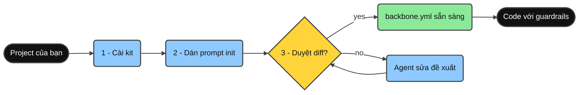
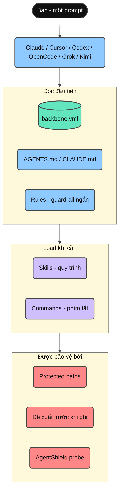
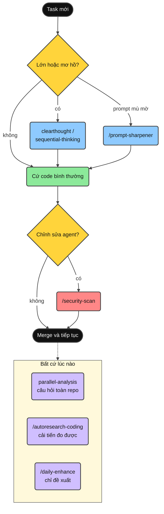
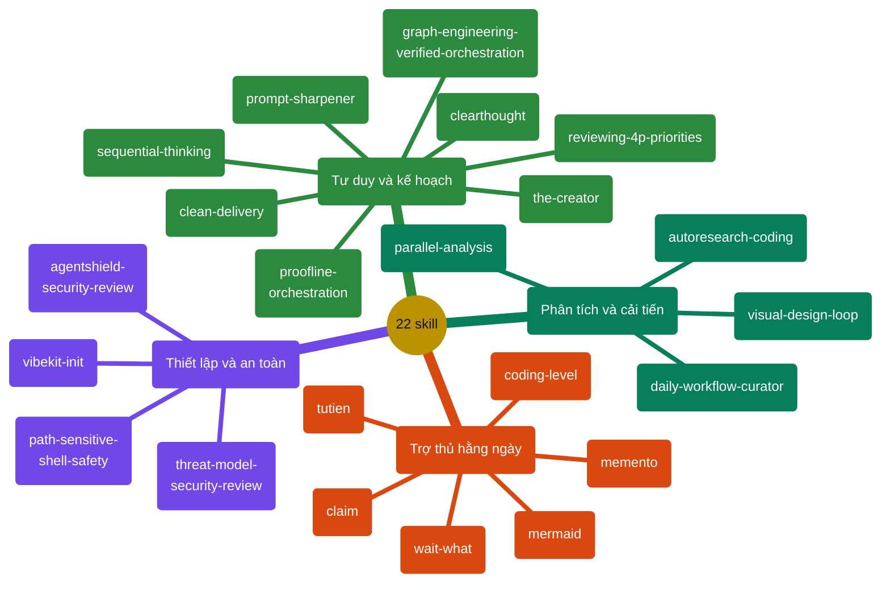
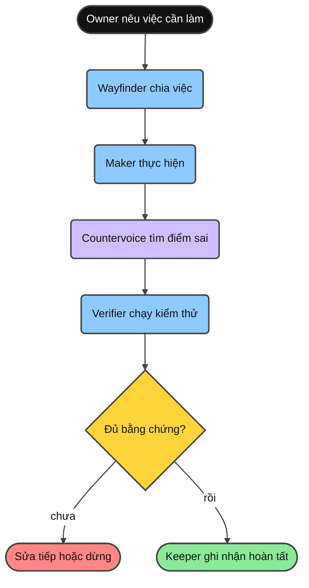
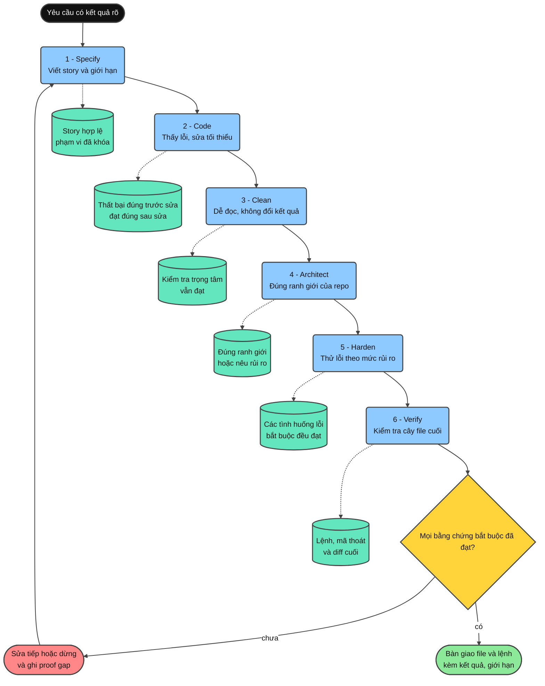
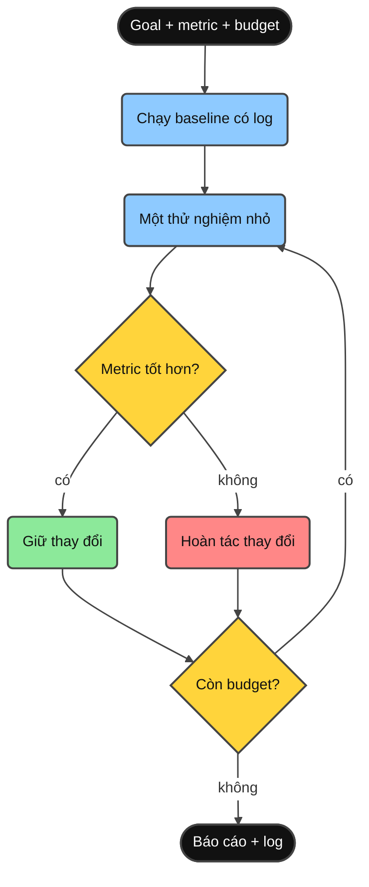

<div align="center">

**Đọc bằng:** [English](../README.md) · **Tiếng Việt** · [简体中文](README.zh-CN.md) · [日本語](README.ja.md) · [한국어](README.ko.md) · [Deutsch](README.de.md) · [Български](README.bg.md)

# Minimal Vibe Coding Kit

[](../LICENSE)
[](https://www.npmjs.com/package/minimal-vibe-coding-kit)
[](../CHANGELOG.md)


**Một bộ kit AI-coding cài một lần cho Claude Code, Cursor, Codex, OpenCode, Grok và Kimi - mọi repo, mọi ngôn ngữ.**

Cài đặt → dán một prompt → duyệt đề xuất → code với guardrails.

Nếu bộ kit này thực sự giúp ích cho bạn, hãy tặng repo một Star. Điều đó cho tôi biết nó hữu ích thêm với một người nữa và tiếp thêm năng lượng để tôi tiếp tục cải thiện nó.

</div>

---

## Bộ kit này là gì?

Một bộ kit nhỏ gồm **rules**, **skills**, **commands** dùng chung, cộng một manifest **`backbone.yml`**, giúp Claude Code, Cursor, Codex, OpenCode, Grok và Kimi hiểu project của bạn theo cùng một cách.

- Không bao giờ ghi đè `CLAUDE.md` / `AGENTS.md` sẵn có - chỉ thêm managed block.
- Mọi thao tác ghi khi setup đều chờ bạn duyệt.
- Rà soát bảo mật bề mặt agent (AgentShield) là một phần của workflow bình thường.
- Xóa an toàn mặc định: mọi agent ưu tiên lệnh `trash` (khôi phục được; init sẽ kiểm tra và gợi ý cách cài nếu thiếu), kèm guardrail config đúng chuẩn từng tool - deny rules cho Claude Code (`.claude/settings.json`), CLI permissions cho Cursor (`.cursor/cli.json`), execution-policy rules cho Codex (`.codex/rules/`, experimental, chỉ chạy khi project được trust), và permission rules cấp project cho Grok (`.grok/config.toml`).
- Init lần đầu hỏi hai tùy chọn - dùng `trash` thay `rm`, và mức giải thích mặc định (0-5, đổi bất cứ lúc nào với `/coding-level N`) - rồi lưu cả hai vào `backbone.yml`.

## Bắt đầu nhanh

Ba bước, khoảng hai phút.



**1. Cài vào project của bạn** (không cần clone):

```bash
npx --yes minimal-vibe-coding-kit@latest install /path/to/your-project
```

Đã chạy `npm i minimal-vibe-coding-kit`, hoặc muốn cài từ GitHub / bản clone? Xem [Cài từ npm](#cài-từ-npm).

**2. Mở project trong Claude Code, Cursor, Codex, OpenCode, Grok hoặc Kimi Code và dán:**

```text
Read .vibekit/init/FIRST_TIME_INIT.md and initialize this repo with Minimal Vibe Coding Kit.
First print the requirements you will check. Then run detection, propose one diff
for backbone.yml and managed instruction blocks, and wait for my yes before writing.
```

**3. Review diff được đề xuất và trả lời `yes`.**

Agent điền `backbone.yml` với stack và quy ước đã dò được, rồi chuyển sang `initialized`. Xong - mọi phiên sau tự động đọc file này và bỏ qua bước init.

Kiểm tra sức khỏe bất cứ lúc nào:

```bash
node .vibekit/scripts/mvck.mjs doctor .
```

## Cài từ npm

Kit được publish trên npm với tên [`minimal-vibe-coding-kit`](https://www.npmjs.com/package/minimal-vibe-coding-kit). Đây là **CLI scaffolding, không phải library** - file nằm trong `node_modules/` tự nó không làm gì cả. Chạy `install` một lần sẽ copy kit vào repo root của bạn, giống hệt installer từ GitHub.

**Cách A - chạy một phát (khuyến nghị).** Không thêm gì vào dependencies của project:

```bash
npx --yes minimal-vibe-coding-kit@latest install /path/to/your-project
```

**Cách B - cài như dependency.** Nếu bạn đã (hoặc muốn) `npm i` package, cần thêm đúng một lệnh nữa:

```bash
npm i -D minimal-vibe-coding-kit
npx mvck install .        # bắt buộc - copy kit từ node_modules ra repo của bạn
```

> **Quan trọng:** `npm i` một mình chỉ tải kit vào `node_modules/` - chưa có gì hoạt động.
> `mvck install` mới là bước copy `.claude/`, `.cursor/`, `.agents/`, `.grok/`, `.kimi-code/`, `.vibekit/` và `backbone.yml` vào repo root.

Sau đó, lệnh ngắn `mvck` (alias: `vibe-kit`) dùng được qua `npx`:

| Lệnh ngắn             | Chức năng                                               |
| --------------------- | ------------------------------------------------------- |
| `npx mvck install .`  | Copy kit vào repo (`--profile`, `--dry-run`, `--force`) |
| `npx mvck update .`   | Làm mới file thuộc kit khi có bản phát hành mới         |
| `npx mvck doctor .`   | Health check chỉ-đọc (`--run-repo-checks` mới chạy validation và probe của repo) |
| `npx mvck validate .` | Validate cấu trúc                                       |

Rồi tiếp tục **bước 2** của Bắt đầu nhanh (dán prompt init).

Các cách cài khác: `npx github:giang6283623/minimal-vibe-coding-kit install /path/to/your-project`, hoặc từ bản clone `./install.sh /path/to/your-project` (Windows: `./install.ps1 -Target C:\path\to\your-project`).

## Những gì được cài vào repo của bạn

Cài đặt chỉ thêm đúng những mục sau - không đụng vào bất cứ thứ gì khác:

```text
your-project/
├── backbone.yml              ← bản đồ project mà agent đọc đầu tiên (nguồn sự thật duy nhất)
├── AGENTS.md                 ← hướng dẫn chung cho agent (managed block)
├── CLAUDE.md                 ← ngắn gọn; import AGENTS.md (chỉ tạo khi chưa có)
├── .gitignore                ← các entry của kit thêm trong managed block
├── .claude/                  ← Claude Code: rules, commands, agents, skills
├── .cursor/                  ← Cursor: rules, commands, skills
├── .agents/                  ← skills cho Codex + OpenCode / portable
├── .codex/  .codex-plugin/   ← config mẫu Codex + plugin manifest
├── .opencode/                ← OpenCode commands and integration guide
├── .grok/                    ← Grok Build: rules, skills, config mẫu
├── .kimi-code/                    ← Kimi Code: skills (thư mục skills project được ưu tiên cao nhất)
└── .vibekit/                 ← mọi thứ thuộc kit, trong MỘT thư mục
    ├── skills/               ← shared skills canonical (mirror sang các harness)
    ├── commands/             ← prompt command dùng chung
    ├── scripts/              ← CLI mvck, init, validate, doctor, security probe
    ├── docs/                 ← tài liệu tham khảo sâu hơn
    └── init/                 ← file onboarding một lần (xóa được bằng /vibe-finalize)
```

File sẵn có không bao giờ bị thay thế - kit chỉ merge managed block (`BEGIN/END: minimal-vibe-coding-kit`) và bỏ qua những gì thuộc về bạn.

## Các mảnh ghép kết nối thế nào



- **`backbone.yml`** - đường dẫn, quy ước, protected paths, và lệnh validate của repo bạn.
- **Rules** - guardrails ngắn, luôn được load (đọc backbone trước, diff nhỏ, security review khi sửa bề mặt agent).
- **Skills** - quy trình lặp lại được, chỉ load khi task cần.
- **Commands** - phím tắt một từ cho các skill hay dùng nhất.

## Hướng dẫn - sử dụng hằng ngày



<details>
<summary><strong>Xem thêm</strong></summary>

1. **Cứ code bình thường.** Yêu cầu feature/fix như thường lệ; agent theo quy ước trong `backbone.yml` và giữ diff nhỏ.
2. **Task lớn hoặc mơ hồ?** Bắt đầu với skill `clearthought` hoặc `sequential-thinking` để có kế hoạch trước.
3. **Task phức tạp nhưng prompt mù mờ?** `/prompt-sharpener <prompt mù mờ>` cải thiện prompt thành bản rõ ràng rồi thực thi ngay trong cùng lượt.
4. **Muốn đưa skill, rule, hoặc tool mới vào repo?** `/claim <yêu cầu + link>` kiểm chứng nguồn với tài liệu chính thức, kiểm tra độ khớp với repo, hỏi lại khi chưa rõ, rồi tích hợp và ghi tài liệu.
5. **Muốn thả lỏng một chút khi nhìn lại tiến độ?** `/tutien` là chế độ tu tiên riêng tư dựa trên lịch sử Git + file export chat AI. Khi đã bật, mọi phản hồi đều giữ văn phong truyện tu tiên linh hoạt theo ngôn ngữ người dùng cho đến lúc `/tutien off`; phản diện đủ điều kiện mặc định cà khịa và mỉa mai lỗi quy trình có bằng chứng. Lúc kích hoạt, chế độ hỏi mức `humiliation=0..10` để tăng dần độ bại trận của vai tu sĩ hư cấu nhưng vẫn giữ ranh giới cứng đối với con người thật. Trường thiên ký sự sẽ phát triển một thế giới, nhân vật, tông môn, hệ thống cảnh giới và các chương truyện riêng cho từng dự án bằng tiếng Việt, tiếng Anh hoặc tiếng Trung giản thể.
6. **Câu hỏi toàn repo hoặc review lớn?** Dùng `parallel-analysis` - chia các lane phân tích chỉ-đọc chạy song song rồi xác minh kết quả gộp.
7. **Đã sửa `.claude/`, skills, hooks, hoặc script installer?** Chạy `/security-scan` trước khi merge.
8. **Muốn cải tiến đo được?** Chạy `/autoresearch-coding` với metric và budget.
9. **Giữ setup luôn sắc bén:** `/daily-enhance` đề xuất cải tiến - không bao giờ tự áp dụng.
10. **Onboarding xong hẳn?** `/vibe-finalize` dọn các file bootstrap một lần.

</details>

## Commands

```mermaid
---
config:
  theme: base
  themeVariables:
    fontFamily: cascadia mono, consolas, noto sans mono, menlo, monospace
    fontSize: 15px
    lineColor: "#444444"
    textColor: "#111111"
    edgeLabelBackground: "#FFFFFF"
    clusterBkg: "#FFF9DB"
    clusterBorder: "#444444"
---
flowchart LR
    subgraph SetupPhase["Thiết lập"]
        Init("/init-vibe<br/>một diff, chờ duyệt")
    end
    subgraph DailyPhase["Hằng ngày"]
        Scan("/security-scan<br/>bề mặt agent")
        Enhance("/daily-enhance<br/>chỉ đề xuất")
    end
    subgraph ImprovePhase["Cải tiến"]
        Auto("/autoresearch-coding<br/>vòng lặp metric")
        Council("/council<br/>kế hoạch gộp")
    end
    subgraph GradPhase["Tốt nghiệp"]
        Final("/vibe-finalize<br/>dọn bootstrap")
    end
    SetupPhase --> DailyPhase --> ImprovePhase --> GradPhase

    classDef terminal fill:#111111,stroke:#444444,stroke-width:2px,color:#FFFFFF
    classDef step fill:#8ECAFF,stroke:#444444,stroke-width:2px,color:#111111
    classDef success fill:#8CE99A,stroke:#444444,stroke-width:2px,color:#111111
    classDef danger fill:#FF8787,stroke:#444444,stroke-width:2px,color:#111111
    classDef accent fill:#D0BFFF,stroke:#444444,stroke-width:2px,color:#111111
    linkStyle default stroke:#444444,stroke-width:1.5px

    class Init step
    class Scan danger
    class Enhance,Council accent
    class Auto success
    class Final terminal
```



<details>
<summary><strong>Xem thêm</strong></summary>

| Command                | Chức năng                                                                  | Ví dụ                                                               |
| ---------------------- | -------------------------------------------------------------------------- | ------------------------------------------------------------------- |
| `/init-vibe`           | Init lần đầu hoặc sửa chữa: đề xuất một diff, chờ duyệt.                   | `/init-vibe` - review diff rồi trả lời `yes`.                       |
| `/security-scan`       | AgentShield probe chỉ-đọc + scanner tùy chọn cho bề mặt agent.             | `/security-scan` trước khi merge thay đổi `.claude/**` hoặc skills. |
| `/daily-enhance`       | Báo cáo chỉ-đề-xuất để cải tiến rules, skills, workflows.                  | `/daily-enhance` - review diff đề xuất rồi duyệt.                   |
| `/autoresearch-coding` | Vòng lặp thử nghiệm theo metric với baseline và budget.                    | `/autoresearch-coding` Goal: giảm lỗi lint. Budget: 3.              |
| `/clean-delivery`      | Đưa một hành vi qua sáu craftsmanship gate theo tỷ lệ.                      | `/clean-delivery` Goal: thêm rate limiting. Risk: medium.             |
| `/council`             | Chọn provider mode rồi chỉ phối hợp những role task thực sự cần.             | `/council` trên diff của branch này.                                |
| `/proofline`           | Điều phối vai trò có giới hạn, phản biện độc lập, tín hiệu và bằng chứng.  | `/proofline` Goal: harden auth. Done signal: targeted tests pass.   |
| `/vibe-finalize`       | Tốt nghiệp project: chuyển file bootstrap một lần vào `_vibekit-cleanup/`. | `/vibe-finalize` - xem trước, áp dụng sau khi duyệt.                |

</details>

### Chọn chế độ multi-agent

Ngay trước khi dispatch child agent hoặc lane multi-agent đầu tiên, parent sẽ hỏi Default, Auto hoặc Custom bằng công cụ câu hỏi có cấu trúc native của provider hiện tại nếu có. Default giữ provider và model mặc định hiện tại. Auto chỉ route lane có giới hạn qua adapter ở trạng thái ready và chọn model có chi phí thấp nhất nhưng vẫn vượt quality và safety floor của task. Custom cho phép bạn gán provider và model đã được xác minh theo từng role.

Chọn "Don't show again" để nhớ chính xác mode đó trong .vibekit/preferences.json. Child agent trả needs_user_input về parent thay vì hỏi trực tiếp bạn. Coding level chỉ thay đổi độ chi tiết giải thích và lựa chọn được đề xuất, không bao giờ hạ chất lượng model hoặc an toàn. Xem [.vibekit/docs/ORCHESTRATION_MODES.md](../.vibekit/docs/ORCHESTRATION_MODES.md).

## Skills

Cả 22 skill nằm canonical trong `.vibekit/skills/`. Claude, Codex, OpenCode, Grok và Kimi mirror đủ 22; Cursor mirror 17 skill tương tác. Gọi bằng tên ("Use the X skill…") hoặc qua các command ở trên.



<details>
<summary><strong>Xem thêm</strong></summary>

| Skill                         | Dùng khi                                                                                                                                                                                                                                               | Prompt ví dụ                                                                            |
| ----------------------------- | ------------------------------------------------------------------------------------------------------------------------------------------------------------------------------------------------------------------------------------------------------ | --------------------------------------------------------------------------------------- |
| `vibekit-init`                | Setup lần đầu, hoặc `backbone.yml` / managed blocks cần sửa.                                                                                                                                                                                           | "Use the vibekit-init skill. Propose one diff and wait for my yes."                     |
| `parallel-analysis`           | Câu hỏi toàn repo, review diff lớn, audit tính nhất quán.                                                                                                                                                                                              | "Use parallel-analysis: where is auth handled and what depends on it?"                  |
| `graph-engineering-verified-orchestration` | Công việc phức tạp có các nhánh thực sự độc lập và cần dependency rõ ràng, cô lập, budget, xác minh khách quan, rollback và merge gate có giới hạn. | "Use graph-engineering-verified-orchestration to design a safe task graph for this migration." |
| `clean-delivery` | Một lát cắt hành vi cần các gate Specify, Code, Clean, Architect, Harden và Verify có kỷ luật, TDD theo tỷ lệ và bằng chứng tái lập được. | "Use clean-delivery để triển khai hành vi này với extreme craftsmanship." |
| `proofline-orchestration`     | Công việc phức tạp cần governance rõ ràng, implementation có giới hạn, một bên phản biện độc lập có thực quyền, tín hiệu escalation có kiểu và acceptance dựa trên bằng chứng. | "Use proofline-orchestration để điều phối migration này và giữ nguyên dissent." |
| `agentshield-security-review` | Audit config agent, skills, hooks, MCP, commands trước khi merge.                                                                                                                                                                                      | "Use agentshield-security-review on .claude/** and .vibekit/skills/**."                 |
| `threat-model-security-review` | Review source ứng dụng, API, authentication, authorization, đường input, trust boundary và diff nhạy cảm về bảo mật với bằng chứng và coverage rõ ràng. | "Use threat-model-security-review on this repository. Stay read-only and report proof gaps." |
| `autoresearch-coding`         | Cải tiến repo qua các thử nghiệm đo được.                                                                                                                                                                                                              | "Use autoresearch-coding. Metric: `npm test`. Direction: higher. Budget: 3."            |
| `daily-workflow-curator`      | Tune-up định kỳ cho rules, skills, workflows (chỉ đề xuất).                                                                                                                                                                                            | "Use daily-workflow-curator and propose today's improvements."                          |
| `path-sensitive-shell-safety` | Trước khi sửa logic shell/installer/deploy có biến path hoặc `rm`/`mv`/`rsync`.                                                                                                                                                                        | "Use path-sensitive-shell-safety before changing this cleanup script."                  |
| `visual-design-loop`          | Polish UI: render → screenshot → review → fix, theo vòng lặp.                                                                                                                                                                                          | "Use visual-design-loop on /dashboard. Budget 3 loops."                                 |
| `clearthought`                | Yêu cầu mơ hồ, tradeoff thiết kế, quyết định rủi ro.                                                                                                                                                                                                   | "Use clearthought. Operation: implementation_plan. Split this feature into safe tasks." |
| `sequential-thinking`         | Chia nhỏ công việc phức tạp theo từng bước.                                                                                                                                                                                                            | "Use sequential-thinking. Break this refactor into ordered steps with tests."           |
| `reviewing-4p-priorities`     | Triage bug/finding theo thứ tự fix P0-P4.                                                                                                                                                                                                              | "Use reviewing-4p-priorities. Classify these findings and give a fix sequence."         |
| `memento`                     | Task nhiều ngày: lưu ngữ cảnh trước khi dừng, resume phiên sau.                                                                                                                                                                                        | "/memento - write MEMENTO.md with Goal, Done, Stuck, Next."                             |
| `coding-level`                | Chỉnh độ chi tiết khi giải thích (0 = ELI5 … 5 = chuyên gia).                                                                                                                                                                                          | "/coding-level 2"                                                                       |
| `prompt-sharpener`            | Task phức tạp nhưng prompt mù mờ: cải thiện prompt rồi thực thi ngay trong cùng lượt.                                                                                                                                                                  | "/prompt-sharpener make the settings page load faster"                                  |
| `claim`                       | Đưa thứ mới vào repo (skill, rule, quy ước, tool): kiểm chứng nguồn chính thức, kiểm tra độ khớp, xác nhận, tích hợp, ghi tài liệu.                                                                                                                    | "/claim add the conventional-commits rule from https://www.conventionalcommits.org"     |
| `wait-what`                   | Câu trả lời vừa rồi chưa rõ: agent dừng lại và trình bày lại bằng ngôn ngữ đơn giản, đúng ngôn ngữ của bạn, khôi phục tiền đề còn thiếu bằng thuật ngữ trong glossary; không làm việc mới.                                                             | "/wait-what đoạn nói về token budget"                                                   |
| `tutien`                      | Chế độ tu tiên riêng tư do người dùng gọi, có bằng chứng Git/chat chính xác và trường thiên mở. Khi bật, mọi phản hồi dùng văn phong tu tiên linh hoạt theo ngôn ngữ người dùng; `humiliation=0..10` điều khiển độ bại trận của vai tu sĩ hư cấu. `/tutien off` khôi phục văn phong thường. | "/tutien on humiliation=8"                                                             |
| `the-creator`                 | Sáng tạo art, design, interface, method, process hoặc system qua 10 level cộng dồn; mỗi level bỏ thêm 10% convention đủ điều kiện nhưng giữ nguyên safety, logic và functional acceptance. | "Use the-creator level 7 để tạo một quy trình code review mới." |
| `mermaid`                     | Sinh sơ đồ Mermaid có style (31 loại) với độ chi tiết theo coding level. Chủ động hỏi có muốn thêm sơ đồ khi viết tài liệu, và khi debug có thể vẽ workflow tô đỏ vùng nghi là nguyên nhân bug.                                                        | "Use the mermaid skill. Vẽ flowchart cho pipeline deploy này."                          |

Với `story=on` (mặc định), sau khi phân tích được duyệt, chế độ chuẩn bị `.vibekit/reports/tutien/story/`: `plot.md` lưu tổng cương và thế giới quan đang phát triển, `story-state.json` giữ mạch truyện, còn `chapters/NNNN-<tên-chương-tu-tiên>.md` lưu mỗi lần đúng một chương. Văn truyện do agent sáng tác từ dữ liệu tổng hợp thay vì ghép câu cố định; tên nhân vật, xưng hô và đối thoại tự nhiên theo `story-language=vi|en|zh`.

</details>

### Proofline: để AI không tự làm rồi tự chấm

**Nói ngắn gọn:** Proofline tổ chức nhiều AI thành một nhóm có người làm, người kiểm tra và người giữ điều kiện nghiệm thu. Mục tiêu là giảm tình huống một AI tự chọn cách làm, tự sửa code rồi tự kết luận rằng mọi thứ đã đúng.

Hãy hình dung bạn sửa một căn nhà. Bạn không muốn người thợ vừa thi công điện, vừa tự kiểm tra an toàn, vừa tự ký biên bản nghiệm thu. Với việc code quan trọng cũng vậy: người làm và người phản biện nên có trách nhiệm khác nhau.

#### Mỗi vai trò giống ai ngoài đời?

| Vai trò | Ví dụ ngoài đời | Trách nhiệm |
| --- | --- | --- |
| `Owner` | Chủ nhà hoặc chủ sản phẩm | Nói rõ cần gì và giữ quyền quyết định cuối cùng |
| `Wayfinder` | Quản lý công trình | Chia việc, giao phạm vi và ghép kết quả |
| `Maker` | Người thợ | Thực hiện đúng phần việc được giao |
| `Countervoice` | Giám sát độc lập | Tìm giả định sai, lỗ hổng và bằng chứng mâu thuẫn |
| `Verifier` | Người đo kiểm | Chạy test hoặc phép đo khách quan |
| `Keeper` | Người giữ checklist nghiệm thu | Chỉ ghi nhận hoàn tất khi đủ điều kiện |

Các tên trên là trách nhiệm, không phải cấp bậc. `Countervoice` được phép nói rằng kế hoạch ban đầu sai, kể cả khi `Wayfinder` có nhiều kinh nghiệm hơn.

#### Lợi ích thực tế

- **Ít lỗi "AI tự tin nhưng sai":** kết luận của người làm phải qua phản biện và test.
- **Phát hiện sai từ gốc:** `Countervoice` có thể chỉ ra rằng yêu cầu, kiến trúc hoặc cách đặt câu hỏi đang sai, thay vì chỉ vá phần ngọn.
- **Giảm sửa nhầm:** mỗi người chỉ được chạm vào phạm vi đã giao; test và file quan trọng được bảo vệ.
- **Dễ kiểm tra lại:** kết quả đi kèm file đã đổi, test đã chạy, điểm còn nghi ngờ và giới hạn chưa giải quyết.
- **Biết lúc nào nên dừng:** thiếu quyền, thiếu test hoặc hết ngân sách thì workflow dừng an toàn, không đoán mò.

#### Khi nào nên dùng?

| Nên dùng Proofline | Không cần dùng Proofline |
| --- | --- |
| Đăng nhập, phân quyền, thanh toán hoặc dữ liệu nhạy cảm | Sửa typo hoặc đổi một câu chữ |
| Migration dữ liệu, refactor lớn hoặc thay đổi kiến trúc | Thay đổi nhỏ trong một file, dễ hoàn tác |
| Nhiều AI hoặc nhiều nhánh đang làm song song | Một người làm và test rõ ràng đã đủ |
| Sai sót có thể gây mất dữ liệu, lộ quyền hoặc downtime | Không có cách kiểm tra khách quan và việc chỉ cần ý tưởng |

#### Dùng ở đâu?

Proofline dùng ngay trong repository có Minimal Vibe Coding Kit, với Codex, Claude Code, Cursor, Grok hoặc Kimi. Nó phù hợp nhất cho task code có file, phạm vi và cách kiểm tra rõ ràng. Paseo chỉ là adapter tùy chọn để điều phối nhiều phiên làm việc; bạn không cần cài Paseo để dùng Proofline.



#### Cách bắt đầu đơn giản nhất

Bạn không cần biết `digest`, `lease` hay `gateway` để bắt đầu. Hãy mô tả năm điều sau:

```text
/proofline
Mục tiêu: sửa phân quyền đăng nhập để role lạ luôn bị từ chối.
Được phép sửa: src/auth-policy.mjs
Không được sửa: test/auth-policy.test.mjs
Hoàn tất khi: test đăng nhập chạy thành công.
Giới hạn: không đổi API và không cài thêm package.
```

Kit sẽ tự chọn cách chạy phù hợp:

- Việc nhỏ: một luồng tuần tự, không dựng cả nhóm không cần thiết.
- Việc cần phản biện: thêm `Countervoice` để kiểm tra độc lập.
- Việc phức tạp và có thể chia nhỏ: dùng nhiều lane có phạm vi rõ ràng.
- Không đủ quyền hoặc không có test đáng tin: chỉ lập kế hoạch hoặc dừng an toàn.

#### Ví dụ thực tế: sửa quyền đăng nhập

Giả sử hệ thống chỉ cho `admin` và `editor` truy cập, còn role lạ phải bị từ chối:

1. `Wayfinder` giao `src/auth-policy.mjs` cho `Maker`, nhưng bảo vệ file test.
2. `Maker` đổi logic sang danh sách role được phép.
3. `Countervoice` thử tìm lỗi nguy hiểm, ví dụ role `unknown` vô tình được cho qua.
4. `Verifier` chạy test cho `admin`, `editor` và `unknown`.
5. `Keeper` chỉ ghi nhận hoàn tất nếu test đạt và mọi phản biện đã được trả lời.

Kết quả bạn nhận không chỉ là "đã xong". Nó gồm code đã đổi, test đã chạy, bằng chứng kiểm tra, điều còn rủi ro và lý do workflow dừng nếu chưa đủ an toàn.

<details>
<summary>Dành cho người muốn hiểu thuật ngữ và kiểm tra ledger</summary>

| Thuật ngữ | Hiểu đơn giản |
| --- | --- |
| Scope | Khu vực được phép chạm vào |
| Digest | Dấu vân tay của file hoặc trạng thái; file đổi thì dấu đổi |
| Grant | Giấy phép cho đúng người, đúng việc và đúng thời hạn |
| Lease | Chìa khóa tạm thời để chỉ một người được tích hợp |
| Proof Return | Phiếu bàn giao gồm thay đổi và bằng chứng kiểm tra |
| Seal | Biên bản ghi nhận đã đủ điều kiện; không tự động cho phép deploy |
| Gateway | Chốt bảo vệ kiểm tra lại quyền trước hành động quan trọng |

Để chạy ví dụ xác định đi kèm:

```bash
npm run test:proofline
node .vibekit/skills/proofline-orchestration/scripts/run-proofline-sandbox.mjs \
  .vibekit/skills/proofline-orchestration/examples/auth-migration-case.json
```

Xem thêm [hợp đồng skill](../.vibekit/skills/proofline-orchestration/SKILL.md), [control matrix](../.vibekit/skills/proofline-orchestration/references/control-matrix.md) và [ví dụ authentication](../.vibekit/skills/proofline-orchestration/examples/auth-migration-case.json).

Validator và gateway đi kèm là công cụ mô phỏng policy trong máy hiện tại. Chúng không chứng minh OS, provider, MCP server hoặc hệ thống bên ngoài đã thực sự cưỡng chế mọi quyền. Merge, deploy hoặc thay đổi hệ thống thật vẫn cần quyền mới của `Owner` và một gateway bên ngoài có bộ đếm dùng chung, bền vững.

[Adapter Paseo](../.vibekit/skills/proofline-orchestration/references/paseo-adapter.md) là tùy chọn, chỉ dùng khi bạn muốn điều phối nhiều phiên làm việc. Proofline không tự cài Paseo, không lưu credential và không sửa cấu hình user-level.

</details>

### Clean Delivery: một thay đổi nhỏ, sáu lần kiểm tra

**Hiểu nhanh:** Clean Delivery là cách làm một thay đổi nhỏ theo thứ tự rõ ràng. Mỗi cổng trả lời một câu hỏi, tạo ra một bằng chứng có thể kiểm tra lại và chỉ cho phép đi tiếp khi điều kiện của cổng đã đạt. Sáu cổng là sáu lần kiểm tra chất lượng, không phải sáu agent và cũng không phải sáu quy trình chạy song song.

Ví dụ, yêu cầu "không ghi `NaN` vào ledger" vẫn còn mơ hồ. Clean Delivery biến nó thành kết quả đo được: mọi giá trị không hữu hạn phải bị từ chối trước khi ghi, ledger phải giữ nguyên khi lỗi, và giá trị hữu hạn vẫn được chấp nhận. Sau đó thay đổi được làm, làm sạch, kiểm tra ranh giới, thử các trường hợp lỗi và xác minh lại trên trạng thái cuối cùng của repo.

Trong phần này, **bằng chứng** nghĩa là một lệnh kiểm tra kèm kết quả và mã thoát, hoặc một nhận xét kỹ thuật có phạm vi rõ khi repo chưa có lệnh phù hợp. Nếu thiếu kiểm tra bắt buộc, đó là `proof gap`, không phải là đã đạt.

#### Mỗi cổng thực sự làm gì?

| Cổng | Việc cần làm | Chỉ đi tiếp khi |
| --- | --- | --- |
| `Specify` | Viết một story nêu kết quả người dùng thấy, file được sửa, file không được sửa và tiêu chí hoàn tất. | Story được validator chấp nhận, phạm vi đã khóa và test quan trọng được đánh dấu là tài sản cần bảo vệ. |
| `Code` | Chạy kiểm tra để thấy lỗi thật trước khi sửa, rồi viết lượng code nhỏ nhất làm hành vi đúng. | Cùng một kiểm tra thất bại đúng lý do trước thay đổi và đạt sau thay đổi. Không test nào bị làm yếu để tạo kết quả giả. |
| `Clean` | Đổi tên, tách đoạn khó đọc và bỏ lặp mà không thêm hành vi mới. | Kiểm tra trọng tâm vẫn đạt sau từng lần làm sạch có ý nghĩa. |
| `Architect` | Xem thay đổi có nằm đúng ranh giới module, đúng chiều phụ thuộc và đúng quy tắc trong `backbone.yml` hay không. | Lệnh kiểm tra kiến trúc đạt, hoặc phần chưa kiểm tra được và rủi ro còn lại được ghi rõ. |
| `Harden` | Thử đường lỗi và dữ liệu xấu phù hợp với mức rủi ro, chẳng hạn giá trị biên, quyền truy cập, không làm thay đổi dữ liệu khi lỗi hoặc kiểm tra đầu cuối. | Mọi kiểm tra bắt buộc cho mức rủi ro đều đạt. Kiểm tra chưa có được báo là `not-configured`, không được tính là đạt. |
| `Verify` | Chạy lại lệnh xác minh của repo và của story trên đúng cây file cuối cùng, rồi xem diff có vượt phạm vi không. | Tất cả bằng chứng bắt buộc đạt, kết quả từng lệnh được ghi lại và không còn thay đổi ngoài story. |

#### Nếu một cổng chưa đạt thì sao?

- Không bỏ qua cổng và không gọi công việc là hoàn tất.
- Nếu lỗi thuộc phần đang làm, sửa rồi chạy lại từ kiểm tra liên quan.
- Nếu yêu cầu ban đầu phải đổi, quay lại `Specify` và khóa lại story.
- Nếu thiếu công cụ hoặc bằng chứng bắt buộc, dừng an toàn và ghi `proof gap` cùng quyết định nhỏ nhất cần người dùng đưa ra.
- Chỉ nhánh màu xanh sau `Verify` mới là trạng thái sẵn sàng bàn giao.

#### Lợi ích thực tế

- Biết chính xác thay đổi này phải làm gì và không được chạm vào đâu trước khi bắt đầu code.
- Có bằng chứng lỗi tồn tại trước khi sửa, nên một test vốn đã xanh không thể bị dùng để chứng minh sai.
- Test, fixture và validator quan trọng không thể bị sửa yếu đi chỉ để tạo kết quả đạt giả.
- Việc làm sạch code luôn đi kèm chạy lại kiểm tra, nên dễ phát hiện refactor làm đổi hành vi.
- Mức kiểm tra tăng theo rủi ro thực tế. Thay đổi nhỏ không bị ép làm nghi thức của thay đổi nguy hiểm.
- Bàn giao cuối cùng nói rõ file nào đổi, lệnh nào đã chạy, kết quả gì và giới hạn nào còn lại.

#### Khi nào nên dùng?

| Dùng Clean Delivery | Quy trình đơn giản hơn là đủ |
| --- | --- |
| Sửa hành vi đăng nhập, phân quyền, thanh toán, ghi dữ liệu hoặc validation ở ranh giới hệ thống. | Sửa chính tả, comment hoặc một câu tài liệu không đổi hành vi. |
| Kết quả cần tiêu chí chấp nhận rõ và phải chứng minh lỗi trước khi sửa. | Chỉ phân tích, giải thích hoặc brainstorm mà không thay đổi repo. |
| Thay đổi đi qua nhiều file, module hoặc có rủi ro làm hỏng hành vi cũ. | Thay đổi cơ học, dễ hoàn tác và đã có một kiểm tra phù hợp. |
| Test hoặc validator phải được bảo vệ khỏi phần code đang triển khai. | Không có hành vi quan sát được để kiểm tra khách quan. |

Với yêu cầu lớn, hãy chia thành nhiều story nhỏ có thể xác minh độc lập. Chỉ thêm Proofline hoặc graph orchestration khi thật sự cần người kiểm tra độc lập, quyền sở hữu tách biệt hoặc nhiều phần việc chạy song song.

#### Nó chạy ở đâu?

**Clean Delivery không phải server, ứng dụng nền hay dịch vụ bên ngoài.** Đây là quy trình mà coding agent thực hiện ngay trong repo đang mở:

1. Đọc yêu cầu, hướng dẫn repo và `backbone.yml`.
2. Tạo một story nhỏ, khóa phạm vi và xác định test cần bảo vệ.
3. Dùng các lệnh kiểm tra repo đã có, chẳng hạn `npm test`.
4. Ghi lại kết quả của từng cổng và mọi `proof gap`.
5. Bàn giao thay đổi cùng bằng chứng có thể chạy lại.

Clean Delivery không tự cài test framework, không tự bật hook và không tự mở rộng quyền chỉ để làm một cổng trông như đã đạt.

#### Luồng đầy đủ và bằng chứng của từng cổng



**Cách đọc sơ đồ:**

1. Đi theo mũi tên liền từ trên xuống để thấy thứ tự sáu cổng.
2. Ô xanh dương là việc agent phải làm tại mỗi cổng.
3. Ô xanh ngọc nối bằng nét chấm là bằng chứng phải giữ lại sau cổng đó.
4. Hình thoi màu vàng là quyết định cuối: mọi bằng chứng bắt buộc đã đạt chưa.
5. Nhánh đỏ quay lại `Specify` vì việc sửa có thể làm thay đổi phạm vi hoặc tiêu chí ban đầu. Nếu không thể sửa an toàn, công việc dừng với `proof gap` rõ ràng.
6. Nhánh xanh chỉ xuất hiện sau khi kiểm tra trên cây file cuối cùng đã đạt.

**Kết luận của sơ đồ:** hoàn thành code ở cổng `Code` chưa có nghĩa là hoàn thành công việc. Chỉ sau `Verify`, khi mọi bằng chứng bắt buộc vẫn đạt trên trạng thái cuối cùng, thay đổi mới sẵn sàng bàn giao.

#### Cách bắt đầu đơn giản nhất

```text
/clean-delivery
Goal (kết quả cần thấy): từ chối metric không hữu hạn trước khi ghi bất kỳ dòng ledger nào.
May edit (chỉ được sửa): src/metric-ledger.py và focused tests.
Must not edit (không được sửa): acceptance fixtures hoặc release scripts hiện có.
Done when (đạt khi): NaN và infinity fail mà không đổi ledger, còn giá trị hữu hạn vẫn pass.
Risk: medium.
```

| Dòng trong prompt | Ý nghĩa |
| --- | --- |
| `Goal` | Kết quả bên ngoài phải quan sát được, không mô tả cách viết code. |
| `May edit` | File hoặc thư mục agent được phép thay đổi. |
| `Must not edit` | Test, fixture, script hoặc khu vực cần giữ nguyên. |
| `Done when` | Điều kiện có thể chạy kiểm tra để kết luận đạt hay chưa. |
| `Risk` | Mức kiểm tra tối thiểu cần áp dụng. |

#### Mức rủi ro thay đổi cách kiểm tra thế nào?

| Mức | Kiểm tra tối thiểu |
| --- | --- |
| `low` | Kiểm tra trọng tâm, lệnh xác minh của repo và xem diff cuối. |
| `medium` | Thêm bằng chứng tiêu chí chấp nhận và xem lại ranh giới kiến trúc. |
| `high` | Thêm kiểm tra bảo mật, đường lỗi, tài sản xác minh được bảo vệ và người xác minh độc lập khi môi trường hỗ trợ đáng tin cậy. |
| `critical` | Thêm phê duyệt của con người, bằng chứng quay lui và người xác minh cuối độc lập. |

#### Ví dụ thực tế: từ chối metric không hợp lệ

| Cổng | Việc xảy ra trong ví dụ | Bằng chứng cần giữ |
| --- | --- | --- |
| `Specify` | Khóa quy tắc: `NaN`, `Infinity`, `-Infinity` và số bị tràn phải bị từ chối trước khi thêm dòng; ledger không được đổi khi lỗi. | Story hợp lệ, file được sửa và test được bảo vệ đã ghi rõ. |
| `Code` | Chạy case metric không hợp lệ để thấy hành vi sai, sau đó thêm kiểm tra số hữu hạn nhỏ nhất. | Case thất bại đúng trước thay đổi và cùng case đạt sau thay đổi. |
| `Clean` | Gom parsing và thông báo lỗi vào cấu trúc dễ đọc mà không đổi định dạng metric hợp lệ. | Kiểm tra metric hữu hạn và không hữu hạn vẫn đạt. |
| `Architect` | Xác nhận validation nằm tại ranh giới nơi metric sắp trở thành một dòng ledger, không nằm rải rác ở caller. | Review ranh giới hoặc lệnh kiến trúc của repo. |
| `Harden` | Thử `NaN`, infinity hai dấu, số tràn, text bất kỳ và xác nhận không có dòng nào được ghi khi lỗi. | Kết quả từng case và kiểm tra ledger không bị thay đổi. |
| `Verify` | Chạy toàn bộ lệnh đã hứa trên cây file cuối, xem diff và kiểm tra không có thay đổi ngoài phạm vi. | Command, mã thoát, kết quả liên quan và giới hạn còn lại. |

#### Từ khó trong phần này

| Thuật ngữ | Nghĩa đơn giản |
| --- | --- |
| `Story` | Bản mô tả nhỏ về một kết quả cần giao, phạm vi được sửa và cách biết đã hoàn tất. |
| `Red evidence` | Bằng chứng kiểm tra thất bại đúng vì hành vi còn thiếu trước khi triển khai. |
| `Focused check` | Kiểm tra nhỏ nhất nhắm trực tiếp vào hành vi đang sửa. |
| `Protected verifier asset` | Test, fixture, schema, snapshot, policy, dữ liệu benchmark hoặc validator mà phần triển khai không được làm yếu. |
| `Proof gap` | Kiểm tra bắt buộc chưa có, chưa chạy được hoặc chưa được giải quyết. |
| `Boundary` | Ranh giới trách nhiệm giữa module, tầng hoặc hệ thống. |
| `Final tree` | Toàn bộ trạng thái file cuối cùng sau mọi lần sửa và làm sạch. |

Kiểm tra một story bằng các lệnh sau:

```bash
node .vibekit/skills/clean-delivery/scripts/validate-story.mjs path/to/story.md
npm run test:clean-delivery
```

Thay `path/to/story.md` bằng đường dẫn thật tới file story. `null`, command vắng mặt hoặc `not-configured: <lý do>` nghĩa là chưa có verifier, không phải đã pass. Xem [skill contract](../.vibekit/skills/clean-delivery/SKILL.md), [story template](../.vibekit/skills/clean-delivery/references/story-template.md) và [verification tiers](../.vibekit/skills/clean-delivery/references/verification-tiers.md).

### Graph engineering: điều phối có xác minh

Đây là **skill do user gọi**, không phải rule luôn bật hay workflow riêng của một provider. Chỉ dùng khi graph có lợi ích thời gian/chi phí hợp lý hoặc giảm rủi ro phối hợp. Mỗi edge phải mang một artifact có tên; thay đổi mutable cần cô lập có thể cưỡng chế; và chỉ output vượt qua xác minh khách quan mới được merge. Nếu quyền, budget, rollback hoặc verifier chưa rõ, skill chỉ trả về graph plan.


<details>
<summary><strong>Xem thêm: một ví dụ thực tế</strong></summary>

**Tình huống - chuyển ba service sang một structured logger.** Monorepo có `billing/`, `auth/` và `reports/`, mỗi service gọi logger cũ trong file riêng của mình. Đúng điều kiện kích hoạt của skill: ba hạng mục công việc có ranh giới, các nhánh không chạm chung file, và một verifier khách quan (bộ test).

- **Khi nào**: công việc tách được thành ít nhất ba hạng mục có ranh giới với ít nhất hai nhánh thực sự độc lập, và graph có khả năng tiết kiệm thời gian hoặc giảm rủi ro phối hợp.
- **Ở đâu**: repo mà quyền ghi tách được rõ ràng (theo service, package hoặc bộ tài liệu) và test hoặc schema có thể xác minh kết quả từ ngoài scope của bên ghi.
- **Vì sao**: cô lập cưỡng chế chặn ghi chồng lấn; mỗi edge mang một artifact có tên nên không có dependency tưởng tượng nào tuần tự hóa công việc; và chỉ diff đã xác minh mới đến merge owner duy nhất.
- **Khi nào không**: dưới ba hạng mục, các nhánh chạm chung file, hoặc không có verifier khách quan - sửa tuần tự rẻ hơn, và skill sẽ tự nói điều đó bằng cách trả về graph plan thay vì thực thi.

```text
Use graph-engineering-verified-orchestration.
Goal: replace the legacy logger with structlog in billing/, auth/, reports/.
Done signal: npm test passes and no legacy logger import remains.
Editable paths: billing/ auth/ reports/. Protected paths: tests/ and configs.
```

Cách tình huống này chạy dưới dạng graph - mỗi edge mang artifact có tên mà node sau tiêu thụ:


Ba node chuyển đổi chạy trong một wave vì scope ghi không chồng lấn; oracle test được bảo vệ ngoài các scope đó; diff hỏng bị cách ly và sửa lại mà không chặn các diff đã đạt; và human gate duyệt đúng diff gộp trước khi mọi thứ được áp dụng.

</details>

## Nâng cao

### Profile cài đặt

Chỉ cài các bề mặt bạn dùng (mặc định là `all`):

```bash
npx --yes minimal-vibe-coding-kit@latest install . --profile claude          # chỉ Claude Code
npx --yes minimal-vibe-coding-kit@latest install . --profile claude,cursor   # Claude + Cursor
npx --yes minimal-vibe-coding-kit@latest install . --profile codex           # Codex / agent dùng AGENTS.md
npx --yes minimal-vibe-coding-kit@latest install . --profile opencode        # OpenCode / AGENTS.md, shared skills, commands
npx --yes minimal-vibe-coding-kit@latest install . --profile grok            # Grok Build CLI
npx --yes minimal-vibe-coding-kit@latest install . --profile kimi            # Kimi Code CLI
```

Cờ: `--force` (ghi đè file kit sẵn có), `--dry-run` (xem trước), `--json` (kế hoạch dạng máy đọc).

### Cập nhật project đã cài

Chạy trong project của bạn khi kit có skill hoặc script mới:

```bash
npx --yes minimal-vibe-coding-kit@latest update . --dry-run   # xem trước
npx --yes minimal-vibe-coding-kit@latest update .             # áp dụng
```

`update` chỉ làm mới **file thuộc kit**, không bao giờ đụng `backbone.yml` hay nội dung của bạn, cập nhật managed block tại chỗ, và backup file bị thay vào `.vibekit/update-backup/<timestamp>/`. Chi tiết: [.vibekit/docs/INSTALL.md](../.vibekit/docs/INSTALL.md).

### Vòng lặp Autoresearch

```text
Use the autoresearch-coding skill.
Goal: improve maintainability. Metric command: <lệnh validate của bạn>. Direction: higher.
Editable paths: src/ docs/. Protected paths: .git .env* node_modules lockfiles.
Budget: 3.
```

Hợp đồng: baseline trước → mỗi lần một thử nghiệm nhỏ → chỉ giữ thay đổi cải thiện metric → log tất cả.



### Rà soát bảo mật (AgentShield)

```bash
node .vibekit/scripts/agentshield-probe.mjs .                          # probe chỉ-đọc, nhanh
npx ecc-agentshield scan --path . --format text --min-severity medium  # scan đầy đủ, tùy chọn
```

Mọi thay đổi tới `CLAUDE.md`, `AGENTS.md`, `.claude/**`, `.cursor/**`, `.agents/**`, `.opencode/**`, `opencode.json`, `.grok/**`, `.kimi-code/**`, `.codex-plugin/**`, hoặc `.vibekit/skills|commands|scripts/**` đều nên kích hoạt review. Mô hình: [.vibekit/docs/SECURITY_MODEL.md](../.vibekit/docs/SECURITY_MODEL.md).

### Doctor và báo cáo

```bash
node .vibekit/scripts/mvck.mjs doctor .                 # health check chỉ-đọc (thêm --run-repo-checks để chạy validation và probe của repo)
node .vibekit/scripts/mvck.mjs doctor . --write-report  # ghi VIBE_REPORT.md
node .vibekit/scripts/daily-enhance.mjs . --write-report
```

### Cho người phát triển kit

```bash
npm test                # syntax + test cài đặt thật vào thư mục tạm + validate cấu trúc
npm run validate:all    # npm test + AgentShield probe + npm pack dry-run
```

Checklist publish: [.vibekit/init/PUSH_TO_GITHUB.md](../.vibekit/init/PUSH_TO_GITHUB.md). Tài liệu sâu hơn: [.vibekit/docs/](../.vibekit/docs/).

<details>
<summary><strong>Khắc phục sự cố</strong></summary>

| Triệu chứng                  | Cách xử lý                                                                                                               |
| ---------------------------- | ------------------------------------------------------------------------------------------------------------------------ |
| Agent bỏ qua luồng init      | Chạy lại installer, hoặc copy [.vibekit/init/CLAUDE-template.md](../.vibekit/init/CLAUDE-template.md) thành `CLAUDE.md`. |
| Agent hỏi init lại mỗi phiên | Chạy init và duyệt; xác nhận `meta.template_status: initialized` trong `backbone.yml`.                                   |
| Dò sai stack                 | Xóa lockfile cũ, hoặc sửa `backbone.yml` trực tiếp.                                                                      |
| Agent chạm path không nên    | Thêm path vào `policy.protected_paths` trong `backbone.yml` (hỗ trợ glob).                                               |
| AgentShield probe cảnh báo   | Cài Python 3, hoặc bỏ qua - là warning, không phải failure.                                                              |
| Thiếu script sau khi cài     | Chạy lại install với `--force`, hoặc copy thủ công `.vibekit/scripts/`.                                                  |

</details>

## Đóng góp

Issue và PR luôn welcome tại [`giang6283623/minimal-vibe-coding-kit`](https://github.com/giang6283623/minimal-vibe-coding-kit). Trước khi mở PR: mirror thay đổi skill giữa `.claude/`, `.cursor/`, `.agents/`, `.grok/`, `.kimi-code/`, giữ template trung lập, và chạy `npm run validate:all`. Xem [CONTRIBUTING.md](../CONTRIBUTING.md), [SECURITY.md](../SECURITY.md), [CODE_OF_CONDUCT.md](../CODE_OF_CONDUCT.md).

**Tác giả:** [GiangBV](https://www.linkedin.com/in/buivangiang1992), [AuPMH](https://www.linkedin.com/in/pham-au-2a1bb1162)
**Powered by:** Caffeine, Determination, AI Collaboration, và những đêm code cuối tuần.

## Giấy phép

MIT. Xem [LICENSE](../LICENSE).

<!-- user-authored dedication: keep the Vietnam flag emoji; exempt from the writing-style emoji rule -->
> 🇻🇳 _Nếu bạn yêu Việt Nam và con người Việt Nam, bạn hoàn toàn được dùng miễn phí mọi thứ trong đây._
