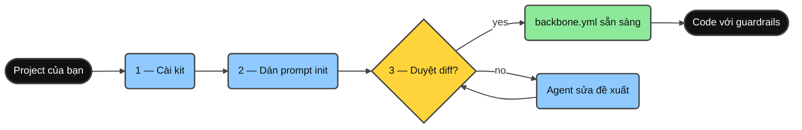
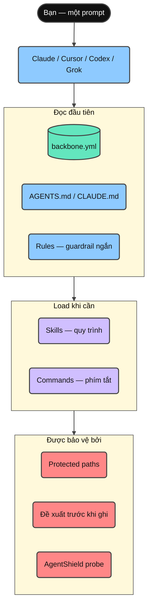
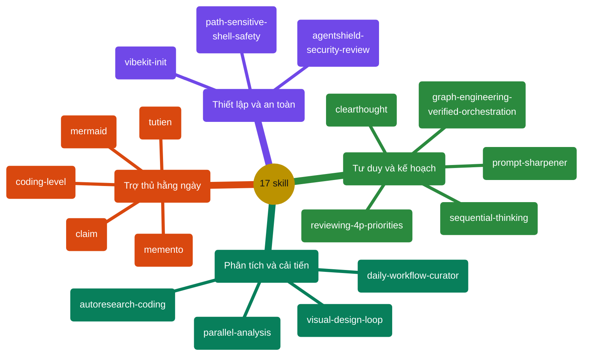
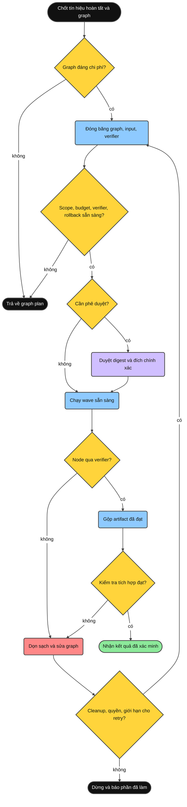
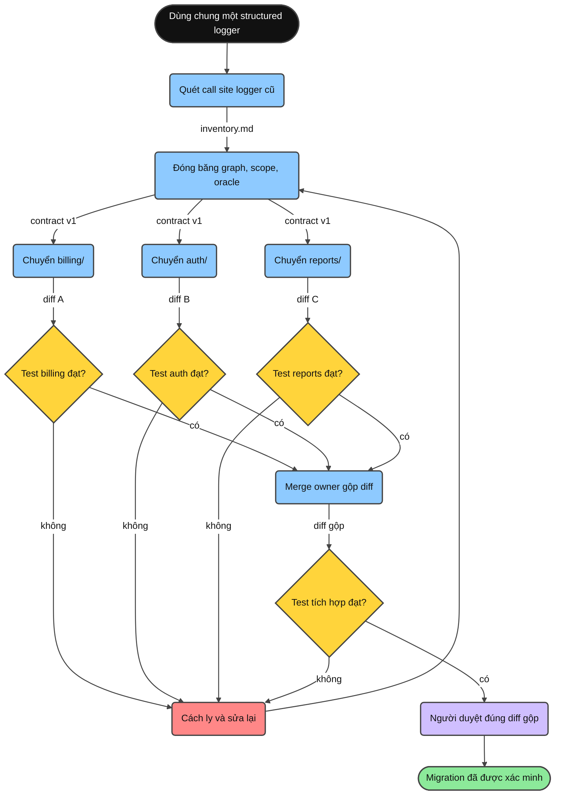

<div align="center">

**Đọc bằng:** [English](../README.md) · **Tiếng Việt** · [简体中文](README.zh-CN.md)

# Minimal Vibe Coding Kit

[](../LICENSE)
[](https://www.npmjs.com/package/minimal-vibe-coding-kit)
[](../CHANGELOG.md)


**Một bộ kit AI-coding cài một lần cho Claude Code, Cursor, Codex và Grok — mọi repo, mọi ngôn ngữ.**

Cài đặt → dán một prompt → duyệt đề xuất → code với guardrails.

</div>

---

## Bộ kit này là gì?

Một bộ kit nhỏ gồm **rules**, **skills**, **commands** dùng chung, cộng một manifest **`backbone.yml`**, giúp Claude Code, Cursor, Codex và Grok hiểu project của bạn theo cùng một cách.

- Không bao giờ ghi đè `CLAUDE.md` / `AGENTS.md` sẵn có — chỉ thêm managed block.
- Mọi thao tác ghi khi setup đều chờ bạn duyệt.
- Rà soát bảo mật bề mặt agent (AgentShield) là một phần của workflow bình thường.
- Xóa an toàn mặc định: mọi agent ưu tiên lệnh `trash` (khôi phục được; init sẽ kiểm tra và gợi ý cách cài nếu thiếu), kèm guardrail config đúng chuẩn từng tool — deny rules cho Claude Code (`.claude/settings.json`), CLI permissions cho Cursor (`.cursor/cli.json`), execution-policy rules cho Codex (`.codex/rules/`, experimental, chỉ chạy khi project được trust), và permission rules cấp project cho Grok (`.grok/config.toml`).
- Init lần đầu hỏi hai tùy chọn — dùng `trash` thay `rm`, và mức giải thích mặc định (0–5, đổi bất cứ lúc nào với `/coding-level N`) — rồi lưu cả hai vào `backbone.yml`.

## Bắt đầu nhanh

Ba bước, khoảng hai phút.



**1. Cài vào project của bạn** (không cần clone):

```bash
npx --yes minimal-vibe-coding-kit@latest install /path/to/your-project
```

Đã chạy `npm i minimal-vibe-coding-kit`, hoặc muốn cài từ GitHub / bản clone? Xem [Cài từ npm](#cài-từ-npm).

**2. Mở project trong Claude Code, Cursor, Codex hoặc Grok và dán:**

```text
Read .vibekit/init/FIRST_TIME_INIT.md and initialize this repo with Minimal Vibe Coding Kit.
First print the requirements you will check. Then run detection, propose one diff
for backbone.yml and managed instruction blocks, and wait for my yes before writing.
```

**3. Review diff được đề xuất và trả lời `yes`.**

Agent điền `backbone.yml` với stack và quy ước đã dò được, rồi chuyển sang `initialized`. Xong — mọi phiên sau tự động đọc file này và bỏ qua bước init.

Kiểm tra sức khỏe bất cứ lúc nào:

```bash
node .vibekit/scripts/mvck.mjs doctor .
```

## Cài từ npm

Kit được publish trên npm với tên [`minimal-vibe-coding-kit`](https://www.npmjs.com/package/minimal-vibe-coding-kit). Đây là **CLI scaffolding, không phải library** — file nằm trong `node_modules/` tự nó không làm gì cả. Chạy `install` một lần sẽ copy kit vào repo root của bạn, giống hệt installer từ GitHub.

**Cách A — chạy một phát (khuyến nghị).** Không thêm gì vào dependencies của project:

```bash
npx --yes minimal-vibe-coding-kit@latest install /path/to/your-project
```

**Cách B — cài như dependency.** Nếu bạn đã (hoặc muốn) `npm i` package, cần thêm đúng một lệnh nữa:

```bash
npm i -D minimal-vibe-coding-kit
npx mvck install .        # bắt buộc — copy kit từ node_modules ra repo của bạn
```

> **Quan trọng:** `npm i` một mình chỉ tải kit vào `node_modules/` — chưa có gì hoạt động.
> `mvck install` mới là bước copy `.claude/`, `.cursor/`, `.agents/`, `.vibekit/` và `backbone.yml` vào repo root.

Sau đó, lệnh ngắn `mvck` (alias: `vibe-kit`) dùng được qua `npx`:

| Lệnh ngắn             | Chức năng                                               |
| --------------------- | ------------------------------------------------------- |
| `npx mvck install .`  | Copy kit vào repo (`--profile`, `--dry-run`, `--force`) |
| `npx mvck update .`   | Làm mới file thuộc kit khi có bản phát hành mới         |
| `npx mvck doctor .`   | Health check chỉ-đọc                                    |
| `npx mvck validate .` | Validate cấu trúc                                       |

Rồi tiếp tục **bước 2** của Bắt đầu nhanh (dán prompt init).

Các cách cài khác: `npx github:giang6283623/minimal-vibe-coding-kit install /path/to/your-project`, hoặc từ bản clone `./install.sh /path/to/your-project` (Windows: `./install.ps1 -Target C:\path\to\your-project`).

## Những gì được cài vào repo của bạn

Cài đặt chỉ thêm đúng những mục sau — không đụng vào bất cứ thứ gì khác:

```text
your-project/
├── backbone.yml              ← bản đồ project mà agent đọc đầu tiên (nguồn sự thật duy nhất)
├── AGENTS.md                 ← hướng dẫn chung cho agent (managed block)
├── CLAUDE.md                 ← ngắn gọn; import AGENTS.md (chỉ tạo khi chưa có)
├── .gitignore                ← các entry của kit thêm trong managed block
├── .claude/                  ← Claude Code: rules, commands, agents, skills
├── .cursor/                  ← Cursor: rules, commands, skills
├── .agents/                  ← skills cho Codex / portable
├── .codex/  .codex-plugin/   ← config mẫu Codex + plugin manifest
├── .grok/                    ← Grok Build: rules, skills, config mẫu
└── .vibekit/                 ← mọi thứ thuộc kit, trong MỘT thư mục
    ├── skills/               ← shared skills canonical (mirror sang các harness)
    ├── commands/             ← prompt command dùng chung
    ├── scripts/              ← CLI mvck, init, validate, doctor, security probe
    ├── docs/                 ← tài liệu tham khảo sâu hơn
    └── init/                 ← file onboarding một lần (xóa được bằng /vibe-finalize)
```

File sẵn có không bao giờ bị thay thế — kit chỉ merge managed block (`BEGIN/END: minimal-vibe-coding-kit`) và bỏ qua những gì thuộc về bạn.

## Các mảnh ghép kết nối thế nào



- **`backbone.yml`** — đường dẫn, quy ước, protected paths, và lệnh validate của repo bạn.
- **Rules** — guardrails ngắn, luôn được load (đọc backbone trước, diff nhỏ, security review khi sửa bề mặt agent).
- **Skills** — quy trình lặp lại được, chỉ load khi task cần.
- **Commands** — phím tắt một từ cho các skill hay dùng nhất.

## Hướng dẫn — sử dụng hằng ngày


<details>
<summary><strong>Xem thêm</strong></summary>

1. **Cứ code bình thường.** Yêu cầu feature/fix như thường lệ; agent theo quy ước trong `backbone.yml` và giữ diff nhỏ.
2. **Task lớn hoặc mơ hồ?** Bắt đầu với skill `clearthought` hoặc `sequential-thinking` để có kế hoạch trước.
3. **Task phức tạp nhưng prompt mù mờ?** `/prompt-sharpener <prompt mù mờ>` cải thiện prompt thành bản rõ ràng rồi thực thi ngay trong cùng lượt.
4. **Muốn đưa skill, rule, hoặc tool mới vào repo?** `/claim <yêu cầu + link>` kiểm chứng nguồn với tài liệu chính thức, kiểm tra độ khớp với repo, hỏi lại khi chưa rõ, rồi tích hợp và ghi tài liệu.
5. **Muốn thả lỏng một chút khi nhìn lại tiến độ?** `/tutien` là chế độ tu tiên riêng tư dựa trên lịch sử Git + file export chat AI. Ngoài phân loại theo bằng chứng thật, trường thiên ký sự sẽ phát triển một thế giới, nhân vật, tông môn, hệ thống cảnh giới và các chương truyện riêng cho từng dự án bằng tiếng Việt, tiếng Anh hoặc tiếng Trung giản thể; `/tutien off` khôi phục văn phong bình thường của kit.
6. **Câu hỏi toàn repo hoặc review lớn?** Dùng `parallel-analysis` — chia các lane phân tích chỉ-đọc chạy song song rồi xác minh kết quả gộp.
7. **Đã sửa `.claude/`, skills, hooks, hoặc script installer?** Chạy `/security-scan` trước khi merge.
8. **Muốn cải tiến đo được?** Chạy `/autoresearch-coding` với metric và budget.
9. **Giữ setup luôn sắc bén:** `/daily-enhance` đề xuất cải tiến — không bao giờ tự áp dụng.
10. **Onboarding xong hẳn?** `/vibe-finalize` dọn các file bootstrap một lần.

</details>

## Commands

```mermaid
---
config:
  theme: base
  themeVariables:
    fontFamily: cascadia mono, consolas, noto sans mono, menlo, monospace
    fontSize: 15px
    lineColor: "#444444"
    textColor: "#111111"
    edgeLabelBackground: "#FFFFFF"
    clusterBkg: "#FFF9DB"
    clusterBorder: "#444444"
---
flowchart LR
    subgraph SetupPhase["Thiết lập"]
        Init("/init-vibe<br/>một diff, chờ duyệt")
    end
    subgraph DailyPhase["Hằng ngày"]
        Scan("/security-scan<br/>bề mặt agent")
        Enhance("/daily-enhance<br/>chỉ đề xuất")
    end
    subgraph ImprovePhase["Cải tiến"]
        Auto("/autoresearch-coding<br/>vòng lặp metric")
        Council("/council<br/>kế hoạch gộp")
    end
    subgraph GradPhase["Tốt nghiệp"]
        Final("/vibe-finalize<br/>dọn bootstrap")
    end
    SetupPhase --> DailyPhase --> ImprovePhase --> GradPhase

    classDef terminal fill:#111111,stroke:#444444,stroke-width:2px,color:#FFFFFF
    classDef step fill:#8ECAFF,stroke:#444444,stroke-width:2px,color:#111111
    classDef success fill:#8CE99A,stroke:#444444,stroke-width:2px,color:#111111
    classDef danger fill:#FF8787,stroke:#444444,stroke-width:2px,color:#111111
    classDef accent fill:#D0BFFF,stroke:#444444,stroke-width:2px,color:#111111
    linkStyle default stroke:#444444,stroke-width:1.5px

    class Init step
    class Scan danger
    class Enhance,Council accent
    class Auto success
    class Final terminal
```



<details>
<summary><strong>Xem thêm</strong></summary>

| Command                | Chức năng                                                                  | Ví dụ                                                               |
| ---------------------- | -------------------------------------------------------------------------- | ------------------------------------------------------------------- |
| `/init-vibe`           | Init lần đầu hoặc sửa chữa: đề xuất một diff, chờ duyệt.                   | `/init-vibe` — review diff rồi trả lời `yes`.                       |
| `/security-scan`       | AgentShield probe chỉ-đọc + scanner tùy chọn cho bề mặt agent.             | `/security-scan` trước khi merge thay đổi `.claude/**` hoặc skills. |
| `/daily-enhance`       | Báo cáo chỉ-đề-xuất để cải tiến rules, skills, workflows.                  | `/daily-enhance` — review diff đề xuất rồi duyệt.                   |
| `/autoresearch-coding` | Vòng lặp thử nghiệm theo metric với baseline và budget.                    | `/autoresearch-coding` Goal: giảm lỗi lint. Budget: 3.              |
| `/council`             | Phối hợp các agent reviewer/researcher/analyst thành một kế hoạch gộp.     | `/council` trên diff của branch này.                                |
| `/vibe-finalize`       | Tốt nghiệp project: chuyển file bootstrap một lần vào `_vibekit-cleanup/`. | `/vibe-finalize` — xem trước, áp dụng sau khi duyệt.                |

</details>

## Skills

Cả 17 skill nằm canonical trong `.vibekit/skills/`. Claude, Codex và Grok mirror đủ 17; Cursor mirror 12 skill tương tác. Gọi bằng tên ("Use the X skill…") hoặc qua các command ở trên.



<details>
<summary><strong>Xem thêm</strong></summary>

| Skill                         | Dùng khi                                                                                                                                                                                                                                               | Prompt ví dụ                                                                            |
| ----------------------------- | ------------------------------------------------------------------------------------------------------------------------------------------------------------------------------------------------------------------------------------------------------ | --------------------------------------------------------------------------------------- |
| `vibekit-init`                | Setup lần đầu, hoặc `backbone.yml` / managed blocks cần sửa.                                                                                                                                                                                           | "Use the vibekit-init skill. Propose one diff and wait for my yes."                     |
| `parallel-analysis`           | Câu hỏi toàn repo, review diff lớn, audit tính nhất quán.                                                                                                                                                                                              | "Use parallel-analysis: where is auth handled and what depends on it?"                  |
| `graph-engineering-verified-orchestration` | Công việc phức tạp có các nhánh thực sự độc lập và cần dependency rõ ràng, cô lập, budget, xác minh khách quan, rollback và merge gate có giới hạn. | "Use graph-engineering-verified-orchestration to design a safe task graph for this migration." |
| `agentshield-security-review` | Audit config agent, skills, hooks, MCP, commands trước khi merge.                                                                                                                                                                                      | "Use agentshield-security-review on .claude/** and .vibekit/skills/**."                 |
| `autoresearch-coding`         | Cải tiến repo qua các thử nghiệm đo được.                                                                                                                                                                                                              | "Use autoresearch-coding. Metric: `npm test`. Direction: higher. Budget: 3."            |
| `daily-workflow-curator`      | Tune-up định kỳ cho rules, skills, workflows (chỉ đề xuất).                                                                                                                                                                                            | "Use daily-workflow-curator and propose today's improvements."                          |
| `path-sensitive-shell-safety` | Trước khi sửa logic shell/installer/deploy có biến path hoặc `rm`/`mv`/`rsync`.                                                                                                                                                                        | "Use path-sensitive-shell-safety before changing this cleanup script."                  |
| `visual-design-loop`          | Polish UI: render → screenshot → review → fix, theo vòng lặp.                                                                                                                                                                                          | "Use visual-design-loop on /dashboard. Budget 3 loops."                                 |
| `clearthought`                | Yêu cầu mơ hồ, tradeoff thiết kế, quyết định rủi ro.                                                                                                                                                                                                   | "Use clearthought. Operation: implementation_plan. Split this feature into safe tasks." |
| `sequential-thinking`         | Chia nhỏ công việc phức tạp theo từng bước.                                                                                                                                                                                                            | "Use sequential-thinking. Break this refactor into ordered steps with tests."           |
| `reviewing-4p-priorities`     | Triage bug/finding theo thứ tự fix P0–P4.                                                                                                                                                                                                              | "Use reviewing-4p-priorities. Classify these findings and give a fix sequence."         |
| `memento`                     | Task nhiều ngày: lưu ngữ cảnh trước khi dừng, resume phiên sau.                                                                                                                                                                                        | "/memento — write MEMENTO.md with Goal, Done, Stuck, Next."                             |
| `coding-level`                | Chỉnh độ chi tiết khi giải thích (0 = ELI5 … 5 = chuyên gia).                                                                                                                                                                                          | "/coding-level 2"                                                                       |
| `prompt-sharpener`            | Task phức tạp nhưng prompt mù mờ: cải thiện prompt rồi thực thi ngay trong cùng lượt.                                                                                                                                                                  | "/prompt-sharpener make the settings page load faster"                                  |
| `claim`                       | Đưa thứ mới vào repo (skill, rule, quy ước, tool): kiểm chứng nguồn chính thức, kiểm tra độ khớp, xác nhận, tích hợp, ghi tài liệu.                                                                                                                    | "/claim add the conventional-commits rule from https://www.conventionalcommits.org"     |
| `tutien`                      | Chế độ tu tiên riêng tư với bằng chứng Git/chat chính xác và trường thiên ký sự mở theo từng repo. Có tổng cương cốt truyện và một chương tuần tự cho mỗi kỳ bằng chứng mới đã duyệt; chỉ chạy khi user gọi, `/tutien off` khôi phục văn phong thường. | "/tutien preview sources=git story-language=vi story-style=web-serial"                  |
| `mermaid`                     | Sinh sơ đồ Mermaid có style (31 loại) với độ chi tiết theo coding level. Chủ động hỏi có muốn thêm sơ đồ khi viết tài liệu, và khi debug có thể vẽ workflow tô đỏ vùng nghi là nguyên nhân bug.                                                        | "Use the mermaid skill. Vẽ flowchart cho pipeline deploy này."                          |

Với `story=on` (mặc định), sau khi phân tích được duyệt, chế độ chuẩn bị `.vibekit/reports/tutien/story/`: `plot.md` lưu tổng cương và thế giới quan đang phát triển, `story-state.json` giữ mạch truyện, còn `chapters/NNNN-<tên-chương-tu-tiên>.md` lưu mỗi lần đúng một chương. Văn truyện do agent sáng tác từ dữ liệu tổng hợp thay vì ghép câu cố định; tên nhân vật, xưng hô và đối thoại tự nhiên theo `story-language=vi|en|zh`.

</details>

### Graph engineering: điều phối có xác minh

Đây là **skill do user gọi**, không phải rule luôn bật hay workflow riêng của một provider. Chỉ dùng khi graph có lợi ích thời gian/chi phí hợp lý hoặc giảm rủi ro phối hợp. Mỗi edge phải mang một artifact có tên; thay đổi mutable cần cô lập có thể cưỡng chế; và chỉ output vượt qua xác minh khách quan mới được merge. Nếu quyền, budget, rollback hoặc verifier chưa rõ, skill chỉ trả về graph plan.



<details>
<summary><strong>Xem thêm: một ví dụ thực tế</strong></summary>

**Tình huống — chuyển ba service sang một structured logger.** Monorepo có `billing/`, `auth/` và `reports/`, mỗi service gọi logger cũ trong file riêng của mình. Đúng điều kiện kích hoạt của skill: ba hạng mục công việc có ranh giới, các nhánh không chạm chung file, và một verifier khách quan (bộ test).

- **Khi nào**: công việc tách được thành ít nhất ba hạng mục có ranh giới với ít nhất hai nhánh thực sự độc lập, và graph có khả năng tiết kiệm thời gian hoặc giảm rủi ro phối hợp.
- **Ở đâu**: repo mà quyền ghi tách được rõ ràng (theo service, package hoặc bộ tài liệu) và test hoặc schema có thể xác minh kết quả từ ngoài scope của bên ghi.
- **Vì sao**: cô lập cưỡng chế chặn ghi chồng lấn; mỗi edge mang một artifact có tên nên không có dependency tưởng tượng nào tuần tự hóa công việc; và chỉ diff đã xác minh mới đến merge owner duy nhất.
- **Khi nào không**: dưới ba hạng mục, các nhánh chạm chung file, hoặc không có verifier khách quan — sửa tuần tự rẻ hơn, và skill sẽ tự nói điều đó bằng cách trả về graph plan thay vì thực thi.

```text
Use graph-engineering-verified-orchestration.
Goal: replace the legacy logger with structlog in billing/, auth/, reports/.
Done signal: npm test passes and no legacy logger import remains.
Editable paths: billing/ auth/ reports/. Protected paths: tests/ and configs.
```

Cách tình huống này chạy dưới dạng graph — mỗi edge mang artifact có tên mà node sau tiêu thụ:



Ba node chuyển đổi chạy trong một wave vì scope ghi không chồng lấn; oracle test được bảo vệ ngoài các scope đó; diff hỏng bị cách ly và sửa lại mà không chặn các diff đã đạt; và human gate duyệt đúng diff gộp trước khi mọi thứ được áp dụng.

</details>

## Nâng cao

### Profile cài đặt

Chỉ cài các bề mặt bạn dùng (mặc định là `all`):

```bash
npx --yes minimal-vibe-coding-kit@latest install . --profile claude          # chỉ Claude Code
npx --yes minimal-vibe-coding-kit@latest install . --profile claude,cursor   # Claude + Cursor
npx --yes minimal-vibe-coding-kit@latest install . --profile codex           # Codex / agent dùng AGENTS.md
npx --yes minimal-vibe-coding-kit@latest install . --profile grok            # Grok Build CLI
```

Cờ: `--force` (ghi đè file kit sẵn có), `--dry-run` (xem trước), `--json` (kế hoạch dạng máy đọc).

### Cập nhật project đã cài

Chạy trong project của bạn khi kit có skill hoặc script mới:

```bash
npx --yes minimal-vibe-coding-kit@latest update . --dry-run   # xem trước
npx --yes minimal-vibe-coding-kit@latest update .             # áp dụng
```

`update` chỉ làm mới **file thuộc kit**, không bao giờ đụng `backbone.yml` hay nội dung của bạn, cập nhật managed block tại chỗ, và backup file bị thay vào `.vibekit/update-backup/<timestamp>/`. Chi tiết: [.vibekit/docs/INSTALL.md](../.vibekit/docs/INSTALL.md).

### Vòng lặp Autoresearch

```text
Use the autoresearch-coding skill.
Goal: improve maintainability. Metric command: <lệnh validate của bạn>. Direction: higher.
Editable paths: src/ docs/. Protected paths: .git .env* node_modules lockfiles.
Budget: 3.
```

Hợp đồng: baseline trước → mỗi lần một thử nghiệm nhỏ → chỉ giữ thay đổi cải thiện metric → log tất cả.


### Rà soát bảo mật (AgentShield)

```bash
node .vibekit/scripts/agentshield-probe.mjs .                          # probe chỉ-đọc, nhanh
npx ecc-agentshield scan --path . --format text --min-severity medium  # scan đầy đủ, tùy chọn
```

Mọi thay đổi tới `CLAUDE.md`, `AGENTS.md`, `.claude/**`, `.cursor/**`, `.agents/**`, `.grok/**`, `.codex-plugin/**`, hoặc `.vibekit/skills|commands|scripts/**` đều nên kích hoạt review. Mô hình: [.vibekit/docs/SECURITY_MODEL.md](../.vibekit/docs/SECURITY_MODEL.md).

### Doctor và báo cáo

```bash
node .vibekit/scripts/mvck.mjs doctor .                 # health check chỉ-đọc
node .vibekit/scripts/mvck.mjs doctor . --write-report  # ghi VIBE_REPORT.md
node .vibekit/scripts/daily-enhance.mjs . --write-report
```

### Cho người phát triển kit

```bash
npm test                # syntax + test cài đặt thật vào thư mục tạm + validate cấu trúc
npm run validate:all    # npm test + AgentShield probe + npm pack dry-run
```

Checklist publish: [.vibekit/init/PUSH_TO_GITHUB.md](../.vibekit/init/PUSH_TO_GITHUB.md). Tài liệu sâu hơn: [.vibekit/docs/](../.vibekit/docs/).

<details>
<summary><strong>Khắc phục sự cố</strong></summary>

| Triệu chứng                  | Cách xử lý                                                                                                               |
| ---------------------------- | ------------------------------------------------------------------------------------------------------------------------ |
| Agent bỏ qua luồng init      | Chạy lại installer, hoặc copy [.vibekit/init/CLAUDE-template.md](../.vibekit/init/CLAUDE-template.md) thành `CLAUDE.md`. |
| Agent hỏi init lại mỗi phiên | Chạy init và duyệt; xác nhận `meta.template_status: initialized` trong `backbone.yml`.                                   |
| Dò sai stack                 | Xóa lockfile cũ, hoặc sửa `backbone.yml` trực tiếp.                                                                      |
| Agent chạm path không nên    | Thêm path vào `policy.protected_paths` trong `backbone.yml` (hỗ trợ glob).                                               |
| AgentShield probe cảnh báo   | Cài Python 3, hoặc bỏ qua — là warning, không phải failure.                                                              |
| Thiếu script sau khi cài     | Chạy lại install với `--force`, hoặc copy thủ công `.vibekit/scripts/`.                                                  |

</details>

## Đóng góp

Issue và PR luôn welcome tại [`giang6283623/minimal-vibe-coding-kit`](https://github.com/giang6283623/minimal-vibe-coding-kit). Trước khi mở PR: mirror thay đổi skill giữa `.claude/`, `.cursor/`, `.agents/`, giữ template trung lập, và chạy `npm run validate:all`. Xem [CONTRIBUTING.md](../CONTRIBUTING.md), [SECURITY.md](../SECURITY.md), [CODE_OF_CONDUCT.md](../CODE_OF_CONDUCT.md).

**Tác giả:** [GiangBV](https://www.linkedin.com/in/buivangiang1992), [AuPMH](https://www.linkedin.com/in/pham-au-2a1bb1162)
**Powered by:** Caffeine, Determination, AI Collaboration, và những đêm code cuối tuần.

## Giấy phép

MIT. Xem [LICENSE](../LICENSE).

> 🇻🇳 _Nếu bạn yêu Việt Nam và con người Việt Nam, bạn hoàn toàn được dùng miễn phí mọi thứ trong đây._
