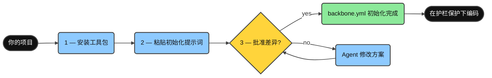
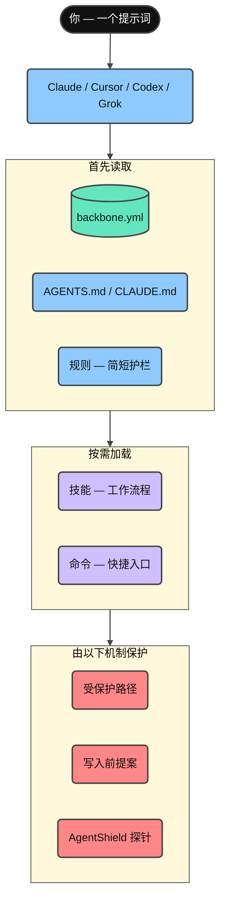
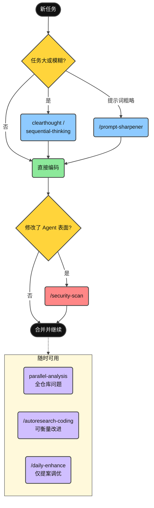
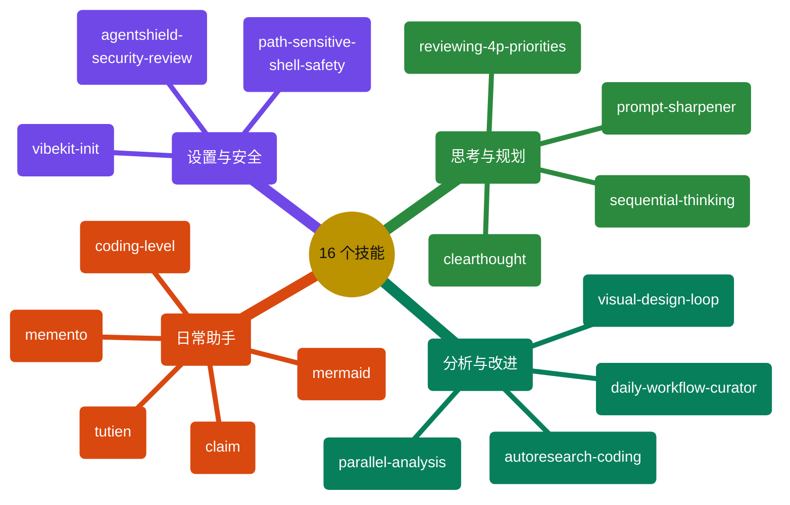
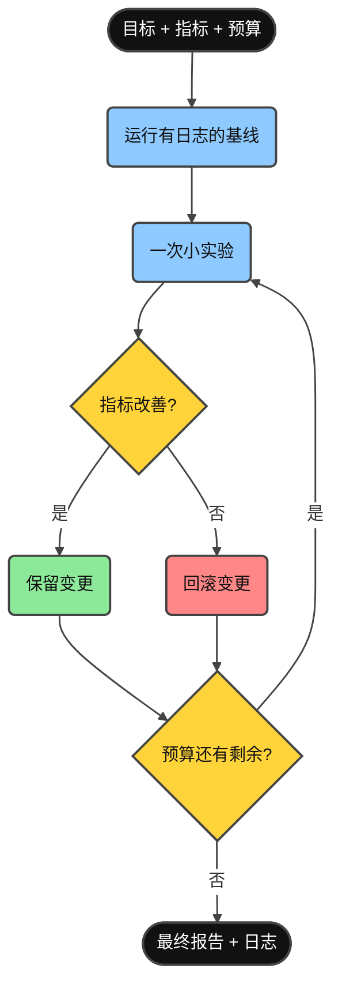

<div align="center">

**阅读语言：** [English](../README.md) · [Tiếng Việt](README.vi.md) · **简体中文**

# Minimal Vibe Coding Kit

[](../LICENSE)
[](https://www.npmjs.com/package/minimal-vibe-coding-kit)
[](../CHANGELOG.md)


**一套可安装的 AI 编程工作流工具包，同时支持 Claude Code、Cursor、Codex 和 Grok——适用于任何仓库、任何语言。**

安装 → 粘贴一个提示词 → 审核方案 → 在护栏保护下开始编码。

</div>

---

## 这是什么？

这是一套精简的共享 **规则（rules）**、**技能（skills）** 和 **命令（commands）**，再配合一个 **`backbone.yml`** 清单，让 Claude Code、Cursor、Codex 和 Grok 以一致的方式理解你的项目。

- 绝不会覆盖已有的 `CLAUDE.md` 或 `AGENTS.md`，只会添加受管理的区块。
- 初始化期间的每一次写入都会等待你的明确批准。
- 对 Agent 表面进行安全审查（AgentShield）是标准工作流的一部分。
- 默认安全删除：所有 Agent 优先使用可恢复的 `trash` 命令。初始化会检查它是否可用，并在缺失时给出安装建议；同时配合各工具官方支持的护栏配置——Claude Code 拒绝规则（`.claude/settings.json`）、Cursor CLI 权限（`.cursor/cli.json`）、Codex 执行策略规则（`.codex/rules/`，实验性，需要先信任项目）以及 Grok 项目权限规则（`.grok/config.toml`）。
- 首次初始化会询问两个偏好：是否用 `trash` 代替 `rm`，以及默认解释级别（0–5，可随时通过 `/coding-level N` 修改），然后将它们记录到 `backbone.yml`。

## 快速开始

三个步骤，大约两分钟。



**1. 安装到你的项目中**（无需克隆仓库）：

```bash
npx --yes minimal-vibe-coding-kit@latest install /path/to/your-project
```

已经运行过 `npm i minimal-vibe-coding-kit`，或者更喜欢 GitHub / 本地克隆方式？请参阅[从 npm 安装](#从-npm-安装)。

**2. 在 Claude Code、Cursor、Codex 或 Grok 中打开项目并粘贴：**

```text
Read .vibekit/init/FIRST_TIME_INIT.md and initialize this repo with Minimal Vibe Coding Kit.
First print the requirements you will check. Then run detection, propose one diff
for backbone.yml and managed instruction blocks, and wait for my yes before writing.
```

**3. 审核提出的差异并回复 `yes`。**

Agent 会使用检测到的技术栈和约定填写 `backbone.yml`，并将状态改为 `initialized`。完成后，之后的每个会话都会自动读取它并跳过初始化。

你可以随时运行健康检查：

```bash
node .vibekit/scripts/mvck.mjs doctor .
```

## 从 npm 安装

工具包以 [`minimal-vibe-coding-kit`](https://www.npmjs.com/package/minimal-vibe-coding-kit) 的名称发布到 npm。它是一个**脚手架 CLI，而不是代码库依赖**——仅仅放在 `node_modules/` 中不会自动生效。运行一次 `install`，才会像 GitHub 安装方式一样把工具包复制到你的仓库根目录。

**方式 A——一次性运行（推荐）。** 不会向项目依赖中添加任何内容：

```bash
npx --yes minimal-vibe-coding-kit@latest install /path/to/your-project
```

**方式 B——作为开发依赖安装。** 如果工具包已经存在或将要加入你的 `package.json`，还需要再执行一个命令：

```bash
npm i -D minimal-vibe-coding-kit
npx mvck install .        # 必需——将工具包从 node_modules 复制到仓库中
```

> **重要：** 单独运行 `npm i` 只会把工具包下载到 `node_modules/`，此时任何功能都尚未启用。
> `mvck install` 才会把 `.claude/`、`.cursor/`、`.agents/`、`.vibekit/` 和 `backbone.yml` 复制到仓库根目录。

之后可以通过 `npx` 使用简短命令 `mvck`（别名：`vibe-kit`）：

| 简短命令                  | 作用                                                             |
| ------------------------- | ---------------------------------------------------------------- |
| `npx mvck install .`      | 将工具包复制到仓库（`--profile`、`--dry-run`、`--force`）        |
| `npx mvck update .`       | 在新版本发布后刷新工具包拥有的文件                               |
| `npx mvck doctor .`       | 只读健康检查                                                     |
| `npx mvck validate .`     | 验证目录和配置结构                                               |

然后继续执行快速开始的**第 2 步**（粘贴初始化提示词）。

其他安装方式：`npx github:giang6283623/minimal-vibe-coding-kit install /path/to/your-project`，或者在本地克隆中运行 `./install.sh /path/to/your-project`（Windows：`./install.ps1 -Target C:\path\to\your-project`）。

## 安装后仓库中会出现什么

安装只会添加以下内容，不会触碰项目中的其他文件：

```text
your-project/
├── backbone.yml              ← Agent 首先读取的项目地图（唯一事实来源）
├── AGENTS.md                 ← 共享 Agent 指令（受管理区块）
├── CLAUDE.md                 ← 简短入口；导入 AGENTS.md（仅在缺失时创建）
├── .gitignore                ← 在受管理区块中追加工具包条目
├── .claude/                  ← Claude Code：规则、命令、Agent、技能
├── .cursor/                  ← Cursor：规则、命令、技能
├── .agents/                  ← Codex / 可移植技能
├── .codex/  .codex-plugin/   ← Codex 配置示例和插件清单
├── .grok/                    ← Grok Build：规则、技能、配置示例
└── .vibekit/                 ← 工具包拥有的所有内容都集中在一个目录
    ├── skills/               ← 规范技能源（镜像到各工具目录）
    ├── commands/             ← 共享命令提示词
    ├── scripts/              ← mvck CLI、初始化、验证、doctor、安全探针
    ├── docs/                 ← 深入参考资料
    └── init/                 ← 一次性引导文件（可通过 /vibe-finalize 移除）
```

已有文件绝不会被替换。工具包只会合并受管理区块（`BEGIN/END: minimal-vibe-coding-kit`），并跳过你自己拥有的内容。

## 各部分如何连接



- **`backbone.yml`**——仓库路径、约定、受保护路径以及验证命令。
- **规则（Rules）**——始终加载的短护栏，例如先读取 backbone、保持差异小、修改 Agent 表面时执行安全审查。
- **技能（Skills）**——可重复执行的工作流程，只在任务需要时加载。
- **命令（Commands）**——常用技能的一词快捷入口。

## 日常使用指南



<details>
<summary><strong>查看更多</strong></summary>

1. **正常提出编码需求。** 像平时一样请求功能或修复；Agent 会遵循 `backbone.yml` 中的约定，并保持差异小而易审查。
2. **任务很大或不够明确？** 先使用 `clearthought` 或 `sequential-thinking` 技能生成计划。
3. **任务复杂，但只有一个粗略提示词？** `/prompt-sharpener <rough prompt>` 会将它变得清晰准确，并在同一轮中执行。
4. **想把新技能、规则或工具带入仓库？** `/claim <request + links>` 会根据官方文档验证来源、检查是否适合当前仓库、在不明确时询问，然后完成集成和文档记录。
5. **想在回顾进度时安静地放松一下？** `/tutien` 是基于 Git 历史和你明确提供的 AI 聊天导出的私密修仙模式。除了严格依据证据进行分类，它还会为每个项目逐步发展独有的世界、人物、宗门、境界体系与连续章节，支持越南语、英语和简体中文；`/tutien off` 会恢复工具包的正常文风。
6. **需要回答全仓库问题或进行大型审查？** 使用 `parallel-analysis`，它会并行执行多个只读分析通道，并验证合并后的结论。
7. **修改了 `.claude/`、技能、hook 或安装脚本？** 合并前运行 `/security-scan`。
8. **想进行可衡量的改进？** 使用带有 metric 和预算的 `/autoresearch-coding`。
9. **保持配置清晰可靠：** `/daily-enhance` 只提出改进建议，绝不会静默应用。
10. **引导工作已经彻底完成？** `/vibe-finalize` 会移出一次性 bootstrap 文件。

</details>

## 命令

```mermaid
---
config:
  theme: base
  themeVariables:
    fontFamily: cascadia mono, consolas, noto sans mono, menlo, monospace
    fontSize: 15px
    lineColor: "#444444"
    textColor: "#111111"
    edgeLabelBackground: "#FFFFFF"
    clusterBkg: "#FFF9DB"
    clusterBorder: "#444444"
---
flowchart LR
    subgraph SetupPhase["设置"]
        Init("/init-vibe<br/>一个差异，等待批准")
    end
    subgraph DailyPhase["日常"]
        Scan("/security-scan<br/>Agent 表面")
        Enhance("/daily-enhance<br/>仅提案")
    end
    subgraph ImprovePhase["改进"]
        Auto("/autoresearch-coding<br/>指标循环")
        Council("/council<br/>统一计划")
    end
    subgraph GradPhase["毕业"]
        Final("/vibe-finalize<br/>清理引导文件")
    end
    SetupPhase --> DailyPhase --> ImprovePhase --> GradPhase

    classDef terminal fill:#111111,stroke:#444444,stroke-width:2px,color:#FFFFFF
    classDef step fill:#8ECAFF,stroke:#444444,stroke-width:2px,color:#111111
    classDef success fill:#8CE99A,stroke:#444444,stroke-width:2px,color:#111111
    classDef danger fill:#FF8787,stroke:#444444,stroke-width:2px,color:#111111
    classDef accent fill:#D0BFFF,stroke:#444444,stroke-width:2px,color:#111111
    linkStyle default stroke:#444444,stroke-width:1.5px

    class Init step
    class Scan danger
    class Enhance,Council accent
    class Auto success
    class Final terminal
```



<details>
<summary><strong>查看更多</strong></summary>

| 命令                     | 作用                                                               | 示例                                                               |
| ------------------------ | ------------------------------------------------------------------ | ------------------------------------------------------------------ |
| `/init-vibe`             | 首次初始化或修复：提出一个差异并等待批准。                         | `/init-vibe`——审核差异后回复 `yes`。                               |
| `/security-scan`         | 对 Agent 表面执行只读 AgentShield 探针和可选完整扫描。              | 修改 `.claude/**` 或技能后，在合并前运行 `/security-scan`。         |
| `/daily-enhance`         | 生成仅供提案的规则、技能和工作流改进报告。                         | `/daily-enhance`——审核提出的差异后再批准。                         |
| `/autoresearch-coding`   | 带基线、指标和预算的实验循环。                                     | `/autoresearch-coding` Goal: fewer lint errors. Budget: 3.         |
| `/council`               | 协调 reviewer、researcher 和 analyst Agent，形成一个统一计划。      | `/council` on this branch diff.                                    |
| `/vibe-finalize`         | 让项目完成引导：将一次性文件移到 `_vibekit-cleanup/`。              | `/vibe-finalize`——先预览，批准后再应用。                           |

</details>

## 技能

全部 16 个技能的规范版本位于 `.vibekit/skills/`。Claude、Codex 和 Grok 镜像全部 16 个技能；Cursor 镜像其中 11 个交互式技能。可以直接按名称调用（例如“Use the X skill…”），也可以使用上面的命令。



<details>
<summary><strong>查看更多</strong></summary>

| 技能                            | 适用场景                                                                                             | 示例提示词                                                                                              |
| ------------------------------- | ---------------------------------------------------------------------------------------------------- | ------------------------------------------------------------------------------------------------------- |
| `vibekit-init`                  | 首次设置，或需要修复 `backbone.yml` / 受管理区块。                                                   | "Use the vibekit-init skill. Propose one diff and wait for my yes."                                   |
| `parallel-analysis`             | 全仓库问题、大型差异审查、一致性审计。                                                               | "Use parallel-analysis: where is auth handled and what depends on it?"                                |
| `agentshield-security-review`   | 合并前审计 Agent 配置、技能、hook、MCP 和命令。                                                       | "Use agentshield-security-review on .claude/** and .vibekit/skills/**."                               |
| `autoresearch-coding`           | 通过可衡量的实验持续改进仓库。                                                                       | "Use autoresearch-coding. Metric: `npm test`. Direction: higher. Budget: 3."                          |
| `daily-workflow-curator`        | 定期调整规则、技能和工作流（仅提案）。                                                               | "Use daily-workflow-curator and propose today's improvements."                                        |
| `path-sensitive-shell-safety`   | 修改包含路径变量或 `rm`/`mv`/`rsync` 的 shell、安装或部署逻辑之前。                                  | "Use path-sensitive-shell-safety before changing this cleanup script."                                |
| `visual-design-loop`            | UI 打磨：渲染 → 截图 → 审查 → 修复，循环进行。                                                       | "Use visual-design-loop on /dashboard. Budget 3 loops."                                               |
| `clearthought`                  | 需求模糊、存在设计取舍或高风险决策。                                                                 | "Use clearthought. Operation: implementation_plan. Split this feature into safe tasks."               |
| `sequential-thinking`           | 将复杂工作拆解为有序步骤。                                                                           | "Use sequential-thinking. Break this refactor into ordered steps with tests."                         |
| `reviewing-4p-priorities`       | 按 P0–P4 对缺陷和发现进行排序。                                                                      | "Use reviewing-4p-priorities. Classify these findings and give a fix sequence."                       |
| `memento`                       | 跨多日任务：停止前保存上下文，下一会话恢复。                                                         | "/memento — write MEMENTO.md with Goal, Done, Stuck, Next."                                           |
| `coding-level`                  | 设置解释详细程度（0 = ELI5，5 = 专家同行）。                                                        | "/coding-level 2"                                                                                     |
| `prompt-sharpener`              | 复杂任务只有粗略提示词时：优化提示词并在同一轮执行。                                                 | "/prompt-sharpener make the settings page load faster"                                                |
| `claim`                         | 将新技能、规则、约定或工具带入仓库：验证官方来源、检查适配性、确认、集成并记录文档。                 | "/claim add the conventional-commits rule from https://www.conventionalcommits.org"                   |
| `tutien`                        | 基于准确 Git/聊天证据的私密修仙模式，并为每个仓库维护开放式连载故事。每个新的已批准证据窗口对应一个有序章节；仅由用户调用，`/tutien off` 恢复正常文风。 | "/tutien preview sources=git story-language=zh story-style=web-serial"                                |
| `mermaid`                       | 生成带样式的 Mermaid 图表（31 种），密度随 coding level 自适应。写文档时会主动询问是否配图；调试时可以生成用红色高亮可疑风险区的流程图。 | "Use the mermaid skill. 把这个部署流程画成流程图。"                                                    |

`story=on`（默认）时，获批分析会准备 `.vibekit/reports/tutien/story/`：`plot.md` 保存持续演化的总纲与世界设定，`story-state.json` 保存连续性，`chapters/NNNN-<修仙章名>.md` 每次只保存一个章节。故事由 Agent 根据聚合证据原创，而不是拼接固定句子；人物姓名、称谓和对白会自然遵循 `story-language=vi|en|zh`。

</details>

## 高级用法

### 安装配置档

只安装你使用的工具表面（默认为 `all`）：

```bash
npx --yes minimal-vibe-coding-kit@latest install . --profile claude          # 仅 Claude Code
npx --yes minimal-vibe-coding-kit@latest install . --profile claude,cursor   # Claude + Cursor
npx --yes minimal-vibe-coding-kit@latest install . --profile codex           # Codex / AGENTS.md Agent
npx --yes minimal-vibe-coding-kit@latest install . --profile grok            # Grok Build CLI
```

选项：`--force`（覆盖已有的工具包文件）、`--dry-run`（预览）、`--json`（机器可读计划）。

### 更新已安装的项目

当工具包发布新技能或脚本后，在项目中运行：

```bash
npx --yes minimal-vibe-coding-kit@latest update . --dry-run   # 预览
npx --yes minimal-vibe-coding-kit@latest update .             # 应用
```

`update` 只刷新**工具包拥有的文件**，绝不会触碰 `backbone.yml` 或你自己的内容。它会原位更新受管理区块，并将变更前的文件备份到 `.vibekit/update-backup/<timestamp>/`。详情请参阅 [.vibekit/docs/INSTALL.md](../.vibekit/docs/INSTALL.md)。

### Autoresearch 循环

```text
Use the autoresearch-coding skill.
Goal: improve maintainability. Metric command: <your validate command>. Direction: higher.
Editable paths: src/ docs/. Protected paths: .git .env* node_modules lockfiles.
Budget: 3.
```

约定：先建立基线 → 每次只进行一个小实验 → 只保留指标改善的变更 → 记录所有实验。



### 安全审查（AgentShield）

```bash
node .vibekit/scripts/agentshield-probe.mjs .                          # 快速只读探针
npx ecc-agentshield scan --path . --format text --min-severity medium  # 可选完整扫描
```

对 `CLAUDE.md`、`AGENTS.md`、`.claude/**`、`.cursor/**`、`.agents/**`、`.grok/**`、`.codex-plugin/**` 或 `.vibekit/skills|commands|scripts/**` 的任何修改都应触发安全审查。安全模型：[.vibekit/docs/SECURITY_MODEL.md](../.vibekit/docs/SECURITY_MODEL.md)。

### Doctor 和报告

```bash
node .vibekit/scripts/mvck.mjs doctor .                 # 只读健康检查
node .vibekit/scripts/mvck.mjs doctor . --write-report  # 写入 VIBE_REPORT.md
node .vibekit/scripts/daily-enhance.mjs . --write-report
```

### 面向工具包开发者

```bash
npm test                # 语法 + 真实临时目录安装测试 + 结构验证
npm run validate:all    # npm test + AgentShield 探针 + npm 打包预检
```

发布检查清单：[.vibekit/init/PUSH_TO_GITHUB.md](../.vibekit/init/PUSH_TO_GITHUB.md)。深入文档：[.vibekit/docs/](../.vibekit/docs/)。

<details>
<summary><strong>故障排除</strong></summary>

| 症状                               | 解决方法                                                                                                                 |
| ---------------------------------- | ------------------------------------------------------------------------------------------------------------------------ |
| Agent 忽略初始化流程               | 重新运行安装程序，或将 [.vibekit/init/CLAUDE-template.md](../.vibekit/init/CLAUDE-template.md) 复制为 `CLAUDE.md`。       |
| Agent 每个会话都重新要求初始化     | 运行并批准初始化；确认 `backbone.yml` 中存在 `meta.template_status: initialized`。                                      |
| 检测到错误的技术栈                 | 删除过期 lockfile，或直接编辑 `backbone.yml`。                                                                          |
| Agent 修改了不应触碰的路径         | 将该路径加入 `backbone.yml` 的 `policy.protected_paths`（支持 glob）。                                                   |
| AgentShield 探针发出警告           | 安装 Python 3，或者忽略；这是 warning，不是 failure。                                                                    |
| 安装后缺少脚本                     | 使用 `--force` 重新安装，或手动复制 `.vibekit/scripts/`。                                                                |

</details>

## 贡献

欢迎在 [`giang6283623/minimal-vibe-coding-kit`](https://github.com/giang6283623/minimal-vibe-coding-kit) 提交 Issue 和 PR。提交 PR 前，请在 `.claude/`、`.cursor/`、`.agents/` 之间同步技能变更，保持模板与具体项目无关，并运行 `npm run validate:all`。另请参阅 [CONTRIBUTING.md](../CONTRIBUTING.md)、[SECURITY.md](../SECURITY.md) 和 [CODE_OF_CONDUCT.md](../CODE_OF_CONDUCT.md)。

**创建者：** [GiangBV](https://www.linkedin.com/in/buivangiang1992)、[AuPMH](https://www.linkedin.com/in/pham-au-2a1bb1162)  
**技术动力：** 咖啡因、坚持、与 AI 协作，以及周末的编程时光。

## 许可证

MIT。请参阅 [LICENSE](../LICENSE)。

> 🇻🇳 _如果你热爱越南和越南人民，你可以完全免费使用这里的一切。_
